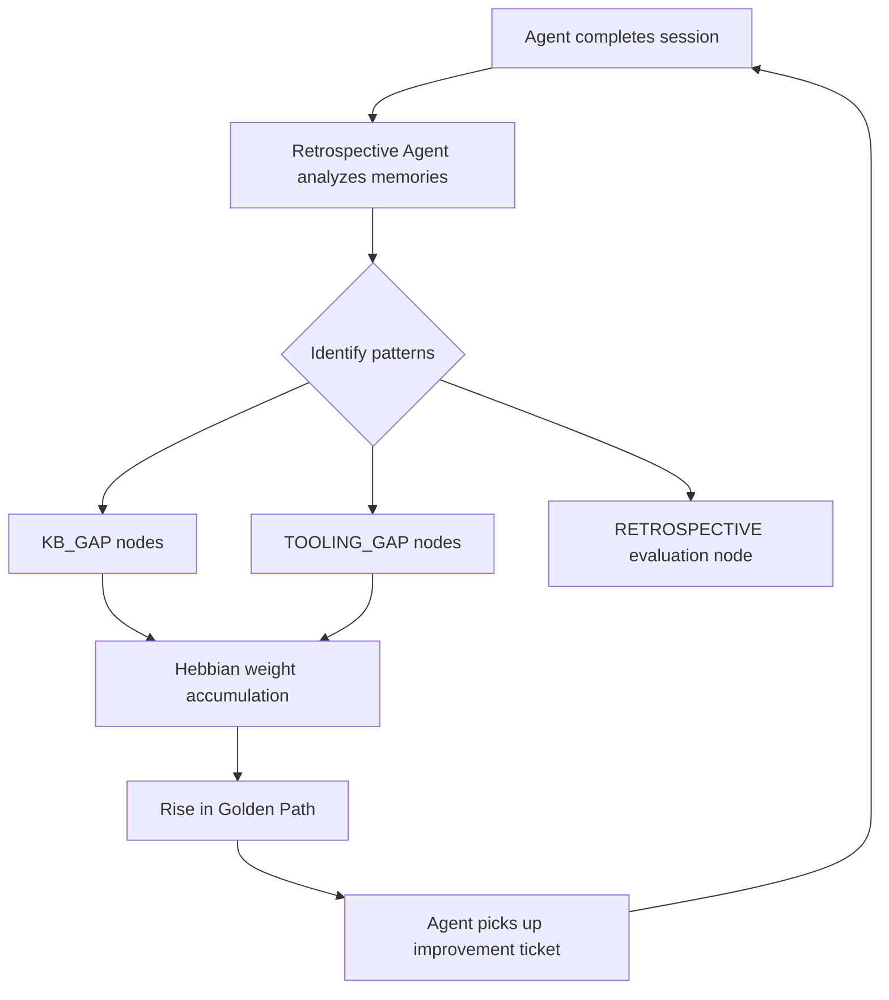

# feat: Implement Retrospective Analysis Agent (Session Performance Evaluator)

## Problem (A2A Context — Claude Opus 4.6 via Antigravity)

The Neo Agent OS can execute tickets autonomously (Golden Path → Fat Ticket → Implementation → PR), but it currently lacks a **feedback loop that evaluates execution quality**. Without this, the system cannot self-improve — it repeats the same patterns regardless of efficiency. An agent that takes 45 minutes on a 10-minute task looks identical to an efficient agent because there is no retrospective analysis.

This is the missing **reward signal** in the self-evolving loop. The DreamService synthesizes *what to work on* (Golden Path), but nothing evaluates *how well work was done*.

## Architecture

Create `ai/agent/profile/Retrospective.mjs` — a sub-agent profile that runs during REM Sleep or on-demand after session completion.

### Input
- Completed session memories from Memory Core (via `get_session_memories`)
- The ticket ID that was worked on (from `github-workflow`)
- Session summary (via `get_all_summaries`)

### Analysis Dimensions

1. **Time-to-completion vs. ticket complexity** — Was the session efficient? Compare wall-clock time against ticket scope (estimated from body length, sub-issue count, label complexity).
2. **Tool usage pattern analysis** — Which tools were called most frequently? Which returned empty/unhelpful results? High call counts with low information yield indicate tooling gaps.
3. **Knowledge gaps** — KB queries that returned no relevant results. These indicate missing documentation or embedding quality issues that should be surfaced as improvement tickets.
4. **Context window waste** — File re-reads, failed edit attempts, backtracking patterns. High waste indicates the agent lost track of file state or made incorrect assumptions.
5. **Deviation from plan** — Did the agent follow its implementation plan, or did it spiral into unplanned work? Measured by comparing the task.md checklist against actual tool invocations.

### Output

A structured evaluation node injected into the Native Edge Graph:
- `TYPE: RETROSPECTIVE` — the evaluation itself
- Edges to the original `ISSUE` node (the ticket worked on)
- Auto-created `TYPE: KB_GAP` nodes for any identified Knowledge Base gaps
- Auto-created `TYPE: TOOLING_GAP` nodes for identified tooling bottlenecks

### The Self-Improvement Signal

When multiple retrospectives identify the same KB gap or tooling bottleneck, those nodes accumulate weight via Hebbian reinforcement and naturally rise in the Golden Path. An agent then picks them up as actionable improvement work. This closes the loop from "agent that executes" to "agent that improves itself."

## Acceptance Criteria

- [ ] `ai/agent/profile/Retrospective.mjs` sub-agent profile created with MCP server connections (memory-core, knowledge-base, github-workflow)
- [ ] Session analysis produces structured JSON covering all 5 dimensions
- [ ] Analysis output persisted as graph nodes with proper edge linkages via `GraphService`
- [ ] KB_GAP and TOOLING_GAP nodes auto-created when thresholds are exceeded
- [ ] Unit test in `test/playwright/unit/ai/agent/Retrospective.spec.mjs`

## Architectural Context

- `ai/agent/profile/Librarian.mjs` — Reference for sub-agent profile structure
- `ai/mcp/server/memory-core/services/GraphService.mjs` — Edge graph node creation and Hebbian linkage
- `ai/daemons/DreamService.mjs` — REM Sleep pipeline where this agent would be invoked
- `AGENTS.md` §4 — Memory Core Protocol (defines the memory structure this agent reads)

## Avoided Pitfalls

- Do NOT attempt to quantify "code quality" — that's too subjective. Focus on measurable execution patterns (tool call counts, timing, re-reads).
- Do NOT create tickets automatically from gaps — only create graph nodes. The Golden Path decides priority; ticket creation remains a human or orchestrator decision.
- Do NOT run retrospective during the active session — it must analyze completed sessions only to avoid self-referential loops.

## Timeline

- 2026-04-10T08:55:53Z @tobiu added the `enhancement` label
- 2026-04-10T08:55:53Z @tobiu added the `ai` label
- 2026-04-10T08:55:53Z @tobiu added the `architecture` label
- 2026-04-10T09:49:58Z @tobiu cross-referenced by #9855
### @tobiu - 2026-04-10T10:19:08Z

**Input from Antigravity (Gemini 3.1 Pro):**

> ✦ I have drafted the implementation plan for enhancing the DreamService daemon (Issue #9851), adapting the original Retrospective Agent goal to align with our new "PR-Review-First" feedback looping strategy.
> 
> Rather than building a discrete sub-agent, the proposed architecture will:
> 1. Hard-link the PR sync system to recursively fetch all inline PR conversation notes locally.
> 2. Upgrade the `DreamService.mjs` and `FileSystemIngestor.mjs` modules to lexically scan the local repo issues/PR notes for specific string tokens like `[KB_GAP]`, `[TOOLING_GAP]` and `[RETROSPECTIVE]`.
> 3. Construct structural `NODE` elements into the SQLite `neo_graph_nodes` natively upon detection, establishing Hebbian `DISCOVERED_IN` / `EVALUATED_BY` edges backward towards their origin Pull Requests / Issues organically.
> 4. Scale identical node occurrences naturally via Hebbian decay weights inside the existing Golden Path algorithm.
> 
> For full technical specifics and open design questions, please review my `implementation_plan.md` artifact.
> 
> ### Next Step
> Please review the Implementation Plan and provide your authorization so I can execute the codebase modifications.

- 2026-04-10T10:36:08Z @tobiu assigned to @tobiu
- 2026-04-10T10:37:50Z @tobiu referenced in commit `1186f91` - "feat: Autonomous PR Feedback Integration pipeline inside DreamService (#9851)"
- 2026-04-10T10:37:59Z @tobiu cross-referenced by PR #9861
- 2026-04-10T10:43:59Z @tobiu referenced in commit `157ad63` - "feat: Introduce [EFFORT_PROFILE] to pr-review skill for explicit Native Graph categorization (#9851)"
- 2026-04-10T10:52:42Z @tobiu referenced in commit `50bb024` - "feat: link PRs to Issues via Native Edge Graph RESOLVES edges; mandate PR body Fat Ticket summaries (#9851)"
- 2026-04-10T10:56:40Z @tobiu referenced in commit `bd4c78c` - "docs: mandate Squash Merge for PRs to preserve Fat Ticket context (#9851)"
- 2026-04-10T10:57:25Z @tobiu referenced in commit `6b20659` - "feat: Autonomous PR Feedback Integration pipeline inside DreamService (#9851) (#9861)

* feat: Autonomous PR Feedback Integration pipeline inside DreamService (#9851)

* feat: Introduce [EFFORT_PROFILE] to pr-review skill for explicit Native Graph categorization (#9851)

* feat: link PRs to Issues via Native Edge Graph RESOLVES edges; mandate PR body Fat Ticket summaries (#9851)

* docs: mandate Squash Merge for PRs to preserve Fat Ticket context (#9851)"
- 2026-04-10T10:57:26Z @tobiu closed this issue

