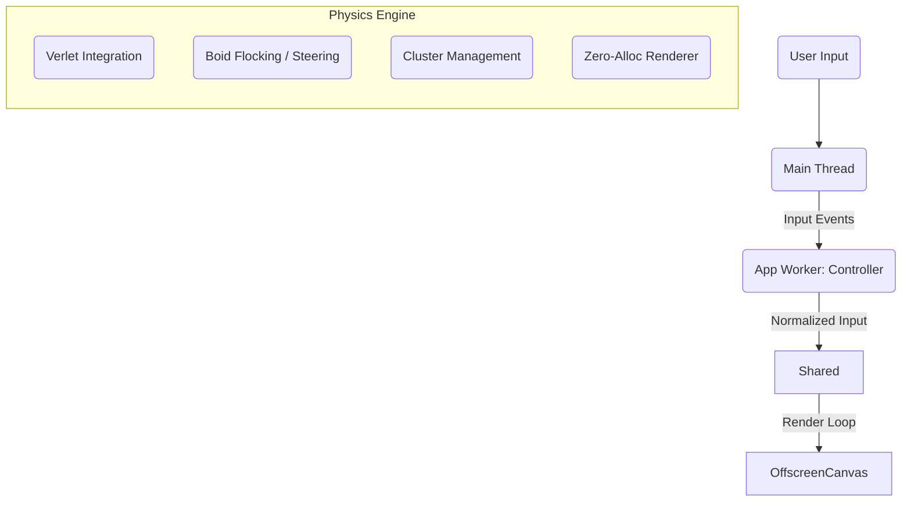

# Neo.mjs v11.22.0 Release Notes

**Release Type:** Visual Identity & Simulation Engine  
**Stability:** Production-Ready  
**Upgrade Path:** Drop-in replacement for v11.21.0  

> **TL;DR:** **v11.22.0 establishes a new paradigm: "UI as a Continuous Simulation".** We moved beyond static layouts to treat the interface as a persistent, physics-driven world. This release deploys two massive SharedWorker simulations—**The Neural Swarm** and **Sonic Waves**—running autonomous agents and fluid dynamics at 60fps. It proves that with a **Zero-Allocation** architecture, the browser can deliver desktop-class, living experiences without blocking the main thread. **62 tickets** resolved in **2 days**.

---

## 🔮 The Principle: UI as a Simulation

Web interfaces typically consist of static elements that wait for input. v11.22.0 inverts this model. We treat the application as a living ecosystem where entities have mass, momentum, and agency, existing independently of user interaction.

To prove this, we built two high-fidelity simulations that run entirely in **SharedWorkers**, ensuring the Main Thread remains purely for DOM reconciliation.

### Proof 1: The Neural Swarm (Home Hero)

> **[Experience the Interactive Simulation](https://neomjs.com)** | **[Read the Architecture Guide](https://github.com/neomjs/neo/blob/dev/learn/guides/advanced/NeuralSwarm.md)**

A complex topological simulation representing the "Agent-Native" runtime.

*   **Living Topology:** Nodes aren't random. They form **Clusters** initialized via a **Golden Spiral** algorithm. They actively detach, drift, and re-parent themselves, visualizing **Atomic Moves**.
*   **Autonomous Agents:** "Seeker Drones" (Boids) actively patrol the network, running a Finite State Machine to **Seek**, **Scan**, and **Flee**.
*   **Physics-Based Interaction:** Clicking triggers a **Shockwave** modeled with `easeOutCubic` physics, physically displacing nodes and disrupting flow fields.

### Proof 2: Sonic Waves (Header Toolbar)

> **"The UI that breathes."** | **[Read the Architecture Guide](https://github.com/neomjs/neo/blob/dev/learn/guides/advanced/CanvasArchitecture.md)**

### 🧬 The "Split Stream" Engine
Instead of discrete hover animations, the header is governed by a **continuous fluid simulation**: a persistent Double Helix energy stream that flows across the navigation bar and responds to obstacles and input in real time.

*   **Adaptive Geometry:** The Shared Worker synchronizes with App Worker layout data (`DOMRects`) to construct real-time collision envelopes. The physics engine does not "avoid" UI elements symbolically—it **physically diverts** the stream around buttons and icons based on their detected geometry.
*   **Turbulence Injection:** Traditional CSS hover states were replaced with **physics inputs**. Cursor proximity injects **Frequency Modulation** directly into the wave equation, locally destabilizing the flow and causing the system to visibly react rather than switch states.
*   **Active State:** The active view is expressed as an **Energy Surge**—a sustained, high-intensity excitation rendered via a **Multi-Pass** pipeline. Crucially, this reuses the same geometry and buffers as the base simulation, preserving continuity instead of layering a separate visual effect.

---

## ⚙️ The Enabler: Zero-Allocation Architecture

Simulating hundreds of entities at 60fps creates a new bottleneck: **Garbage Collection**. Creating temporary objects (e.g., `{x: 1, y: 2}`) triggers micro-stutters that ruin immersion.

To enable "Continuous Simulation," we enforced a strict **Zero-Allocation Policy**:

*   **Structure of Arrays (SoA):** We replaced objects with pre-allocated `Float32Array` buffers. Physics calculations read/write directly to memory blocks.
*   **Inlined Math:** We eliminated helper function calls in critical loops to avoid stack overhead.
*   **Resource Caching:** Expensive assets like Gradients are generated once on resize, not per-frame.

```javascript
// 🚫 Bad: Creating objects every frame (GC Pressure)
// let point = {x: 10, y: 20};

// ✅ Good: Writing to pre-allocated buffers (Zero GC)
// STRIDE = 9; index = i * STRIDE;
this.nodeBuffer[index + 0] += this.nodeBuffer[index + 2]; // x += vx
this.nodeBuffer[index + 1] += this.nodeBuffer[index + 3]; // y += vy
```

### The Architecture in Action



---

## 🛠️ Core & Infrastructure

*   **Service Worker Hardening:** Refactored update lifecycle (#8690) for non-blocking activation (no more blank pages) and fixed quota resilience (#8691).
*   **Bullet-Proof Components:** Hardened `MagicMoveText` against layout thrashing with smart measurement caching.
*   **Portal UX:** Renamed "Latest" to "Backlog" for clarity and improved smart routing to latest releases.

---

## 📦 Full Changelog

### 🌌 Epic: Home Hero Canvas (The Neural Swarm) (#8661)
*   **Feat:** Scaffold Home Canvas Architecture (App/Shared Worker) (#8662)
*   **Feat:** Implement Neural Network Physics & Rendering (#8663)
*   **Feat:** Implement Home Canvas Interaction & Parallax (#8664)
*   **Feat:** Implement Cluster Physics (Golden Spiral & Cohesion) (#8668)
*   **Feat:** Implement Autonomous Agent Drones (Boids) (#8669)
*   **Feat:** Implement Data Flow Packets & Parallax (#8670)
*   **Feat:** Implement Topology Mutation (Re-parenting) (#8671)
*   **Feat:** Implement Cluster Drift with Flow Fields (#8672)
*   **Feat:** Implement Elastic Connections & Breathing (#8673)
*   **Feat:** Implement Interactive Physics ("Force Push") (#8675)
*   **Feat:** Implement Agent-Driven State (Energy Decay) (#8674)
*   **Feat:** Implement "Containment Field" for Drift Control (#8676)
*   **Feat:** Enhance Shockwave Visuals (Composite Rings & Sparks) (#8677)
*   **Feat:** Optimize Contrast for Light Theme ("Inverted Neon") (#8682)
*   **Fix:** Restore Shockwave Physics Interaction (#8681)
*   **Refactor:** Implement HeroContainer for correct scrolling (#8678)
*   **Refactor:** Visual Polish & GC Optimization (Inlining) (#8683)
*   **Refactor:** HomeCanvas Styling & Pointer Events (#8665)
*   **Perf:** Optimize HomeCanvas Lifecycle (Pause/Resume) (#8666)
*   **Perf:** Optimize HomeCanvas Rendering (Gradient Caching) (#8667)
*   **Docs:** Create "The Neural Swarm" Architecture Guide (#8680)
*   **Docs:** Enhance JSDoc & Buffer Layout Documentation (#8679)

### 🌊 Epic: Header Toolbar Canvas (Sonic Waves) (#8630)
*   **Feat:** Scaffold Header Canvas Architecture (#8631)
*   **Feat:** Implement Sonic Wave Visual Effects (#8632)
*   **Feat:** Tune Sonic Wave Visuals (#8635)
*   **Feat:** Implement "Luminous Flux" Theme (Gradients) (#8636)
*   **Feat:** Add Vertical Padding to Header Canvas Waves (#8637)
*   **Feat:** Strict Vertical Clamping for Header Waves (#8638)
*   **Feat:** Implement Dynamic Life Effects (Breathing/Shimmer) (#8639)
*   **Feat:** Implement Variable Wavelength (FM) (#8640)
*   **Feat:** Refine Header Canvas Dynamics (Phase & FM) (#8641)
*   **Feat:** Implement Adaptive Wave Geometry (Icons vs Text) (#8642)
*   **Feat:** Dampen Wave Amplitude for Social Icons (#8643)
*   **Feat:** Implement 3D "Neon Tube" & "Ribbon" Effects (#8647, #8648)
*   **Feat:** Implement "Neo Ether" Particle System (#8645)
*   **Feat:** Implement "Energy Surge" Active State (#8660)
*   **Feat:** Implement Interactive Shockwave Physics (#8655)
*   **Fix:** Fix HeaderCanvas navRects TypeError (#8633)
*   **Fix:** Fix HeaderCanvas Invalid Input Data Structure (#8634)
*   **Refactor:** Clean up HeaderCanvas Comments (#8650)
*   **Refactor:** HeaderCanvas ComponentManager & SCSS (#8656)
*   **Perf:** Optimize Rendering (GC & Gradient Caching) (#8651)
*   **Perf:** Throttle MouseMove Events (#8653, #8654)
*   **Docs:** Create "Advanced Canvas Architecture" Guide (#8657)
*   **Docs:** Enhance JSDoc for Visual Engine (#8646, #8649)
*   **Docs:** Document Zero-Allocation Architecture (#8652)

### 🛠️ Core & Portal
*   **Fix:** Service Worker Update Blocking (Blank Page Fix) (#8690)
*   **Fix:** Service Worker Fetch Failure on Quota Exceeded (#8691)
*   **Fix:** MagicMoveText Corrupted State on Navigation (#8684)
*   **Fix:** Correct Default Expansion Logic for Release/Ticket Trees (#8688)
*   **Enhance:** Rename "Latest" to "Backlog" in Ticket Index (#8685)
*   **Enhance:** Update Ticket View Default Route Logic (#8686)
*   **Enhance:** Improve Timeline Labels for Sub-Issues (#8689)
*   **Build:** Update Default Expansion in Release Index (#8687)
*   **Docs:** Create "Neural Timeline" Architecture Guide (#8658)
*   **Docs:** Correct Mermaid Diagram in Neural Timeline Guide (#8659)


All changes delivered in 1 atomic commit: [472f1ce](https://github.com/neomjs/neo/commit/472f1ce1f8733c162e8a497241b9bf93205e3347)
