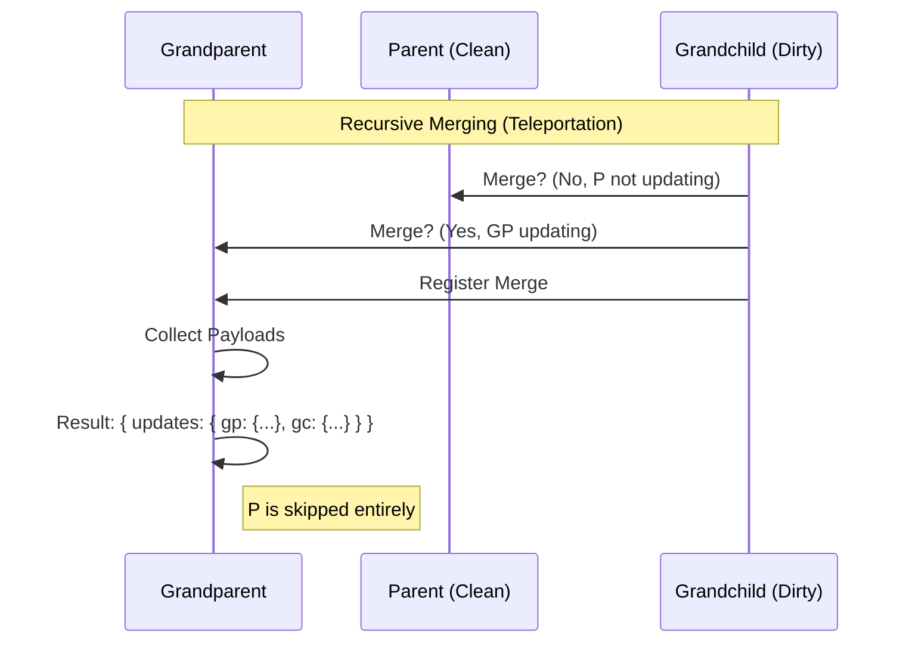
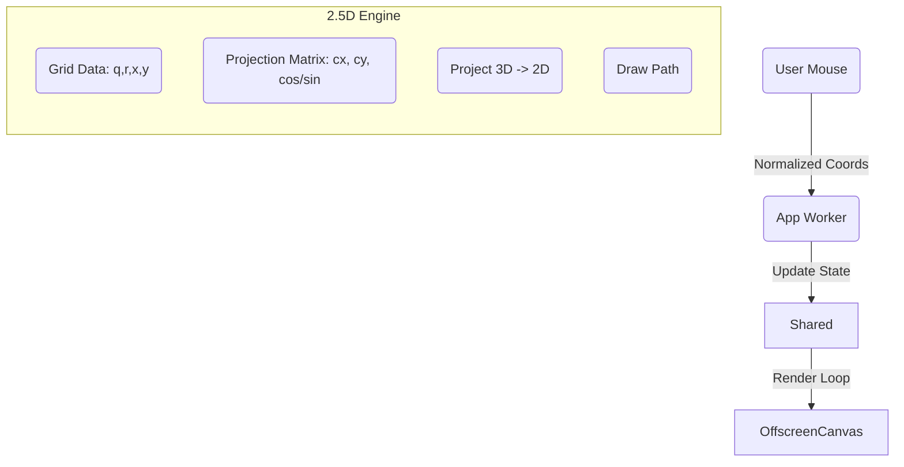

# Neo.mjs v11.23.0 Release Notes

**Release Type:** Visual Identity & Core Architecture  
**Stability:** Production-Ready  
**Upgrade Path:** Drop-in replacement for v11.22.0  

> **TL;DR:** **v11.23.0 completes "The Semantic Environment".** We didn't just add a "Dark Mode"; we engineered a living system where every component, pixel, and transition is deeply theme-aware. This release debuts **The Wave** (a spatial transition engine), **The Event Horizon** (a physics-driven singularity), and **VDOM Teleportation** (an O(1) update strategy). It represents a new peak in velocity: **153 tickets** resolved in **5 days** (30.6 tickets/day), proving that **Context Engineering** has permanently altered the trajectory of software development.

---

## ⚡ Velocity Case Study: The "Teleportation" Paradox

To prove the "Human + AI" velocity, let's look at **Epic #8834: Batched Disjoint VDOM Updates**.

*   **The Context:** We initially prototyped **"Leapfrog Merging"** to bundle parent and child updates. While efficient for bandwidth, we discovered it required expanding "clean" intermediate ancestors (Bridge Paths) to maintain tree integrity. For deep hierarchies, this introduced O(N) processing overhead on the Worker thread.
*   **The Challenge:** We needed a way to update a deep descendant *without* touching its ancestors ("Teleportation"), while still maintaining the ability to bundle multiple updates into a single worker message (Transaction). This created a paradox: How do you bundle disjoint nodes into a tree structure without connecting them?
*   **The Resolution:** We shifted the VDOM protocol from a "Tree Delta" to a **"Disjoint Batch"**.
    1.  **Worker API:** Implemented `vdom.Helper.updateBatch` to accept a flat map of disjoint payloads.
    2.  **Manager Logic:** The `VDomUpdate` manager now identifies transaction groups but instructs the `TreeBuilder` to **prune all children** (Depth 1) for every component in the batch.
    3.  **Result:** A Parent and its Grandchild can now update in the same 16ms frame, in the same message, with **zero** processing of the intermediate Child.

### Recursive Merging Architecture

This new architecture allows a "Dirty Grandchild" to merge its update payload directly into a "Dirty Grandparent", skipping the "Clean Parent" entirely. This is **O(1)** relative to tree depth.



**Actual Timeline (Jan 20, 2026):**
*   **18:56 UTC** - Epic Created.
*   **20:06 UTC** - Initial "Teleportation" prototype implemented.
*   **20:36 UTC** - Regression Fixed (Ghost Updates in RealWorld tests).
*   **22:22 UTC** - Optimization: Restored Sparse Tree pruning for deep updates.
*   **02:21 UTC** - **Epic Closed**. Full architectural shift completed in **7.5 hours**.

---

## 🌑 The Dark Mode Engine

> **"Dark Mode is not a preference. It's an environment."**

v11.23.0 doesn't just "add dark mode" to the Portal App. We rebuilt the visual foundation of the entire Neo.mjs platform to support dynamic, system-wide theming. This architecture is now available for every Neo.mjs application.

### 1. The Semantic Token System
We have fully realized the Design Token architecture originally established by **Max Mertens (@mxmrtns)**.

*   **The Foundation:** The `neo-light` theme introduced our tri-layer system (Core → Semantic → Component) over two years ago.
*   **The Expansion:** `neo-dark` proves the flexibility of this architecture by reusing the exact same token structure. We simply map new values to the existing semantic variables, requiring zero code changes in the components themselves.
*   **The Polish:** We conducted a deep audit to eradicate any remaining hardcoded values that bypassed this system, ensuring 100% compliance across Grids, Tables, Trees, Tabs, Menus, Calendars, Dialogs, and Forms.
*   **Deep Integration:** We built adapters for **Monaco Editor** (VS Code), **Mermaid.js**, and **HighlightJS** to ensure they all switch themes instantly and coherently with the app. This architecture is now available for every Neo.mjs application.

```scss
// 🚫 Before (Hardcoded)
.my-component {
    background-color: #ffffff;
    color: #333333;
}

// ✅ After (Semantic)
.my-component {
    // Automatically switches values based on [data-theme]
    // No JS required for runtime switching
    background-color: var(--sem-color-bg-default);
    color: var(--sem-color-text-primary-default);
}
```

### 2. Spatial Theme Transitions ("The Wave")
Switching themes shouldn't be a flashbang. We implemented a **Spatial Transition Engine** using the View Transitions API.
*   **The Trigger:** Clicking the theme toggle captures the exact mouse coordinates.
*   **The Effect:** The new theme expands radially (`clip-path: circle`) from the cursor, physically "washing" the new environment over the old one.
*   **The Engine:** This runs entirely on the **Compositor thread** (off-main-thread), ensuring 60fps performance even while the heavy layout recalculation happens in the background.

```javascript
// ViewportController.mjs
document.startViewTransition(() => {
    this.setTheme(newTheme);
}).ready.then(() => {
    // Spatial Wipe Effect driven by cursor position
    document.documentElement.animate(
        { clipPath: [
            `circle(0px at ${x}px ${y}px)`,
            `circle(${radius}px at ${x}px ${y}px)`
        ]},
        { duration: 500, easing: 'ease-in-out', pseudoElement: '::view-transition-new(root)' }
    );
});
```

---

## 🌌 New Visualizations: Physics-Driven UI

We deployed **two new** high-fidelity visualizations running in SharedWorkers, proving that "Zero-Allocation" graphics can deliver desktop-class experiences in the browser.

### 1. The Event Horizon (Footer)
A visualization of the **Agent OS** core as a central singularity.
*   **Global Attractor:** A central gravity well pulls thousands of particles into a spiral death-dance.
*   **Local Gravity Wells:** Hovering over footer links creates local gravity fields, physically pulling particles out of the main stream to orbit the cursor.
*   **Interaction:** The system feels alive, responding to user presence with fluid dynamics rather than static CSS states.

### 2. The Neural Fabric (Services)
A visualization of the **Application Engine** runtime.
*   **2.5D Volumetric Projection:** A hexagonal grid projected onto a tilted plane with 3D rotation based on mouse position.
*   **Agentic Traffic:** "Neural Agents" (intelligent packets) traverse the grid at high speed. Unlike random particles, they have agency: they stop, scan nodes, and trigger "Compilation Events".
*   **Construction Physics:** High-traffic areas trigger the formation of "Super Modules" (fused hex clusters) that assemble with an implosion effect and dissolve with a digital fragmentation effect, visualizing the engine's constant object lifecycle.

#### The Projection Pipeline
To achieve 3D depth without the 600KB+ overhead of Three.js, we implemented a manual 2.5D projection engine directly in the SharedWorker.



---

## 🛡️ System Resilience

We hardened the runtime against the chaos of the real world.

*   **Zombie App Prevention:** Implemented a **"Network-First"** strategy for config files (`neo-config.json`). The App Worker now strictly enforces version synchronization with the Service Worker, triggering an immediate, safe reload if a mismatch is detected (e.g., after a deployment).
*   **Async Destruction Traps:** We audited the core framework for "Async Death" scenarios. We introduced a `trap()` pattern that wraps Promises (Fetch, XHR, Dynamic Imports). If the component is destroyed while the promise is pending, it silently rejects with a suppressed `Neo.isDestroyed` signal, preventing "Set state on destroyed component" crashes.

    ```javascript
    // Before: Unguarded async operation
    async loadData() {
        const data = await fetch('/api/data');
        this.data = data; // 💥 Crash if component destroyed during fetch
    }

    // After: Trapped async operation
    async loadData() {
        const data = await this.trap(fetch('/api/data'));
        this.data = data; // ✅ Safe: auto-aborted if destroyed
    }
    ```

*   **Native ESM Builds:** All workers (App, Data, VDom) now output **Native ES Modules** in production. No more Webpack wrappers. This unlocks better tree-shaking and future-proofs the engine for Top-Level Await.

---

## 🤖 The AI-Native Advantage

This release was built at a velocity that shouldn't be possible for a small team.
*   **153 Tickets Resolved**
*   **76 AI Sessions Summarized**
*   **713 Memories Created** (Peak Session: 87 turns)

How? By treating the AI as a stateful team member, not a chatbot. We use the **Memory Core** to persist architectural decisions and the **Neural Link** to give the AI eyes on the runtime.

### Memory Core: The "Read-Write" Brain
Most AI agents are amnesic. Ours references a persistent vector database of every past decision.
*   **Case Study (Session `61e67c39`):** The Agent encountered a logical paradox in the VDOM update engine where "Collision" and "Merge" logic seemed to conflict. Instead of guessing, it queried its own history (`query_summaries`), retrieved the specific architectural constraints of the "Leapfrog" pattern from v11.21, and resolved the deadlock by distinguishing between `Collision` (Safety) and `Merge` (Optimization).

### Neural Link: The "Eyes" of the Engine
The AI doesn't just read code; it inspects the living application via WebSocket.
*   **Case Study (Session `ab8b63f2`):** The "Phantom Mount" bug—where a component layout broke silently—was diagnosed by the Agent querying the App Worker's live component tree. It realized the component was marked `mounted: true` *before* the DOM node existed, a race condition invisible to static analysis.

---

## 📦 Full Changelog

### 🌑 Epic: Portal Dark Theme & Visuals (#8727)
*   **Feat:** Implement Semantic Token Infrastructure (Light/Dark) (#8728, #8731, #8737, #8738, #8741)
*   **Feat:** Spatial "Wave" Theme Transition (#8856)
*   **Feat:** Portal App Dark Mode Default (#8855)
*   **Feat:** Persist & Auto-Detect System Theme (#8843, #8844)
*   **Feat:** Theme-Aware Monaco Editor & HighlightJS (#8845, #8846, #8847)
*   **Feat:** Theme-Aware Mermaid Diagrams (#8754, #8756, #8757)
*   **Feat:** "Event Horizon" Physics Footer (#8854, #8852, #8853)
*   **Feat:** "Neural Fabric" Services Canvas (2.5D Hex Grid) (#8702, #8703, #8710, #8711, #8712, #8713, #8714, #8715, #8716, #8717, #8718, #8721, #8722, #8723, #8724, #8725)
*   **Refactor:** Dark Theme for Grid, Table, List, Tree (#8734, #8747, #8788)
*   **Refactor:** Dark Theme for Tab, Menu, Toolbar (#8735, #8742, #8748, #8729, #8740, #8746)
*   **Refactor:** Dark Theme for Calendar, Dialog, Tooltip (#8736)
*   **Refactor:** Dark Theme for Markdown & Portal Content (#8739, #8749, #8750, #8751, #8752, #8753, #8768, #8769, #8770, #8772)
*   **Refactor:** General Components, Containers, Forms (#8732, #8733)
*   **Refactor:** Portal Canvases & Theme Switching (#8696, #8699, #8743, #8744, #8745, #8771, #8775, #8776, #8777, #8778, #8779)
*   **Fix:** Visual Polish & Bugs (#8701, #8730, #8773, #8774, #8780)

### 🚀 Core & VDOM Architecture
*   **Feat:** Batched Disjoint VDOM Updates ("Teleportation") (#8834, #8835, #8836, #8841, #8842)
*   **Feat:** Sparse Tree Generation for Deep Updates (#8832, #8833)
*   **Feat:** Recursive VDOM Batching & Collision Filtering (#8838, #8840, #8829)
*   **Feat:** Native ESM Output for All Workers (#8762, #8763)
*   **Feat:** "Network First" Config Loading Strategy (#8759)
*   **Fix:** VDOM Race Condition (Duplicate Nodes) (#8814, #8819, #8820, #8821, #8822, #8823, #8824, #8825, #8826, #8827, #8828, #8830)
*   **Fix:** Cross-Window VDOM Context Loss (#8849, #8850)
*   **Fix:** Async Destruction Hardening (Trap Pattern) (#8801, #8802, #8803, #8804, #8805, #8806)
*   **Fix:** Service Worker Version Sync & Recovery (#8694, #8695)
*   **Fix:** Canvas Remount Race Conditions (#8809, #8811)
*   **Fix:** Phantom Mounts in Nested TabContainers (#8812, #8813)

### 🛠️ Infrastructure & Build
*   **Feat:** Refactor `buildScripts` Directory Structure (#8764, #8765, #8766, #8767)
*   **Feat:** Exclude DefaultConfig from Bundles (#8760, #8761)
*   **Refactor:** Standardize Portal Canvas Architecture (`Portal.canvas.Base`) (#8791, #8792, #8793, #8794, #8795, #8796)
*   **Perf:** Zero-Allocation Refactor for ServicesCanvas (#8719)
*   **Perf:** MagicMoveText Optimization & Fixes (#8783, #8797, #8798, #8799, #8800)
*   **Perf:** Render Loop Optimization (#8692, #8693, #8781, #8782, #8789, #8790)
*   **Misc:** Portal Content & Refactoring (#8398, #8580, #8621, #8700, #8720, #8726, #8784, #8785, #8786, #8787, #8808, #8815, #8816, #8817, #8818, #8851)


All changes delivered in 1 atomic commit: [6ead20b](https://github.com/neomjs/neo/commit/6ead20b84d180b45daad10c3f1c58d94391d3b84)
