# Neo.mjs v11.24.0 Release Notes

**Release Type:** Core Architecture & UX Physics  
**Stability:** Production-Ready  
**Upgrade Path:** Drop-in replacement for v11.23.0  

> **TL;DR:** **v11.24.0 is the "Grid Supremacy" update.** We successfully engineered the convergence of our two most complex systems: **Buffered Row Recycling** (Grid) and **VDOM Teleportation** (Disjoint Updates). This required a foundational shift to **App-Worker Authority** for VDOM identity to eliminate race conditions in high-frequency mutable views. Additionally, we brought **Desktop Drag-Scrolling** and **Kinetic Physics** to the Grid, delivering a native-app feel across all devices. **46 tickets** resolved in **10 days**.

---

## ⚡ Velocity Case Study: The "Stephanie++" Paradox

To prove the "Human + AI" velocity, let's look at the investigation that led to **Epic #8899: App-Worker Authority**.

*   **The Context:** Historically, Neo.mjs followed a **"Render First, Sync IDs Later"** pattern. Components assigned their own IDs, but granular child nodes (like a text `<span>`) were often sent without IDs. The VDOM Worker would fill these gaps, and the App Worker would try to sync them back after the roundtrip. This worked flawlessly for 98% of use cases.
*   **The Discovery:** We realized that because **VDOM State is Mutable by Design**, structural changes (like Container moves, inserts, or Buffered Grid scrolling) could shift the array structure *before* the sync logic ran. The "Lazy Sync" heuristic would then apply stable IDs to the wrong nodes based on outdated index positions ("Node Stealing"), creating duplicates like "Stephanie ++Stephanie ++".
*   **The Fix:** We optimized the workflow to enforce authority upfront.
    1.  **Before:** App (Partial IDs) -> Worker (Fill IDs) -> Sync back (Heuristic).
    2.  **After:** App (`TreeBuilder`) assigns **all** missing IDs **Just-In-Time**, *before* the update cycle starts.
    3.  **Result:** The App Worker is now the **Source of Truth**. The VDOM Worker acts purely as a renderer, while the App Worker maintains full autonomy over node identity. This enables safe, high-frequency VDOM manipulations in the App Worker without waiting for ID synchronization roundtrips.

```mermaid
sequenceDiagram
    participant App as App Worker
    participant VDom as VDOM Worker
    participant Main as Main Thread

    Note over App, Main: 🔴 BEFORE: Lazy Sync (The Race Condition)
    App->>VDom: Update (Partial IDs)
    VDom->>VDom: Generate Missing IDs
    VDom->>Main: Apply Patch
    VDom-->>App: Sync IDs Back (Async)
    Note right of App: 💥 Structural Mutation (Moves/Inserts) = ID Mismatch

    Note over App, Main: 🟢 AFTER: App Authority (JIT Generation)
    App->>App: TreeBuilder: Generate ALL IDs (JIT)
    App->>VDom: Update (Full IDs)
    VDom->>Main: Apply Patch
    Note right of App: ✅ IDs are stable before VDOM ever sees them
```



**Actual Timeline (Jan 28, 2026):**
*   **15:29 UTC** - Epic Created.
*   **15:49 UTC** - JIT ID Generation Implemented in `TreeBuilder`.
*   **15:50 UTC** - Obsolete Sync Logic Deleted (Negative Code!).
*   **17:15 UTC** - **"Scoped Deterministic IDs"** invented for Functional Components to ensure they play by the same rules without state.
*   **17:41 UTC** - **Epic Closed**. A foundational stability upgrade in **2 hours, 12 minutes**.

---

## 🛡️ Grid Resilience: Foundation Hardening

We dedicated this release to restoring the **Big Data Grid** example (`apps/bigData`) to its full glory.

> **[Experience the 20 Million Cell Demo](https://neomjs.com/examples/grid/bigData/index.html)**

While the demo starts conservatively (1k rows), it is engineered to scale instantly to **100k rows x 200 columns (20M cells)**. Simply open the **Controls Panel** (Hamburger button, top-right) to change dimensions at runtime. It had suffered several regressions which are now resolved:

*   **Fixed Data Regeneration:** Filtering the grid previously caused the 100k record Store to accidentally reset to the default 1,000 records. We implemented "Shadow Collection" protection in `Neo.collection` to prevent data loss.
*   **Restored LoadMask:** The "Loading..." mask had disappeared due to the VDOM engine yielding too late. We adjusted the `VdomLifecycle` timing to ensure the mask paints *before* the heavy data generation blocks the thread.
*   **Turbo Mode Re-enabled:** We ensured `autoInitRecords: false` is respected, allowing the grid to ingest 100,000 raw data objects instantly without paying the instantiation cost upfront.

---

## 🏎️ Velocity Case Study 2: The Kinetic Grid Evolution

> **"A masterpiece of architectural evolution at the speed of thought."**

While the VDOM improvements were about *Stability*, this Epic was about *Feel*. It perfectly demonstrates our "Human + AI" workflow, where a simple bug fix evolved into a complete architectural pivot in a single afternoon (Jan 30, 2026).

*   **The UX Gap:** We identified a critical usability hole: Desktop users without trackpads or horizontal scroll wheels were stuck. Navigating wide grids via arrow keys felt brittle.
*   **The Idea (#8911):** "Why restrict drag-to-scroll to mobile?" We enabled mouse-drag support in the App Worker to give every user a "Hand Tool" experience.
*   **The Bottleneck (#8912):** It worked, but it felt "chunky". The latency of sending high-frequency `mousemove` events from Main -> Worker -> Main was palpable.
*   **The Pivot (#8913 - The "Speed of Thought" Moment):** Instead of optimizing the Worker path, we made a radical decision: **Move the interaction to the Main Thread.** We created `Neo.main.addon.GridDragScroll`, a specialized addon that lives in the UI thread and manipulates the DOM directly. Latency dropped to zero.
*   **The Unification (#8914):** "If the Main Thread is faster, why are we still handling Touch in the Worker?" We moved *all* scrolling logic (Touch & Mouse) into the addon, unifying the codebase.
*   **The Physics (#8916):** "It feels dead when you let go." We added a Kinetic Energy model with exponential decay. Now, you can "throw" the grid with your mouse, just like on a phone.

**Actual Timeline (Jan 30, 2026):**
*   **10:22 UTC** - **The Spark (#8910):** Fixed a simple console warning about `preventDefault` on touch events.
*   **10:49 UTC** - **The Idea (#8911):** Enabled mouse-drag in App Worker.
*   **11:51 UTC** - **The Pivot (#8913):** Decision made to move interaction to the **Main Thread**.
*   **13:03 UTC** - **The Unification (#8914):** Moved Touch logic to the Main Thread Addon.
*   **13:25 UTC** - **The Physics (#8916):** Kinetic Energy model added.
*   **13:55 UTC** - **Epic Closed.** A native-grade engine in **3 hours, 33 minutes**.

**The Result:** A native-grade, physics-based scrolling engine that handles both Mouse and Touch with zero latency, architected, implemented, and polished in **3 hours, 33 minutes**.

### 1. Main Thread Addon (`GridDragScroll.mjs`)
We introduced a new architectural pattern: **Main Thread Addons** that take over specific high-frequency interactions.
*   **Zero Latency:** The addon listens to `touchmove` and `mousemove` directly on the DOM.
*   **Unified Physics:** Whether you use a Touchscreen or a Mouse (Drag), the experience is identical.
*   **Over-Drag:** By attaching global capture listeners during the drag, you can throw the grid around even if your cursor leaves the window.

### 2. The Physics Engine
It's not just 1:1 dragging. We implemented a **Kinetic Energy** model.
*   **Velocity Tracking:** The addon maintains a rolling buffer of movement vectors.
*   **Momentum:** Releasing the grid triggers a `requestAnimationFrame` loop with **Exponential Decay** friction (`0.95`).
*   **The Feel:** You can "throw" the grid. It feels weighty, responsive, and indistinguishable from a native OS control.

---

## 💻 Code in Action

Here is how we implemented the **Unified Physics** and **Kinetic Engine** in the Main Thread Addon.

### Unified Event Handling
We normalized Mouse and Touch events into a single coordinate system, applying `capture: true` to ensure the drag operation continues even if the cursor leaves the browser window (Over-Drag).

```javascript
/**
 * @param {MouseEvent|TouchEvent} event
 */
onDragStart(event) {
    // ...
    if (event.type === 'mousedown') {
        // Global capture allows "throwing" the grid outside the window bounds
        document.body.style.setProperty('cursor', 'grabbing', 'important');
        document.addEventListener('mousemove', me.activeDrag.listeners.move, {capture: true});
        document.addEventListener('mouseup', me.activeDrag.listeners.end,    {capture: true})
    } else {
        // Passive: false is crucial to prevent native browser scrolling
        document.addEventListener('touchmove', me.activeDrag.listeners.move, {capture: true, passive: false});
        document.addEventListener('touchend', me.activeDrag.listeners.end,   {capture: true})
    }
}
```

### The Kinetic Engine
The momentum loop uses exponential decay to simulate friction. It runs entirely in the UI thread (`requestAnimationFrame`), bypassing the App Worker to ensure 60fps smoothness.

```javascript
autoScroll(data) {
    let me = this,
        {friction, registration, velocity} = data;

    // Stop when energy is depleted
    if (Math.abs(velocity.x) < 0.1 && Math.abs(velocity.y) < 0.1) {
        return
    }

    // Direct DOM manipulation (Zero Latency)
    if (registration.containerElement) {
        registration.containerElement.scrollLeft -= velocity.x
    }
    if (registration.bodyElement) {
        registration.bodyElement.scrollTop -= velocity.y
    }

    // Apply friction
    velocity.x *= friction;
    velocity.y *= friction;

    // Schedule next frame
    me.activeDrag = {
        id       : data.id,
        animation: requestAnimationFrame(me.autoScroll.bind(me, data))
    }
}
```

---

## 🛡️ Data Integrity & Collection Hardening

We conducted a deep audit of the `Neo.collection` and `Neo.data.Store` classes, driven by edge cases in the Big Data Grid.

*   **The Shadow Collection Fix:** We discovered that `Collection.filter()` creates a shadow clone (`allItems`). Previously, operations like `clear()` or `filter()` could accidentally wipe this shadow source, leading to permanent data loss when un-filtering. We introduced `clear(reset=false)` to allow "View Clearing" without "Source Clearing".
*   **Turbo Mode:** The Big Data example now correctly uses `autoInitRecords: false`, instantiating records lazily for 100k+ datasets.
*   **Lifecycle Cleanup:** `Collection.destroy()` now recursively destroys its internal `sorters`, `filters`, and `allItems`, plugging a potential memory leak.

---

## 📚 Testing Documentation Overhaul

We have addressed a major documentation gap by publishing a complete suite of **Testing Guides**. While the migration from Siesta to Playwright was completed in Q4 2025, the documentation has now caught up to provide a first-class onboarding experience.

These guides serve as the perfect baseline for both **Developers** and **AI Agents** to master the framework's unique testing pillars.

### Overview: The Three Pillars
> **[Read the Guide](https://github.com/neomjs/neo/blob/dev/learn/guides/testing/Overview.md)**

Explains *why* we need three different environments (Node.js, Real Browser, specialized Harness) to test a multi-threaded App Engine.

### 1. Unit Testing (Logic & State)
> **[Read the Guide](https://github.com/neomjs/neo/blob/dev/learn/guides/testing/UnitTesting.md)**

**Focus:** Core Logic, VDOM Diffing, State Management.
**Environment:** Simulated Single-Thread Node.js.
*   Learn how to simulate the App Worker environment in Node.js for instant feedback (< 10ms).
*   Understand namespace isolation strategies to prevent cross-test pollution.
*   Master the **Developer Workflow**: Running single files, debugging with `--debug`, and using the "Safety Net".

### 2. Component Testing (Visuals & Events)
> **[Read the Guide](https://github.com/neomjs/neo/blob/dev/learn/guides/testing/ComponentTesting.md)**

**Focus:** DOM Events, Layout, CSS, Browser APIs.
**Environment:** Real Browser (Chrome/Firefox/Webkit).
*   Learn the **Remote Control** architecture using the `neo` Playwright fixture.
*   Understand how to drive the App Worker from the test runner to verify real DOM updates.
*   Explore advanced patterns like **E2E Testing** and **Custom Test Harnesses**.

### 3. Benchmarking (Performance)
> **[Read the Guide](https://github.com/neomjs/neo/blob/dev/learn/guides/testing/Benchmarking.md)**

**Focus:** Resilience, Concurrency, FPS.
**Environment:** Specialized Harness (Separate Repo).
*   Understand the philosophy of **"Runtime vs. Load Time"**: Why we measure the "Marathon" (8 hours of usage), not just the "Sprint" (Page Load).
*   Learn about **Atomic In-Browser Measurement** using `MutationObserver` to eliminate test-runner latency.

---

## 📦 Full Changelog

### 🏗️ Epic: App-Worker Authority (#8899)
*   **Feat:** Implement JIT ID Generation in `TreeBuilder` (#8900)
*   **Feat:** Implement "Scoped Deterministic IDs" for Functional Components (#8903)
*   **Refactor:** Remove Obsolete ID Sync Logic from `VDom.mjs` (#8901)
*   **Fix:** VDOM ID Corruption during Component Recycling (#8898)
*   **Fix:** Preserve Functional Component Scroll State with Early ID Generation (#8906)
*   **Test:** Verify VDOM ID Architecture Stability (#8902, #8904)

### 🏎️ Epic: Kinetic Grid & Main Thread Addon
*   **Feat:** Main Thread Addon for High-Performance Grid Drag Scrolling (#8913)
*   **Feat:** Implement Kinetic/Momentum Scrolling (#8916)
*   **Feat:** Consolidate Touch & Mouse Logic into Addon (#8914, #8915)
*   **Feat:** Enable Mouse Drag Scrolling in ScrollManager (#8911)
*   **Enhance:** Enhance Mouse Event Data (buttons/button) (#8912)
*   **Fix:** Prevent Default on uncancelable events (#8910)

### 📊 Epic: Grid Resilience & Big Data
*   **Feat:** Add `reset` parameter to `Collection.clear()` (#8909)
*   **Fix:** Ensure `Collection.clear()` handles `allItems` correctly (#8886)
*   **Fix:** Prevent `filter()` from clearing `allItems` on restore (#8887)
*   **Fix:** Big Data Grid regeneration regression (#8908)
*   **Fix:** LoadMask regression in Big Data Grid (#8907)
*   **Fix:** JS Errors in Filter logic (#8885)
*   **Perf:** Enable Turbo Mode for Big Data Grid (#8889)
*   **Refactor:** Deep cleanup in `Collection.destroy()` (#8888)

### 🚀 Core & Performance
*   **Perf:** Implement Reverse Component Map (O(1) Child Lookup) (#8872)
*   **Fix:** `syncVnodeTree` should nullify vnode for removed children (#8868)
*   **Fix:** Harden `getById` against null nodes (#8870)
*   **Fix:** Release script regex for Footer (#8866)

### 📚 Documentation & Testing
*   **Feat:** Implement Global Test Safeguard for `Neo.isDestroyed` (#8895)
*   **Refactor:** Intercept `process.emit` for Unhandled Rejections (#8896)
*   **Docs:** Restructure Testing Guides (Unit, Component, Overview) (#8878, #8879)
*   **Docs:** Replace Siesta Guide with Playwright (#8877)
*   **Docs:** Update Testing Guides with Benchmarks Insights (#8880, #8881)
*   **Docs:** Enhance ComponentTesting.md (#8882, #8883, #8884)
*   **Test:** Fix Namespace Collisions in Unit Tests (#8876)
*   **Test:** Verify Wrapper Node Lifecycle (#8875)


All changes delivered in 1 atomic commit: [6984add](https://github.com/neomjs/neo/commit/6984addb0dbbc8f808f22d5cd81378ce4b1c565c)
