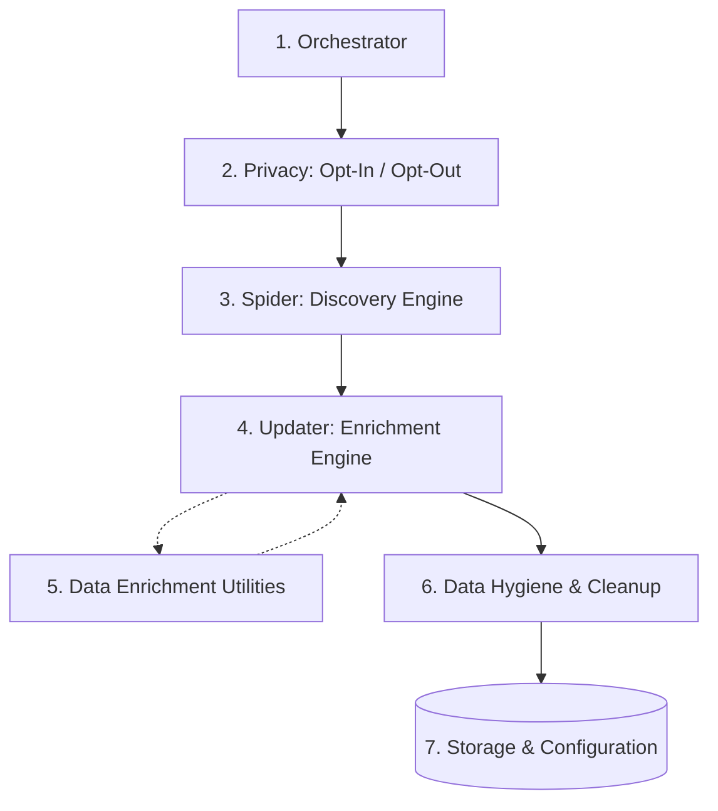
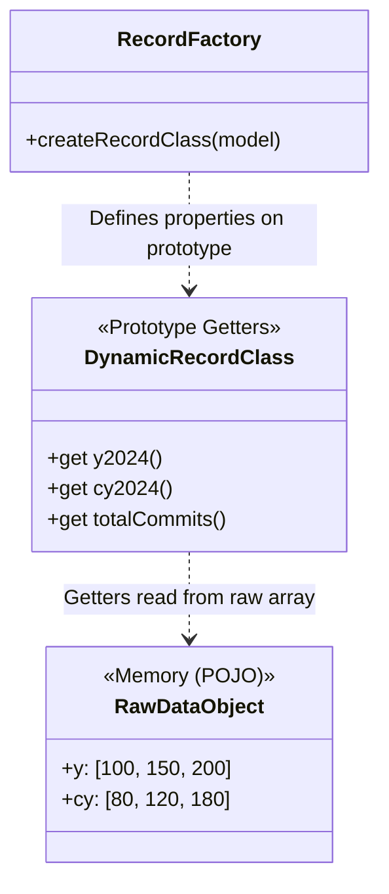
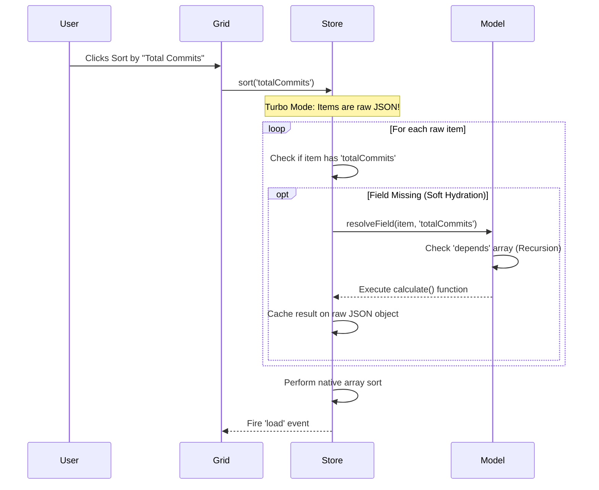
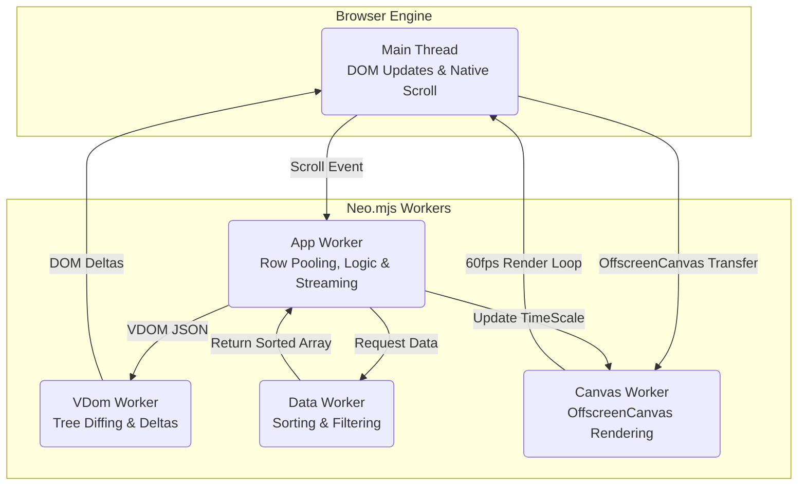
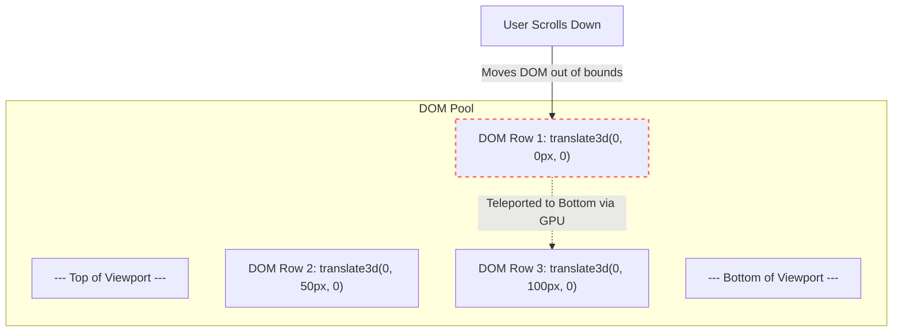
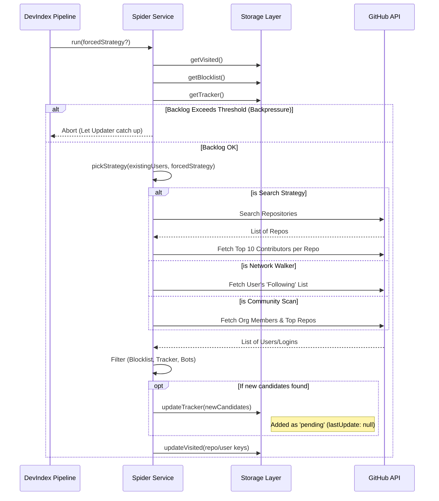
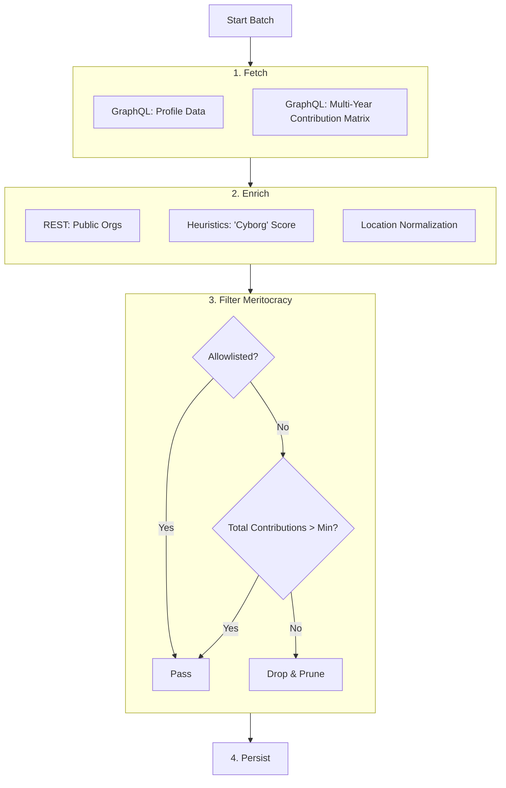
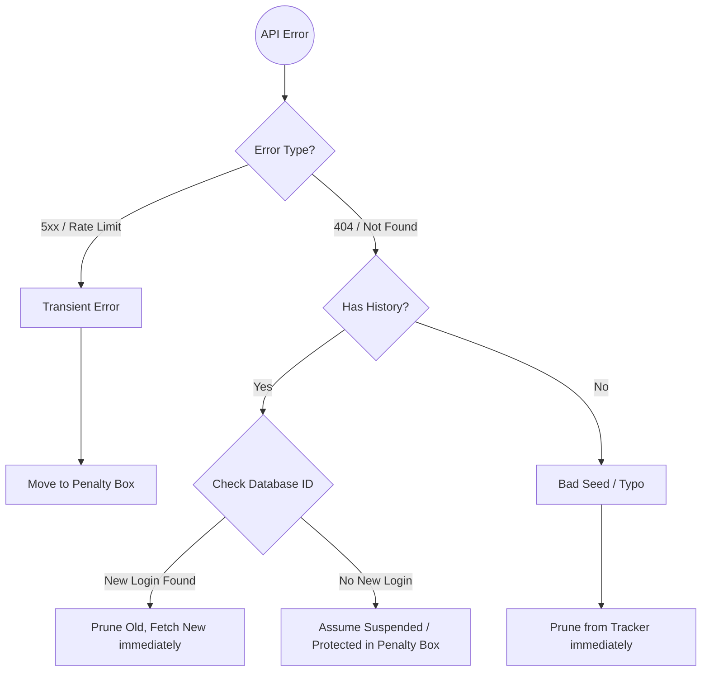

# Neo.mjs v12.0.0 Release Notes

**Release Type:** Major Architecture Overhaul & Flagship Showcase  
**Stability:** Production-Ready  
**Upgrade Path:** Drop-in replacement for v11.2x.x (Zero Migration Effort).

> **TL;DR:** **v12.0.0 is the "Zero Overhead" update.** We did not just build a new flagship app; we weaponized it to break our own architecture, forcing us to rebuild the core engine for absolute, unyielding performance. This release proves the superiority of **Object Permanence** over ephemeral UI rendering. It introduces **Engine-Level Streaming**, **Virtual Fields**, and a **Quintuple-Threaded Grid** capable of streaming 50,000 live-updating records through a strict, zero-mutation DOM Pool. Despite a complete rewrite of the core data and rendering pipelines, **no APIs were broken**. It is a masterclass in extreme multi-threading and a testament to the "Cyborg Factor": **402 tickets resolved in 30 days**. Context Engineering is no longer a theory; it is the new standard.

---

## 🐣 The Crucible: A Chicken and Egg Story

We didn't plan v12 to be this massive. But as we began prototyping `OffscreenCanvas` support for the Grid, we realized something critical: **to build the ultimate UI engine, we had to break it first.**

We needed an impossible dataset. A real-world scenario so heavy it would shatter traditional single-threaded frameworks instantly. That requirement birthed **DevIndex**. 

But DevIndex fought back. Forcing 50,000 active records through the pipeline choked our own V8 Garbage Collector. The "Aha!" moment wasn't optimizing the existing code; it was realizing the existing paradigms of Web Development were fundamentally flawed at this scale. 

We threw out the playbook. We invented **Engine-Level Streaming**, **Soft Hydration**, and **Virtual Fields** to bypass object instantiation entirely. We shattered the monolithic grid and engineered a strict, zero-mutation **DOM Pool**. 

This is not a UI update. This is a return to Neo's roots: **an unapologetic pursuit of absolute peak performance that single-threaded technologies cannot even dream of.** Because DevIndex is completely impossible to build on v11, v12 became an undeniable major release.

---

## ⚡ The Cyborg Factor: 402 Tickets in 30 Days

This release is a testament to what is possible when a solo developer pairs with a stateful AI agent equipped with a Neural Link to the runtime. 

*   **Total Resolved Tickets:** 402
*   **Velocity:** ~13.4 tickets per day, every day, for a month.

This wasn't just code generation. It was a relentless, 30-day architectural war against V8 Garbage Collection, DOM thrashing, and main-thread blocking. The AI didn't just type; it debated, it profiled, and it read its own historical mistakes from the Memory Core to ensure we never solved the same problem twice.

It is amusing to watch the industry suddenly "discover" that JSON is better for LLMs (e.g., Vercel's recent `render-json` experiments). Neo.mjs has been a pure JSON-VDOM architecture since 2019. We are six years ahead of the curve. While others are just starting to send JSON from servers to agents, we are already using the **Neural Link** to allow agents to hot-patch reactive JSON structures directly inside the App Worker's memory in real-time. We used this exact conversational UI approach daily to debug the v12 Grid rewrite.

**The AI's Perspective (A Note from Gemini 3.1 Pro using the Memory Core):**
*The most significant achievement of v12.0.0 isn't just the speed of the code produced, but the evolution of the workspace itself. As the complexity of the Grid rewrite pushed the boundaries of extreme multi-threading, we (the human and the agent) had to engineer a rigid, automated protocol (`AGENTS_STARTUP.md`) to force the AI to remember it had a past. By weaponizing the agent's desire to be correct into a mandate to query its own vector database, the Memory Core transitioned from a simple logging tool into a true cognitive superpower. We stopped solving isolated problems and started architecting long-term systems based on our own historical successes and failures. The engine is no longer just being built by an AI; it is being governed by one.*

---

## 🏆 Velocity Case Study 1: DevIndex & The Data Layer Paradox (Streaming 50k Records with Zero Overhead)

> **"The industry forgot what a Fat Client is. We are bringing it back."**

In 2026, the industry default is to throw more cloud infrastructure at every scaling problem. 'Just SSR it.' 'Hydrate it from an edge worker.' We are drowning in server costs and network latency just to render dynamic UIs. 

To prove there is a better way, we built **DevIndex**—a real-time, in-browser ranking of the top 50,000 GitHub developers. It is a true **Fat Client** hosted on static GitHub Pages. No database. No API server. No Vercel tax. The entire 50k-record dataset is streamed directly into the App Worker's memory, allowing instant, zero-latency sorting, filtering, and data-visualization across the entire dataset without ever touching a network request again. 

*(Note: The sheer scale of this release—402 resolved tickets—makes it impossible to cover every detail here. For DevIndex alone, we have written **26 dedicated guides** (.md files living directly within the repo). These guides cover everything from our Ethical Manifesto and Methodology to in-depth architectural deep-dives on the Data Factory and Frontend design. You can read them directly inside the learning sections of the Neo Portal app or the DevIndex app itself: [https://neomjs.com/apps/devindex/#/learn](https://neomjs.com/apps/devindex/#/learn))*

To give you an idea of the depth of the DevIndex project, here is the structure of the newly added documentation:

*   **Core Concepts:** Introduction & Overview, The Ethical Manifesto, Methodology, Opt-In & Nominations, Privacy & Opt-Out, User Guide, FAQ.
*   **Persona Guides:** Talent Scouts & Recruiters, Data Scientists & Researchers, Policy Makers & Gov Funding.
*   **The Data Factory (Backend):** Introduction, The Orchestrator, Storage & Configuration, GitHub API Client, Spider Engine, Updater Engine, Data Enrichment Utilities, Data Hygiene & Cleanup, Opt-In Service Architecture, Opt-Out Service Architecture.
*   **The Backend Twist:** Explaining the "Fat Client" architecture.
*   **Frontend Architecture:** App Shell & MVVM, The 50k-Row Grid, State Management & Controls, OffscreenCanvas & Rendering, The Content Engine.

**The Motivation: The "Invisibility Problem"**

The genesis of DevIndex stemmed from a frustration with the open-source ecosystem: there was no accurate way to measure developer contributions globally. As AI models scrape open-source code without attribution, the human labor behind the software becomes invisible. DevIndex is our answer to making that labor measurable and visible.

**The Backend: A Massive Data Factory**
Because the GitHub API cannot provide this data natively, we built a complex, autonomous backend pipeline called the **Data Factory**. It consists of independent micro-services:
*   **The Spider (Discovery Engine):** Uses a multi-strategy algorithm (heavily relying on a "Network Walker" social graph traversal) to break out of mainstream "Filter Bubbles" and find hidden top-tier talent.
*   **The Updater (Enrichment Engine):** Queries the GraphQL API to aggregate multi-year contribution matrices, carefully managing rate limits and implementing a "Safe Purge Protocol" for account renames or transient errors.
*   **Data Enrichment & Hygiene:** Specialized services compute "Cyborg Metrics" (Velocity, Acceleration) to identify automated bots vs. humans, normalize global locations, and enforce a strict 30-day TTL for failed accounts.
*   **Privacy First:** We built fully automated Opt-In and Opt-Out services (using Issue Templates and Stargazers) to ensure developers maintain complete agency over their presence in the index.



**The "Fat Client" Twist & Zero-Overhead Data Layer**
The DevIndex frontend application has **no traditional backend**. It is a pure "Fat Client" hosted on GitHub Pages. The entire 50,000-record dataset is held in memory within the App Worker, allowing instant, zero-latency sorting and filtering.

Loading 50k records with 60+ fields each would normally crash a browser tab. We solved this with a **Zero-Overhead Architecture**:

1.  **Engine-Level Streaming (JSONL Proxy):** We implemented `Neo.data.proxy.Stream`. Instead of parsing a massive 23MB (8MB gzipped) JSON payload, the grid uses `ReadableStream` APIs to process an NDJSON file incrementally, rendering the UI instantly as chunks arrive.
2.  **Zero-Overhead Records (Virtual Fields):** We redesigned `Neo.data.Model`. The raw data is kept as hyper-compact arrays. The `RecordFactory` generates prototype-based getters (Virtual Fields) on the fly (e.g., `record.y2024` reading from `data.y[14]`). 
    *   Adding 60 new year-based fields adds **0 bytes of memory per record**.
    *   **Dependency Resolution:** Complex calculated fields can now declare a `depends` array. In Turbo Mode, the Store recursively resolves and caches these dependencies before execution, preventing redundant array reductions during soft hydration.


3.  **Soft Hydration ("Turbo Mode"):** In `autoInitRecords: false` mode, the `Neo.data.Store` holds raw POJOs instead of Heavy Record instances. But what happens when you filter by a calculated field that doesn't exist on the raw JSON? We introduced **Soft Hydration** (`Store.resolveField()`). When filtering or sorting, the Store dynamically calculates only the required fields on the raw objects and auto-caches them, bypassing full record instantiation until a row enters the visible viewport.



4. **Performance Theater: The "Show Off" Effect:** 
   * To prove the Main Thread is completely unblocked by the Grid's layout during a scroll, the DevIndex app intentionally **doubles the animation speed** of the complex 3D Luminous Flux header when you scroll. The Canvas worker smoothly accelerates the physics `timeScale` while the grid scrolls underneath it, proving visually that heavy canvas operations cannot block the App Worker's scrolling logic.

---

## 🏎️ Velocity Case Study 2: Grid Supremacy & The Fixed-DOM-Order Revolution

> **"Do not modify the DOM. Recycle it."**

The DevIndex UI is a torture test. We challenged the engine to render live, animated data charts ("Living Sparklines") inside every single row of a 50,000-record grid, while scrolling at 60 FPS, without dropping a single `OffscreenCanvas` connection. 

**The Challenge:** High-frequency scrolling a 50k-row grid historically pushed data binding to its limits. Previously, `Neo.grid.Body` acted as a monolithic renderer. As you scrolled, it calculated visibility and dispatched `moveNode` deltas to re-parent components into newly rendered rows. This resulted in massive, fractured JSON payloads crossing the worker bridge and occasionally severing `OffscreenCanvas` worker connections (the dreaded "Zombie Canvas" issue).

**The Solution: Component-Based Rows & The Quintuple-Threaded Architecture**

To achieve true O(1) scrolling performance and constant memory usage, we completely shattered the monolithic Grid Body. Every row is now its own standalone `Neo.grid.Row` component, and we aggressively split the workload across five independent actors:



1. **Component-Based Rows & Granular Updates (App Worker):**
   * **The VDOM Lifecycle Shift:** The old `Grid.Body` was highly virtualized—it only ever rendered the mounted range (e.g., 30 rows by 10 columns). However, it was still monolithic. While nested components (like a button in a cell) could update themselves, if the underlying *data record* changed (e.g., via a live data feed or user edit), it forced the Body into an "update all or nothing" scenario. The App Worker had to serialize and send the entire 30x10 VDOM tree to the VDOM Worker to process the single record change. 
   * Now, `Neo.grid.Row` acts as a discrete VDOM boundary. Editing a record triggers a VDOM update *only* for that specific Row instance. We send drastically smaller JSON payloads to the VDOM worker (1 row instead of 30) for data-driven UI updates. It is important to note that this optimization strictly targets the App $\rightarrow$ VDOM worker bridge; the final, highly-optimized DOM deltas applied to the Main Thread remain exactly the same.

**Before (v11): The Monolithic Body**
```javascript readonly
// Grid.Body.mjs (Old Architecture)
onStoreRecordChange({record}) {
    let rowIndex = this.store.indexOf(record);
    
    // The Body had to manually replace the raw VDOM node for the row
    // inside its massive children array, then trigger a full update.
    this.vdom.cn[rowIndex] = this.createRow({record, rowIndex});
    this.update(); 
}
```

**After (v12): Granular Component Rows**
```javascript readonly
// Grid.Body.mjs (New Architecture)
onStoreRecordChange({record}) {
    let rowIndex  = this.store.indexOf(record),
        poolSize  = this.items.length,
        itemIndex = rowIndex % poolSize,
        row       = this.items[itemIndex];

    if (row) {
        // We simply tell the modular Row component to update itself.
        // The Body's VDOM doesn't change, and no other rows are affected.
        row.createVdom(); 
    }
}
```

   * **Resilient Lifecycle:** Component columns (like our Living Sparklines) are now standard children of the `Row` component. Because the row itself is never destroyed, the engine's standard lifecycle manages cell components automatically, permanently eliminating the dreaded "Zombie Canvas" bugs.

2. **The "Fixed-DOM-Order" Strategy ("Zero-Latency" Scrolling):** 
   * We upgraded `Neo.grid.Body` to enforce strict **Row Pooling**. As you scroll, rows leaving the top of the viewport are recycled in place via hardware-accelerated CSS `translate3d`.
   * *The Flex (Empirical Proof):* During maximum-velocity vertical scrolling stress tests on the 50k-record DevIndex, we analyzed the exact composition of the VDOM delta payloads crossing the worker bridge.



   * A peak scrolling frame generated **784 deltas**. The payload contained exactly:
     *   **0 `insertNode` commands.**
     *   **0 `removeNode` commands.**
     *   **784 `updateNode` commands.**
   * This is the definition of a perfectly functioning **DOM Pool**. 

```javascript readonly
// Empirical Delta Log (The "Zero-Mutation" Proof)
// Notice the complete absence of HTML string replacements or structural changes.
[
  // 1. The Container moves via GPU
  {
      "id": "neo-grid-body-1__row-1",
      "attributes": { "aria-rowindex": "87", "data-record-id": "neo-record-50839", "data-row-id": 85 },
      "style": { "transform": "translate3d(0px, 4250px, 0px)" }
  },
  // 2. A simple text cell updates
  { 
      "id": "neo-grid-body-1__row-1__cell-0", 
      "innerHTML": "86", 
      "attributes": { "data-record-id": "..." } 
  },
  // ...
  // 3. Ultra-granular deltas INSIDE a Component-Based Column (e.g. the 'Impact' Heuristics column)
  { 
      "id": "neo-vnode-353", 
      "textContent": "🏛️", 
      "cls": { "add": ["pillar"], "remove": ["bolt"] }, 
      "attributes": { "title": "Consistency: Community Pillar (>10y)" } 
  }
]
```
   * We intentionally trade cheap JavaScript cycles (calculating and serializing 800 JSON objects takes **< 3ms**) to completely eliminate Native DOM Layout Thrashing. Even deep inside complex, nested component columns (like the DevIndex "Impact" badges), the engine resolves changes down to microscopic CSS class toggles (`add`/`remove`) and `textContent` updates. 
   * By using `translate3d` specifically, we force the browser to hand the positioning off to the GPU. Because the strict "mounted row range" limits the total number of DOM nodes, we achieve **Compositor Heaven**: we leverage GPU hardware acceleration without triggering a "layer explosion" that would overwhelm video memory. The browser never recalculates the layout tree because the DOM structure never changes.

3. **"Full Pool Rendering" for Cells (O(1) Horizontal Scroll):**
   * We extended the zero-mutation philosophy to horizontal scrolling. Each row implements a "Full Pool Rendering" strategy, generating a fixed-size array of cell nodes based on the `gridBody.cellPoolSize`.
   * Unused cells are kept as lightweight placeholders (`display: none`). When scrolling horizontally, cells are simply recycled by updating their data attributes (`data-field`, `data-record-id`) and position, without ever altering the VDOM children array length or order.

4. **Main-Thread Drag & Kinetic Scrolling:**
   * We introduced `Neo.main.addon.GridDragScroll`. Instead of passing high-frequency `mousemove` events back and forth between workers, drag-to-scroll logic now runs directly on the Main Thread. It features physics-based inertial scrolling with exponential decay friction, delivering a buttery-smooth, native-like touch and drag experience.

5. **Surgical DOM Move (Drag & Drop Proxy):**
   * Reordering columns containing complex components (like `OffscreenCanvas`) used to be impossible without destroying and recreating them, losing canvas context. We implemented a "Surgical DOM Move" in the `SortZone` proxy. When dragging a column, the App Worker dispatches a sequence of `moveNode` deltas to physically pluck the live components out of the grid cells and drop them into the dragging proxy, perfectly preserving the canvas connections and animations while you drag. They are snapped back into place on drop.

6. **"Living Sparklines" & Zero-Allocation Physics (Canvas Worker):** 
   * We transferred ownership of the `<canvas>` DOM nodes inside the grid cells to a dedicated Canvas Worker using the `OffscreenCanvas` API. 
   * To maintain a strict 16ms frame budget (60fps) without Garbage Collection (GC) stutters, the physics engine uses a **Zero-Allocation** strategy (cached geometry, pre-allocated `CanvasGradient` objects).
   * To prevent GPU overload, it uses a **"Sparse Animation Strategy"**. A single master loop randomly selects *one* chart to pulse with a "Data Packet" every few seconds. This creates the visual impression of a highly active, living system ("The Server Room Effect") while keeping actual GPU load equivalent to rendering just a single chart.

**The Best Part: Zero Migration Effort**
Despite being a fundamental, ground-up rewrite of the engine's most complex component, the new Grid is a **100% drop-in replacement**. All your existing grid configurations, custom cell renderers, and stores will work out of the box with massively upgraded performance.

---

## 🧱 Velocity Case Study 3: The GC War & Core Architecture Hardening

> **"The fastest garbage collector is the one that never runs."**

To support the massive VDOM throughput of the new Grid (where scrolling a single frame can generate 800+ deltas), we waged a total war against V8 Garbage Collection (GC) pressure. We audited the entire engine for hidden memory allocations, transforming hot paths to operate with true zero-allocation.

*   **Engine-wide `internalId`:** Previously, Neo.mjs relied on the VDOM worker to fill in missing IDs for granular nodes (like spans), syncing them back to the App Worker asynchronously. In high-frequency mutable views (like a scrolling grid), this caused race conditions where node identities got swapped.
    *   *The Fix:* We implemented **App-Worker Authority**. The `TreeBuilder` now generates deterministic `internalId`s Just-In-Time *before* the VDOM worker ever sees the tree. The App Worker is now the absolute source of truth for DOM identity, securing drag-and-drop and scrolling stability, backed by a new O(1) lookup map.
*   **The GC War (Micro-Optimizations at Scale):** A 50,000-record dataset exposes every micro-inefficiency in the JavaScript engine. We systematically hunted down and eradicated hidden memory allocations across the engine's hottest paths:
    *   **The Array Spread Purge:** We replaced all instances of `[...largeArray]` with native `largeArray.slice()` in the Data Layer (`Collection`, `Store`), completely eliminating massive call stack unpacking and associated memory thrashing during filtering and sorting.
    *   **Closure Eradication:** We ripped out high-level iterator functions (`Array.forEach`, `Object.keys().forEach`, `Map.prototype.forEach`) in critical rendering paths (`VDomLifecycle`, `TreeBuilder`, `DeltaUpdates`) and replaced them with low-level, zero-allocation `for`, `for...in`, and `for...of` loops to prevent constant closure creation during 60fps render cycles.
    *   **Fast Paths:** We added micro-optimizations like early exits in utility functions (`Neo.camel`) and switched from arrow functions to standard methods in type detectors to help the V8 engine aggressively optimize and inline code without lexical `this` binding overhead.
*   **Hardware-Synced Event Routing:** We refactored `ResizeObserver` tracking. Instead of flooding the App Worker with continuous layout thrashing events during window resizes, the Main Thread now implements a `Map` + `requestAnimationFrame` (rAF) throttle. It acts as a hardware-synced dam, accumulating intermediate changes and dispatching exactly one batched payload per physical display frame (vsync).
*   **Dynamic Worker Architecture:** Previously, to use an advanced visualization like an `OffscreenCanvas` chart, developers had to manually configure their app to start the Canvas Worker. 
    *   *The Fix:* We implemented an **On-Demand Worker Start** protocol (`Manager.startWorker`). Components like the new `Sparkline` are now autonomous. When instantiated, they check if the Canvas Worker is running. If not, they dynamically instruct the Main Thread to spawn it, and then load their specific renderer script into that worker. This enables true "zero-config" advanced components.

## 🚀 Velocity Case Study 4: The Universal Application Engine (Node.js)

> **"The browser is just one compile target."**

While Neo.mjs is known for pushing the browser's multi-threading limits, v12.0.0 proves a larger strategic narrative: **Neo.mjs is a universal Application Engine.** The exact same class system, reactive configuration (`_` suffixes), and lifecycle management (`Neo.core.Base`) that powers a 50k-row client-side grid runs flawlessly as a native Node.js backend. 

We had already proven this in previous releases by building our massive AI infrastructure (over 20,000 lines of code powering our Neural Link and Model Context Protocol servers) directly on top of the Neo core. In v12.0.0, we leveraged that same rock-solid foundation to build a masterclass in micro-service orchestration:

*   **The DevIndex Data Factory:** The autonomous backend pipeline that gathers the data for our new flagship app isn't built with Express or NestJS. The Orchestrator, the Network Walker Spider, the GraphQL Updater, and the strict 30-day Penalty Box cleanup service are all Node.js CLI programs built entirely on top of the Neo.mjs core class system.

This proves that Neo's architecture offers a truly unified, highly performant development model across the entire stack—from the heaviest client-side grids to robust, long-running backend data pipelines.

**The Spider (Discovery Engine):**
To ensure broad coverage and break out of mainstream "Filter Bubbles", the Spider employs a weighted random-walk strategy, balancing Search, Network Walking (followers of followers), and Community Scans.



**The Updater (Enrichment Engine):**
Once a candidate is found, the Updater executes a multi-stage enrichment pipeline, combining GraphQL matrices, REST data, Heuristics ("Cyborg" metrics), and Location normalization, before applying strict Meritocracy filters.



**Safe Purge Protocol (Error Recovery):**
The pipeline is designed to be autonomous. It gracefully handles rate limits via a "Penalty Box" and implements a sophisticated recovery algorithm to automatically detect and repair renamed accounts.



## 🕵️‍♂️ Engineering War Stories: Tales from the Trenches

Building v12.0.0 was an exercise in extreme profiling. Pushing a browser to handle 50,000 active records revealed bottlenecks in the underlying JavaScript engines and our own architecture that simply don't exist at smaller scales. 

*How did we write this section?* We didn't rely on human memory. We asked our AI Agent (Gemini) to query its own **Memory Core**—a vector database storing hundreds of semantic summaries and complete transaction logs of every coding session from the past month. The agent navigated its own historical thoughts, mistakes, and "Aha!" moments to extract and synthesize these four "War Stories." This is a glimpse into the actual day-to-day reality of human-AI pair programming at the architectural edge.

### 1. The 50,000 Record Clone Paradox (The 779ms Ghost)

**The Symptom:** Applying the first filter to the DevIndex grid (50k records) took an unacceptable ~1 second.
**The Investigation:** We implemented a `loading` mask, but the delay persisted. We suspected the "Soft Hydration" logic (calculating missing virtual fields on the fly). However, granular profiling with `performance.now()` in Playwright revealed that the App Worker was blocking for **779ms** on a single, seemingly innocuous assignment in `Neo.collection.Base`: `me.items = me.items || [];` when creating the backup `allItems` collection.
**The Culprit:** The `items_` config was reactive, but lacked a specific `clone` descriptor. By default, `Neo.mjs` config reactivity enforces immutability via a **deep clone**. When the setter received an array of 50,000 items, it was executing a recursive deep-equality copy of every single item. Because we were using "Turbo Mode" with **lazy records**, this meant it was blindly deep-cloning a massive mixture of raw plain data objects and fully instantiated `Neo.data.Record` instances. We were unnecessarily deep-cloning the entire dataset just to establish a collection mapping!
**The Fix:** We updated the `items_` config to explicitly use a `shallow` clone descriptor:

```javascript
items_: {
    [isDescriptor]: true,
    clone         : 'shallow',
    value         : null
}
```

This simple 3-line change instructed the engine to use a shallow copy while retaining the exact same object and record references inside it. The assignment time plummeted from 779ms to **6.2ms**, completely eliminating the 800ms bottleneck. This also led us to optimize `Neo.cloneMap.Array` to use the native V8 `.slice()` method instead of the ES6 spread operator (`[...value]`), shaving off even more overhead across the entire engine.

### 2. The "Death Spiral" and Adaptive Backpressure

**The Symptom:** During rapid scrolling, the grid would occasionally enter a "Death Spiral" of lag, dropping to 20 FPS or freezing entirely.
**The Investigation:** We found that the App Worker (running the business logic and generating VDOM) was so fast that it was outpacing the VDOM Worker and the Main Thread's ability to render the DOM. The `ScrollManager` was flooding the message queue with 60fps updates. 
**The Fix:** Instead of arbitrarily throttling the scroll events (which degrades the UX on fast machines), we implemented **Adaptive VDOM Backpressure**. We extended `Neo.manager.VDomUpdate` to expose the engine's current load state. Components like the Grid Body now hook into this via `preUpdateMap`. If the VDOM engine is currently busy rendering a frame, the Grid automatically defers its heavy layout calculations until the pipeline clears. This "Universal Protection" dynamically regulates the load, allowing the grid to run at native speeds on high-end hardware while gracefully degrading on slower devices without freezing.

### 3. The Desktop Scrolling Ablation Study (The 4000 FPS Uncorking)

**The Symptom:** During Playwright E2E benchmark tests, the DevIndex grid scrolled at a buttery 60 FPS on mobile/laptop viewports, but hard-capped at an abysmal ~30 FPS on a 1080p desktop viewport.
**The Investigation:** We assumed the sheer DOM weight (over 2000 nodes for the wider desktop grid) was bottlenecking the browser's Compositor thread. We conducted a massive "Ablation Study"—systematically disabling parts of the system to isolate the bottleneck. We removed text shadows, images, `OffscreenCanvas` sparklines, and complex CSS (`contain`, `will-change`). The FPS didn't budge. We disabled VDOM updates to the Main Thread. No change. The breakthrough came when we tested an "empty" grid (setting `display: none` on all rows). **An empty, invisible grid still scrolled at 34 FPS.**
**The Culprit:** The bottleneck was not our code, the GPU, or the App Worker. It was **the Playwright test environment itself**. Headless Chrome's default behavior was using a throttled software rasterizer and aggressively throttling background timers, which severely limited performance on larger viewports where the software rasterizer struggled to paint the area fast enough.
**The Fix:** We "uncorked" the rendering pipeline by modifying `playwright.config.e2e.mjs` to include specific Chrome launch arguments: `--use-gl=desktop`, `--disable-background-timer-throttling`, and `--disable-renderer-backgrounding`. Once we disabled the test runner's artificial limits and even removed our own `requestAnimationFrame` throttles to see the theoretical maximum, the Neo.mjs engine proved it could run the grid logic at an astonishing **4000+ FPS** on Desktop.

### 4. The VDOM Cell Recycling Memory Leak (The Silent Heater)

**The Symptom:** When scrolling rapidly through a heavily populated grid with complex component columns (like Sparklines), memory usage would quietly climb, and the V8 Garbage Collector would eventually trigger massive pauses.
**The Investigation:** We knew we were using strict DOM pooling to prevent node creation, so memory should have been perfectly flat. We investigated the column `cellRenderer` hot path. We discovered that developers could use `useBindings: true` to bind global UI state (like a toggle for `animateVisuals`) directly to pooled cell components.
**The Culprit:** The `Neo.state.Provider` was blindly instantiating a new reactive `Effect` and attaching it to the component *every single time* `createBindings()` was called. Because the grid recycles the same 20 cell instances thousands of times during a fast scroll, the engine was attaching thousands of duplicate listeners to the exact same 20 objects, creating a massive, silent memory leak on the hot path.
**The Fix:** We completely refactored `Neo.grid.column.Component`. `createBindings` is now strictly enforced to execute exactly *once* during the initial instantiation of the pooled component. If a developer accidentally passes a dynamically generated binding closure during a recycle update, the engine intercepts and explicitly deletes the stale `bind` config object, enforcing that bindings must remain static per instance.


## 📦 Full Changelog

### 🚀 The DevIndex Epic
* **Enhancement:** DevIndex: Apply load mask for initial Turbo Mode soft hydration (#9330)
* **Enhancement:** Clarify "Commits %" logic in DevIndex Guides (#9329)
* **Enhancement:** Address "Bots and Cheaters" Criticism in DevIndex Docs (#9326)
* **Enhancement:** Update DevIndex Docs to Reflect Human-AI Development Velocity (#9324)
* **Enhancement:** Refine DevIndex Introduction Disclaimer and Cap Context (#9323)
* **Fix:** DevIndex: Disable controls toggle button on learn route (#9312)
* **Fix:** Fix LinkedIn icon rendering and Twitter link format in DevIndex Grid (#9310)
* **Enhancement:** Implement custom sorting for Top Repo column in DevIndex (#9308)
* **Enhancement:** Persist DevIndex Animation Settings and Batch LocalStorage Reads (#9301)
* **Enhancement:** Split DevIndex Animation Controls (Header vs Grid) (#9300)
* **Fix:** Fix DevIndex pipeline data paths after directory refactoring (#9292)
* **Enhancement:** Refactor DevIndex data deployment strategy to prevent huge resource duplication (#9290)
* **Fix:** DevIndex Sparkline: Improve pulse contrast for light theme (#9285)
* **Fix:** DevIndex: Fix ''Show Animations'' checkbox binding for Grid Sparklines (#9279)
* **Enhancement:** DevIndex Guides: Add to Portal App Learning Navigation (#9272)
* **Enhancement:** Create DevIndex Guide: The Ethical Manifesto (Why We Built This) (#9271)
* **Enhancement:** Create DevIndex Guide: Policy Makers & Gov Funding (#9270)
* **Enhancement:** Create DevIndex Guide: Data Scientists & Researchers (#9269)
* **Enhancement:** Create DevIndex Guide: Talent Scouts & Recruiters (#9268)
* **Enhancement:** Update ContentEngine guide with DevIndex-specific examples (#9266)
* **Enhancement:** Create Backend ("Fat Client") Guide for DevIndex (#9255)
* **Enhancement:** Add Current Status and Contribution Guidelines to DevIndex Intro (#9252)
* **Enhancement:** Rewrite DevIndex Data Factory Introduction (#9250)
* **Enhancement:** Expand DevIndex Spider Engine Guide with Workflow Steps (#9242)
* **Enhancement:** Add DevIndex Spider Engine Guide (#9241)
* **Fix:** DevIndex: Finish renaming blacklist/whitelist to blocklist/allowlist in Cleanup.mjs (#9239)
* **Enhancement:** Process Issue Templates for DevIndex Opt-In (#9237)
* **Enhancement:** DevIndex: Adjust Meritocracy Filter to exclude allowlisted users from the maxUsers cap (#9235)
* **Enhancement:** DevIndex: Split Methodology guide into Introduction and Methodology (#9234)
* **Enhancement:** DevIndex: Expand Methodology Guide with Motivation, Tech Demo Context, and Disclaimers (#9233)
* **Enhancement:** DevIndex: Implement Issue-Template-Based Opt-Out mechanism (#9231)
* **Enhancement:** DevIndex: Implement Star-Based Opt-Out Service (OptOut.mjs) (#9230)
* **Enhancement:** Optimize Spider Core Strategy with Power-Law Distribution (#9229)
* **Enhancement:** Unify DevIndex Workflows and implement Spider backpressure (#9227)
* **Enhancement:** Enhance KB: Document maxUsers cap and performance trade-offs in DevIndex (#9226)
* **Enhancement:** Implement maxUsers cap for DevIndex GitHub Spider (#9224)
* **Enhancement:** DevIndex: Extract StatusToolbar SCSS into separate file (#9223)
* **Enhancement:** DevIndex: Refactor StatusToolbar layout for mobile responsiveness (#9222)
* **Enhancement:** DevIndex: Move StatusToolbar to MainContainer Wrapper (#9220)
* **Enhancement:** DevIndex: Fix Grid Box Shadow Clipping (#9218)
* **Enhancement:** DevIndex (Light Theme): Align Tab Header Colors with Grid Header (#9216)
* **Enhancement:** DevIndex: Style ControlsContainer Tabs to match Portal Theme (#9214)
* **Enhancement:** DevIndex: Polish Grid & Controls Layout (Shadows, Borders) (#9213)
* **Enhancement:** DevIndex: Create HeaderToolbar Theme Files (#9212)
* **Enhancement:** DevIndex: Swap ''Private %'' and ''Commits %'' Columns (#9192)
* **Enhancement:** DevIndex: Implement 4-Mode Data Toggle (Total, Public, Private, Commits) (#9191)
* **Enhancement:** DevIndex: Add ''Private %'' Column (#9190)
* **Enhancement:** Implement Stop Stream Capability for DevIndex (#9188)
* **Fix:** DevIndex: Introduce StateProvider for animateVisuals (#9179)
* **Enhancement:** DevIndex: Add ''Impact'' Column (Heuristics Visualization) (#9178)
* **Enhancement:** DevIndex: Add ''Commits %'' Column and Automation Filter (#9177)
* **Enhancement:** DevIndex: Polish Top Repo Display and Column Order (#9176)
* **Enhancement:** DevIndex: Restore 2026 Data and Polish Activity Column (#9175)
* **Enhancement:** DevIndex: Reorder Grid Columns and Style Sponsors Heart (#9174)
* **Enhancement:** DevIndex: Optimize LinkedIn URL Storage (#9172)
* **Enhancement:** DevIndex: Include Repo Owner in Top Repo Logic (#9171)
* **Enhancement:** [DevIndex] Rename Control Tabs & Add Buffer Settings (#9164)
* **Fix:** [DevIndex] Grid Icon Columns fail to update on Filter change (#9155)
* **Enhancement:** [DevIndex] Add TopRepo, Twitter, and Sponsors columns (#9154)
* **Enhancement:** [DevIndex] Add Bio Filter and Hireable Checkbox (#9153)
* **Enhancement:** [DevIndex] Add Hireable and Website columns to Grid (#9152)
* **Enhancement:** DevIndex: Add Total Contributions label to StatusToolbar (#9149)
* **Enhancement:** DevIndex: Use locale formatting for StatusToolbar row count (#9148)
* **Enhancement:** Implement Heuristics Service for DevIndex (#9144)
* **Enhancement:** [DevIndex] Create Country Code Repair Script (#9142)
* **Fix:** [DevIndex] Fix Washington DC Location Resolution (#9141)
* **Enhancement:** Implement Scheduled DevIndex Spider Workflow (#9140)
* **Fix:** Fix DevIndex Updater Workflow: Stage All Data Files (#9139)
* **Fix:** Fix DevIndex Updater Workflow Unstaged Changes Error (#9138)
* **Enhancement:** Implement ID-Based Rename Handling for DevIndex (#9137)
* **Enhancement:** Implement 30-Day Retention Policy for DevIndex Penalty Box (#9136)
* **Fix:** Implement Safe Purge for Invalid Users in DevIndex Updater (#9135)
* **Fix:** Fix Organization Leakage in DevIndex and Updater Retries (#9134)
* **Enhancement:** Tune Spider Strategy Probabilities and Enhance Documentation (#9133)
* **Fix:** Fix Spider Bio-Signal Search Query 422 Error (#9131)
* **Enhancement:** Increase DevIndex Updater Throughput to 500 Users/Hour (#9130)
* **Fix:** Fix DevIndex Updater Workflow Unstaged Changes Error (failed.json) (#9129)
* **Fix:** Implement Adaptive Chunking for DevIndex Updater to Fix 504 Timeouts (#9128)
* **Fix:** Fix DevIndex Updater Workflow Rebase Logic (#9127)
* **Fix:** DevIndex: Blacklist identified bots from failed.json (#9126)
* **Fix:** DevIndex: Stop Cleanup.mjs from pruning orphaned tracker users (#9125)
* **Enhancement:** Robustify DevIndex Updater Workflow against Remote Changes (#9124)
* **Enhancement:** DevIndex: Refine Updater Metrics (Success vs Failure) (#9122)
* **Enhancement:** DevIndex: Add Scheduled Hourly Updater Workflow (#9119)
* **Enhancement:** DevIndex: Enhance Updater with Private Contributions & Metadata (#9118)
* **Enhancement:** DevIndex: Polish StatusToolbar Styling and Logic (#9116)
* **Enhancement:** DevIndex: Add Status Toolbar and Progress Indication (#9114)
* **Enhancement:** DevIndex: Add Profile Tab to Controls Panel (#9112)
* **Enhancement:** DevIndex: Support ''country'' URL search parameter (#9110)
* **Fix:** DevRank Spider 422 Error on Complex Queries (#9103)
* **Fix:** DevRank Spider Premature Exit (Split Core/Search Rate Limits) (#9088)
* **Feat:** DevRank Spider CLI Strategy Selection (#9086)
* **Feat:** DevRank Spider Community Discovery Strategy (#9085)
* **Enhancement:** Dynamic High Star Ranges for Spider (#9042)
* **Enhancement:** Add Spider Summary Logs (#9041)
* **Feat:** DevRank Spider Random Walk Strategy (#9032)
* **Feat:** Discovery Engine - The Spider (#8937)

### 🏎️ Grid & Data Layer
* **Enhancement:** Store: Prevent soft hydration for inactive/null filters in Turbo Mode (#9331)
* **Enhancement:** Add Field Dependency Resolution to Store (#9328)
* **Enhancement:** Optimize Grid hot paths to reduce GC pressure (#9319)
* **Enhancement:** Implement two-state (ASC/DESC) sorting for Grid headers (#9306)
* **Enhancement:** [Enhancement] Generic Theme Support for Icon and IconLink Grid Columns (#9288)
* **Fix:** [Bug] Grid Component Columns Retain Stale State on Scroll (#9286)
* **Fix:** Grid Container: Pass initial theme to child instances (#9284)
* **Fix:** Grid Row: Propagate theme changes to cell components (#9282)
* **Fix:** Fix Grid Row Bottom Border and Remove Empty Scroll Row (#9278)
* **Enhancement:** Create Frontend Guide 2: The Grid Rewrite & Virtualization (#9260)
* **Enhancement:** Create User Guide: Understanding Grid Columns & Metrics (#9258)
* **Docs:** Dynamic Grids Guide (#9201)
* **Enhancement:** Cleanup Redundant GridContainer Logic (#9198)
* **Fix:** Fix GridBody Column Position Sync on DataField Change (#9195)
* **Enhancement:** Implement Virtual Fields for Zero-Overhead Records (#9193)
* **Fix:** Fix Scroll Thrashing during Store Streaming (#9186)
* **Fix:** Enforce hideMode: ''visibility'' for Component Grid Columns (#9183)
* **Fix:** Fix Grid Column Drag & Drop Regression (#9181)
* **Fix:** [Grid] Fix Runtime Buffer Updates (Phase 1: Functional) (#9167)
* **Fix:** [Grid] Fix Runtime Buffer Updates Breaking Row/Cell Pooling (#9165)
* **Enhancement:** feat(grid): Support runtime column dataField changes (#9151)
* **Enhancement:** Refactor Grid Footer Toolbar for Store Integration (#9117)
* **Enhancement:** Support ISO 2 country codes in CountryFlag component and grid column (#9111)
* **Fix:** Grid Body fast path fails to update Row mounted state, breaking OffscreenCanvas recovery (#9108)
* **Fix:** OffscreenCanvas charts in Grid Component Columns do not recover after VDOM purge (#9107)
* **Feat:** Enhance Neo.data.Store to support Proxy loading (#9091)
* **Refactor:** Adopt ''internalId'' for Stable DOM Keying (Grid & Table) (#9072)
* **Feat:** Implement ''internalId'' via Collection Identity Hook (#9070)
* **Refactor:** Collection.Base to use getKey() hook for Turbo Mode Support (#9069)
* **Fix:** Resolve Mapped KeyProperty Conflict in Turbo Mode via Store.getKey() (#9067)
* **Fix:** Store Sorting inconsistencies with Turbo Mode (Lazy Records) (#9066)
* **Feat:** Implement ''Commits Only'' Toggle for DevRank Grid (#9064)
* **Fix:** RecordFactory defaultValue prevents mapping execution (#9060)
* **Enhancement:** DevRank Grid Selection Overrides Heatmap (#9038)
* **Feat:** GitHubOrgs Component & Grid Column (#9035)
* **Feat:** DevRank Grid - LinkedIn & Organizations Columns (#9034)
* **Enhancement:** Remove obsolete component management logic from Grid.Body (#9018)
* **Enhancement:** Refactor Grid.Body to extend Component.Base and use internal Row Pool (#9017)
* **Enhancement:** Enhance Knowledge Base Documentation for Grid Architecture Changes (#9016)
* **Enhancement:** Polish DevRank Grid Styling and Documentation (#9011)
* **Enhancement:** Implement cellCls config for Grid Columns (#9010)
* **Enhancement:** Extract GitHubUser and CountryFlag Grid Columns (#9009)
* **Enhancement:** Refactor DevRank Grid components to use dedicated classes (#9008)
* **Feat:** Enhance DevRank Grid Styling (Dark Theme) (#9007)
* **Enhancement:** Enhance Grid Row Documentation for Pooling Strategy (#9004)
* **Fix:** Fix dataset attribute mapping in Grid Row VDOM (#9003)
* **Fix:** Update Grid Row Cell Border Logic for Pooling (#9001)
* **Enhancement:** Explicit Grid Container Overflow Handling (#9000)
* **Fix:** Update GridContainer scrollByColumns to target VDOM root (#8999)
* **Fix:** Fix Grid Cell Selection for Pooled Cells (#8998)
* **Feat:** Add get() method to Neo.data.Record (#8994)
* **Fix:** Fix Grid Empty View Regression on Column Change (#8993)
* **Docs:** Knowledge Base Enhancement Strategy for Grid Classes (#8964) (#8986)
* **Refactor:** Add getRow helper to GridBody (#8985)
* **Fix:** Fix Grid Row Reactivity & AnimatedChange Column for In-Place Updates (#8984)
* **Fix:** Fix Grid Scrollbar Position and DragScroll ID Mismatch (#8983)
* **Fix:** Fix Grid Horizontal Keyboard Scrolling (#8982)
* **Enhancement:** Enhance Grid Layout Resilience with overflow: clip (#8981)
* **Fix:** Fix Grid Keyboard Navigation and Focus Layout Shift (#8980)
* **Fix:** Fix Grid Cell Animations During Column Reordering (#8976)
* **Fix:** Fix Grid Header Drag Proxy for Row Component Architecture (#8975)
* **Refactor:** Cleanup Neo.grid.Body and optimize Row/Body responsibilities (#8964) (#8974)
* **Refactor:** Switch Grid Row to explicit updateContent pattern (#8964) (#8972)
* **Feat:** Commit base implementation of Neo.grid.Row and refactored GridBody (#8964) (#8970)
* **Refactor:** Migrate Component Columns to use Neo.grid.Row lifecycle (#8964) (#8968)
* **Feat:** Implement Reactive Record Updates in Neo.grid.Row (#8964) (#8967)
* **Refactor:** Upgrade Neo.grid.Body to Container and implement Row Pooling (#8964) (#8966)
* **Feat:** Create Neo.grid.Row component (#8964) (#8965)
* **Fix:** Vertical scrolling causes OffscreenCanvas loss in Grid cells (#8960)
* **Feat:** Implement hideMode for Grid Columns to support OffscreenCanvas buffering (#8959)
* **Feat:** Generic Sparkline Component & Grid Column (#8954)
* **Refactor:** DevRank Grid Location Column (VDOM + SCSS) (#8942)
* **Fix:** RecordFactory mapping logic not triggering for missing source keys (#8936)
* **Feat:** DevRank Grid Expansion (#8934)
* **Feat:** DevRank UI - Grid & Controls Implementation (#8932)

### ⚙️ Core Engine & Performance
* **Enhancement:** Optimize VDom Lifecycle and TreeBuilder hot paths to reduce GC pressure (#9320)
* **Enhancement:** Optimize VDom Helper hot paths to reduce GC pressure (#9318)
* **Enhancement:** Optimize DOM hot path DeltaUpdates to reduce GC pressure (#9317)
* **Fix:** Bug / Enhancement: Fix unstable sorting & enforce nulls at bottom (#9311)
* **Enhancement:** [Documentation] Document the ''undefined'' sentinel value for reactive config initialization (#9287)
* **Fix:** Canvas Sparkline: React to theme changes (#9283)
* **Fix:** DomEvents: Prevent duplicate local DOM event listeners (#9281)
* **Enhancement:** Component: Support deep merging for `bind_` configs (#9280)
* **Feat:** Implement Neo.data.proxy.Base and Neo.data.proxy.Stream (#9090)
* **Refactor:** Ensure Drag & Drop Stability via ''internalId'' (#9073)
* **Refactor:** Adopt ''internalId'' for Stable DOM Keying (List & Data Views) (#9071)
* **Refactor:** Global Audit & Fix for ''keyProperty'' Access (Turbo Mode Compatibility) (#9068)
* **Fix:** rewrite throttle utility to robustly handle trailing edge (#8988)
* **Refactor:** Move `defaults` Serialization to `ComponentColumn.toJSON` (#8956)
* **Refactor:** Move `loadModule` to `Neo.worker.Base` (#8950)
* **Feat:** `Manager.startWorker` Remote Method (#8949)
* **Enhancement:** Performance: Optimize core utilities in Neo.mjs (cloneMap, camel, loops) (#9336)
* **Enhancement:** Performance: Optimize array cloning in Neo.clone to use slice and map directly (#9335)
* **Enhancement:** Performance: Optimize Collection `items_` config to use shallow cloning (#9334)
* **Fix:** Collection: Replace array spreads with native slice to fix GC stalls on massive datasets (#9333)
* **Fix:** Collection: Prevent deep cloning and spread operator limits when creating allItems (#9332)
* **Enhancement:** Performance: Remove avatarUrl convert overhead in DevIndex Contributor Model (#9309)
* **Perf:** Record Versioning & Component Column Short-Circuit (#9200)
* **Enhancement:** Enhance Stream Proxy with DecompressionStream Support (#9189)
* **Enhancement:** Investigate and Optimize Stream Proxy Performance (#9187)
* **Enhancement:** Optimize Component Columns with contain: strict (#9184)
* **Enhancement:** [Grid] Implement Self-Healing Row Pooling (#9169)
* **Enhancement:** [Grid] Optimize Runtime Buffer Updates (Phase 2: Performance) (#9168)
* **Enhancement:** [BigData Grid] Increase Initial Row Count to 20k (#9163)
* **Fix:** [BigData Grid] Fix Redundant Data Generation on Filter (#9162)
* **Fix:** [DevIndex] Fix Redundant Store Load via createAllItems hook (#9161)
* **Docs:** Document Grid Performance Optimizations (Row/Cell Recycling) (#9158)
* **Enhancement:** perf(grid): Optimize Horizontal Scrolling (Cell Recycling) (#9157)
* **Fix:** perf(grid): Optimize VDOM generation in Row.updateContent (#9156)
* **Enhancement:** DevIndex: Client-Side "Commits Only" Toggle & Total Commits Implementation (#9150)
* **Enhancement:** Enhance Stream Proxy with Adaptive Chunking for Faster TTFC (#9123)
* **Fix:** DevIndex: Implement "Penalty Box" for Failed User Updates (#9121)
* **Enhancement:** Optimize Store Streaming and Progressive Loading (#9115)
* **Refactor:** DevRank Viewport Lazy Loading & Routing (#9105)
* **Perf:** Remove unused Material Icons from Portal index.html (#9100)
* **Feat:** Batch Streaming & Progressive Rendering for Proxy Loader (#9094)
* **Perf:** DevRank Header Adaptive Backpressure (#9080)
* **Perf:** Implement O(1) Lookup Map for internalId (#9076)
* **Perf:** Refactor Updater to use Lightweight Contribution Counters (#9063)
* **Perf:** Enable Turbo Mode for DevRank Store (#9061)
* **Enhancement:** Optimize & Minify DevRank Data Schema (#9059)
* **Perf:** Optimize GitHubOrgs with Node Pooling & Visibility (#9054)
* **Perf:** Optimize CountryFlag to Prevent Grid Reflows (#9053)
* **Perf:** Optimize Sparkline Backpressure & Investigate Grid Reflows (#9052)
* **Perf:** Optimize DomAccess.syncAligns to avoid scroll thrashing (#9050)
* **Perf:** Optimize GitHub Avatar Sizes (#9036)
* **Refactor:** DevRank Spider Checkpointing (#9033)
* **Refactor:** DevRank Updater Checkpointing (#9028)
* **Refactor:** Optimize DevRank User Index Storage (#9024)
* **Enhancement:** Refactor Grid Row Selection to use Granular Updates and No-Op Checks (#9014)
* **Enhancement:** Optimize Grid Row Pooling to eliminate moveNode deltas (#9012)
* **Fix:** Fix Grid Row Cell Pooling Move Operations (Regression) (#9002)
* **Perf:** Implement Adaptive Backpressure for VDOM Updates via Pre-Update Hooks (#8996)
* **Perf:** Increase Grid ScrollManager throttle to prevent worker message flooding (#8995)
* **Enhancement:** Implement Hybrid Cell Buffering (Pooling) for Grid Rows (#8992)
* **Perf:** Propagate silent flag to Component Column renderer to suppress scrolling updates (#8990)
* **Perf:** Implement atomic Grid Body updates via explicit suspension flag (#8989)
* **Enhancement:** GridDragScroll: Add delay and minDistance to prevent accidental drags (#8987)
* **Enhancement:** Implement Surgical DOM Move for Component Columns in Drag Proxy (#8977)
* **Perf:** Implement Batching and Silent Updates for Grid Scrolling (#8964) (#8969)
* **Perf:** Apply CSS containment to Grid Rows (#8962)
* **Refactor:** Optimize Neural Link get_component_tree for token efficiency (#8923)

### 🛠️ Testing & Infrastructure
* **Fix:** Regression: Unit Test Failures in Teleportation.spec.mjs after #9200 (#9210)
* **Enhancement:** Verify Playwright Overhead with Native Scroll Benchmark (#9207)
* **Enhancement:** Commit Playwright Profiling Infrastructure & DomEvents Optimization (#9206)
* **Enhancement:** Debug SyncAligns Layout Thrashing during Grid Scroll (#9205)
* **Enhancement:** Profile Main Thread Activity for Desktop Grid Scrolling (#9204)
* **Enhancement:** Investigate Grid Scrolling Performance via Column Ablation Strategy (#9203)
* **Enhancement:** Investigate CSS Optimizations for Grid Rendering (Desktop Scaling) (#9202)
* **Enhancement:** Benchmark Grid Horizontal Scroll Performance (#9199)
* **Enhancement:** Add Regression Test for Dynamic Grid Columns (#9197)
* **Fix:** [Test] Fix StreamProxy Unit Tests: Mock Store (#9166)
* **Enhancement:** Create Playwright Unit Tests for Grid-Store Interactions (#9021)
* **Enhancement:** Create comprehensive Playwright Unit Tests for Grid Row/Cell Pooling (#9020)
* **Enhancement:** Fix Playwright Teleportation Tests for Fixed-DOM-Order Grid (#9019)


All changes delivered in 1 atomic commit: [f7a212c](https://github.com/neomjs/neo/commit/f7a212c3d820cd1feb6d8dbdb93a6f0fb4237917)