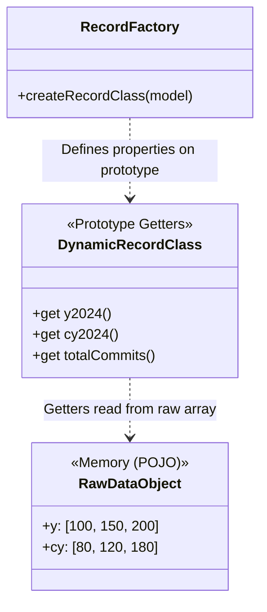
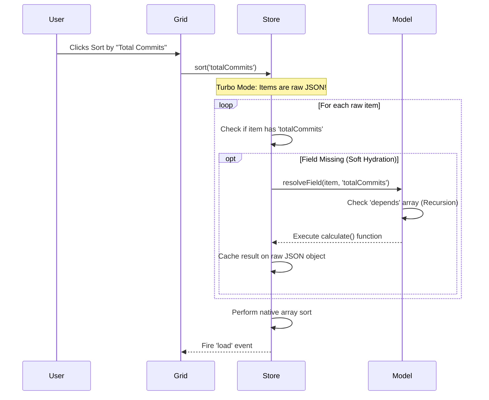
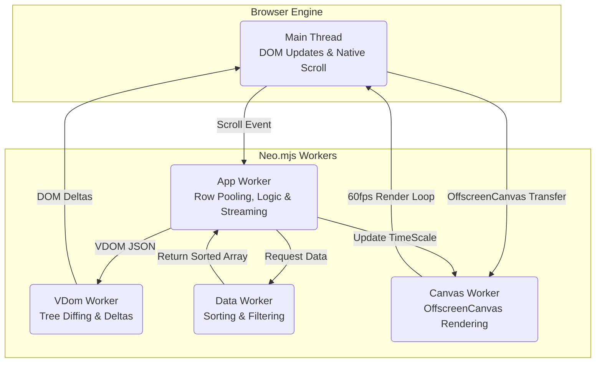

# Neo.mjs v12.0.0 Release Notes

**Release Type:** Major Architecture Overhaul & Flagship Showcase  
**Stability:** Production-Ready  
**Upgrade Path:** Requires manual migration for Grid implementations (see Migration Guide).

> **TL;DR:** **v12.0.0 is the "Zero Overhead" update.** We didn't just build a new flagship application; we used it to push the framework's architecture to its absolute physical limits. This release introduces **Zero-Overhead Record Architecture**, **Component-Based Grid Rows**, and the **Stream Proxy**. It represents a staggering achievement in human-AI collaboration: **402 tickets resolved in a single month**, proving the efficacy of Context Engineering.

---

## 🐣 The Crucible: A Chicken and Egg Story

We originally planned different features for v12. But we realized we needed to massively enhance the core Grid with OffscreenCanvas cell support, granular row pooling, and strict zero-allocation strategies. 

To prove those capabilities, we needed an impossible dataset. That requirement birthed the DevIndex app. In turn, dealing with 50,000 records in DevIndex forced us to push our existing "Turbo Mode" to the absolute limit, leading us to invent Engine-Level Streaming, Soft Hydration, and Virtual Fields in the Data Layer. 

It goes way deeper than a UI update. We executed massive data package enhancements, deep core polishing, and went straight back to the Neo roots: **pushing for absolute peak performance on a level that single-threaded technologies cannot even dream of.** Both the flagship app and the core engine evolved in parallel, at rocket speed. Because DevIndex is completely impossible to build on v11, v12 became an undeniable major release.

---

## ⚡ The Cyborg Factor: 402 Tickets in 30 Days

This release is a testament to what is possible when a solo developer pairs with a stateful AI agent equipped with a Neural Link to the runtime. 

*   **Total Resolved Tickets:** 402
*   **Velocity:** ~13.4 tickets per day, every day, for a month.

We didn't just write code; we debated architecture, profiled Garbage Collection (GC) pressure in V8, and completely rewrote the core data and grid layers to handle 50,000 active records in memory without a single DOM insertion during scrolling.

---

## 🏆 Hero Story 1: DevIndex & The Data Layer Revolution

To prove Neo.mjs can handle massive, complex data on the client side, we built **DevIndex**—a real-time, in-browser ranking of the top 50,000 (0.03%) GitHub developers. 

*(Note: The sheer scale of this release—402 resolved tickets—makes it impossible to cover every detail here. For DevIndex alone, we have written **26 dedicated guides** (.md files living directly within the repo). These guides cover everything from our Ethical Manifesto and Methodology to in-depth architectural deep-dives on the Data Factory and Frontend design. You can read them directly inside the learning sections of the Neo Portal app or the DevIndex app itself: [https://neomjs.com/apps/devindex/#/learn](https://neomjs.com/apps/devindex/#/learn))*

**The Motivation: The "Invisibility Problem"**
The genesis of DevIndex stemmed from a frustration with the open-source ecosystem: there was no accurate way to measure developer contributions globally. As AI models scrape open-source code without attribution, the human labor behind the software becomes invisible. DevIndex is our answer to making that labor measurable and visible.

**The Backend: A Massive Data Factory**
Because the GitHub API cannot provide this data natively, we built a complex, autonomous backend pipeline called the **Data Factory**. It consists of independent micro-services:
*   **The Spider (Discovery Engine):** Uses a multi-strategy algorithm (heavily relying on a "Network Walker" social graph traversal) to break out of mainstream "Filter Bubbles" and find hidden top-tier talent.
*   **The Updater (Enrichment Engine):** Queries the GraphQL API to aggregate multi-year contribution matrices, carefully managing rate limits and implementing a "Safe Purge Protocol" for account renames or transient errors.
*   **Data Enrichment & Hygiene:** Specialized services compute "Cyborg Metrics" (Velocity, Acceleration) to identify automated bots vs. humans, normalize global locations, and enforce a strict 30-day TTL for failed accounts.
*   **Privacy First:** We built fully automated Opt-In and Opt-Out services (using Issue Templates and Stargazers) to ensure developers maintain complete agency over their presence in the index.

**The "Fat Client" Twist & Zero-Overhead Data Layer**
The DevIndex frontend application has **no traditional backend**. It is a pure "Fat Client" hosted on GitHub Pages. The entire 50,000-record dataset is held in memory within the App Worker, allowing instant, zero-latency sorting and filtering.

Loading 50k records with 60+ fields each would normally crash a browser tab. We solved this with a **Zero-Overhead Architecture**:

1.  **Engine-Level Streaming (JSONL Proxy):** We implemented `Neo.data.proxy.Stream`. Instead of parsing a massive 23MB (8MB gzipped) JSON payload, the grid uses `ReadableStream` APIs to process an NDJSON file incrementally, rendering the UI instantly as chunks arrive.
2.  **Zero-Overhead Records (Virtual Fields):** We redesigned `Neo.data.Model`. The raw data is kept as hyper-compact arrays. The `RecordFactory` generates prototype-based getters (Virtual Fields) on the fly (e.g., `record.y2024` reading from `data.y[14]`). 
    *   Adding 60 new year-based fields adds **0 bytes of memory per record**.
    *   **Dependency Resolution:** Complex calculated fields can now declare a `depends` array. In Turbo Mode, the Store recursively resolves and caches these dependencies before execution, preventing redundant array reductions during soft hydration.


3.  **Soft Hydration ("Turbo Mode"):** In `autoInitRecords: false` mode, the `Neo.data.Store` holds raw POJOs instead of Heavy Record instances. But what happens when you filter by a calculated field that doesn't exist on the raw JSON? We introduced **Soft Hydration** (`Store.resolveField()`). When filtering or sorting, the Store dynamically calculates only the required fields on the raw objects and auto-caches them, bypassing full record instantiation until a row enters the visible viewport.



4. **Performance Theater: The "Show Off" Effect:** 
   * To prove the Main Thread is completely unblocked by the Grid's layout during a scroll, the DevIndex app intentionally **doubles the animation speed** of the complex 3D Luminous Flux header when you scroll. The Canvas worker smoothly accelerates the physics `timeScale` while the grid scrolls underneath it, proving visually that heavy canvas operations cannot block the App Worker's scrolling logic.

---

## 🏎️ Hero Story 2: Grid Supremacy (The Ultimate Flex)

The DevIndex UI is a torture test. It renders live, animated data charts ("Living Sparklines") inside every single row of a 50k-record grid, alongside complex icon components and country flags.

**The Challenge:** High-frequency scrolling a 50k-row grid pushes data binding and rendering to its limits. Previously, `Neo.grid.Body` acted as a monolithic renderer. While we had component-based columns before, the architecture was fractured. The `Grid.Body` managed the row HTML structure, while each component column managed its own isolated pool of instances. As you scrolled, columns had to calculate their own visibility and dispatch `moveNode` deltas to re-parent their components into the newly rendered row cells. This worked, but it was brittle. It resulted in massive, fractured JSON payloads crossing the worker bridge. More critically, horizontal scrolling destroyed and recreated DOM nodes for cells leaving the viewport, instantly severing `OffscreenCanvas` worker connections (the dreaded "Zombie Canvas" issue).

**The Solution: Component-Based Rows & The Quintuple-Threaded Architecture**

To achieve true O(1) scrolling performance and constant memory usage, we completely shattered the monolithic Grid Body. Every row is now its own standalone `Neo.grid.Row` component, and we aggressively split the workload across five independent actors:



1. **Component-Based Rows & Granular Updates (App Worker):**
   * Editing a record now triggers a VDOM update *only* for that specific `Neo.grid.Row` instance. 
   * **Resilient Lifecycle:** Component columns (like our Living Sparklines) are now standard children of the `Row` component. Because the row itself is never destroyed, the framework's standard lifecycle manages cell components automatically, permanently eliminating the dreaded "Zombie Canvas" bugs.

2. **The "Fixed-DOM-Order" Strategy ("Zero-Latency" Scrolling):** 
   * We upgraded `Neo.grid.Body` to enforce strict **Row Pooling**. As you scroll, rows leaving the top of the viewport are recycled in place via hardware-accelerated CSS `translate3d`.
   * *The Flex (Empirical Proof):* During maximum-velocity vertical scrolling stress tests on the 50k-record DevIndex, we analyzed the exact composition of the VDOM delta payloads crossing the worker bridge.

```mermaid
graph TD
    subgraph Mounted Row Range (DOM Pool)
        TopBoundary[--- Top of Viewport ---]
        R1[DOM Row 1: translate3d(0, 0px, 0)]
        R2[DOM Row 2: translate3d(0, 50px, 0)]
        R3[DOM Row 3: translate3d(0, 100px, 0)]
        BottomBoundary[--- Bottom of Viewport ---]
    end

    Scroll[User Scrolls Down] -->|Moves DOM out of bounds| R1
    R1 -.->|Teleported to Bottom via GPU| R3
    
    style R1 stroke:#f66,stroke-width:2px,stroke-dasharray: 5 5
```

   * A peak scrolling frame generated **784 deltas**. The payload contained exactly:
     *   **0 `insertNode` commands.**
     *   **0 `removeNode` commands.**
     *   **784 `updateNode` commands.**
   * This is the definition of a perfectly functioning **DOM Pool**. 

```javascript readonly
// Empirical Delta Log (The "Zero-Mutation" Proof)
// Notice the complete absence of HTML string replacements or structural changes.
[
  // 1. The Container moves via GPU
  {
      "id": "neo-grid-body-1__row-1",
      "attributes": { "aria-rowindex": "87", "data-record-id": "neo-record-50839", "data-row-id": 85 },
      "style": { "transform": "translate3d(0px, 4250px, 0px)" }
  },
  // 2. A simple text cell updates
  { 
      "id": "neo-grid-body-1__row-1__cell-0", 
      "innerHTML": "86", 
      "attributes": { "data-record-id": "..." } 
  },
  // ...
  // 3. Ultra-granular deltas INSIDE a Component-Based Column (e.g. the 'Impact' Heuristics column)
  { 
      "id": "neo-vnode-353", 
      "textContent": "🏛️", 
      "cls": { "add": ["pillar"], "remove": ["bolt"] }, 
      "attributes": { "title": "Consistency: Community Pillar (>10y)" } 
  }
]
```
   * We intentionally trade cheap JavaScript cycles (calculating and serializing 800 JSON objects takes **< 3ms**) to completely eliminate Native DOM Layout Thrashing. Even deep inside complex, nested component columns (like the DevIndex "Impact" badges), the framework resolves changes down to microscopic CSS class toggles (`add`/`remove`) and `textContent` updates. 
   * By using `translate3d` specifically, we force the browser to hand the positioning off to the GPU. Because the strict "mounted row range" limits the total number of DOM nodes, we achieve **Compositor Heaven**: we leverage GPU hardware acceleration without triggering a "layer explosion" that would overwhelm video memory. The browser never recalculates the layout tree because the DOM structure never changes.

3. **"Full Pool Rendering" for Cells (O(1) Horizontal Scroll):**
   * We extended the zero-mutation philosophy to horizontal scrolling. Each row implements a "Full Pool Rendering" strategy, generating a fixed-size array of cell nodes based on the `gridBody.cellPoolSize`.
   * Unused cells are kept as lightweight placeholders (`display: none`). When scrolling horizontally, cells are simply recycled by updating their data attributes (`data-field`, `data-record-id`) and position, without ever altering the VDOM children array length or order.

4. **Main-Thread Drag & Kinetic Scrolling:**
   * We introduced `Neo.main.addon.GridDragScroll`. Instead of passing high-frequency `mousemove` events back and forth between workers, drag-to-scroll logic now runs directly on the Main Thread. It features physics-based inertial scrolling with exponential decay friction, delivering a buttery-smooth, native-like touch and drag experience.

5. **Surgical DOM Move (Drag & Drop Proxy):**
   * Reordering columns containing complex components (like `OffscreenCanvas`) used to be impossible without destroying and recreating them, losing canvas context. We implemented a "Surgical DOM Move" in the `SortZone` proxy. When dragging a column, the App Worker dispatches a sequence of `moveNode` deltas to physically pluck the live components out of the grid cells and drop them into the dragging proxy, perfectly preserving the canvas connections and animations while you drag. They are snapped back into place on drop.

6. **"Living Sparklines" & Zero-Allocation Physics (Canvas Worker):** 
   * We transferred ownership of the `<canvas>` DOM nodes inside the grid cells to a dedicated Canvas Worker using the `OffscreenCanvas` API. 
   * To maintain a strict 16ms frame budget (60fps) without Garbage Collection (GC) stutters, the physics engine uses a **Zero-Allocation** strategy (cached geometry, pre-allocated `CanvasGradient` objects).
   * To prevent GPU overload, it uses a **"Sparse Animation Strategy"**. A single master loop randomly selects *one* chart to pulse with a "Data Packet" every few seconds. This creates the visual impression of a highly active, living system ("The Server Room Effect") while keeping actual GPU load equivalent to rendering just a single chart.

**The Best Part: Zero Migration Effort**
Despite being a fundamental, ground-up rewrite of the framework's most complex component, the new Grid is a **100% drop-in replacement**. All your existing grid configurations, custom cell renderers, and stores will work out of the box with massively upgraded performance.

---

## 🧱 Hero Story 3: Core Architecture Hardening

To support the massive VDOM throughput of the new Grid, we had to harden the core identity systems.

*   **Framework-wide `internalId`:** Previously, Neo.mjs relied on the VDOM worker to fill in missing IDs for granular nodes (like spans), syncing them back to the App Worker asynchronously. In high-frequency mutable views (like a scrolling grid), this caused race conditions where node identities got swapped.
    *   *The Fix:* We implemented **App-Worker Authority**. The `TreeBuilder` now generates deterministic `internalId`s Just-In-Time *before* the VDOM worker ever sees the tree. The App Worker is now the absolute source of truth for DOM identity, securing drag-and-drop and scrolling stability.
*   **The GC War:** We systematically eradicated `Array.from()`, `Object.entries().forEach()`, and deep array spreads (like `[...largeArray]`) from the core hot paths (`VDomLifecycle`, `TreeBuilder`, `Collection`), replacing them with zero-allocation `for` loops and native `slice()`.

---

## 🚀 Hero Story 4: The Universal Application Engine (Node.js)

While Neo.mjs is famous for its multi-threaded browser UI architecture, v12.0.0 reinforces a much larger strategic narrative: **Neo is a universal Application Engine.**

It is not just a client-side framework. The very same class system, reactive configs (`_` suffixes), and strict singleton management (`Neo.core.Base`) that power our grids perform exceptionally well natively in Node.js. 

We had already proven this in previous releases by building our entire AI infrastructure (our 4 Model Context Protocol servers) on top of the Neo core. In v12.0.0, we doubled down on what worked incredibly well to build something even bigger:

*   **The DevIndex Data Factory:** The massive, autonomous backend pipeline that gathers the data for our new flagship app isn't built with Express or NestJS. The Orchestrator, the Network Walker Spider, and the GraphQL Updater are all Node.js CLI services built entirely on top of the Neo.mjs core class system.

This proves that Neo's architecture offers a truly unified, highly performant development model across the entire stack—from the heaviest client-side grids to complex, long-running backend data pipelines.

---

## 📦 Full Changelog

### 🚀 The DevIndex Epic
* **Enhancement:** DevIndex: Apply load mask for initial Turbo Mode soft hydration (#9330)
* **Enhancement:** Clarify "Commits %" logic in DevIndex Guides (#9329)
* **Enhancement:** Address "Bots and Cheaters" Criticism in DevIndex Docs (#9326)
* **Enhancement:** Update DevIndex Docs to Reflect Human-AI Development Velocity (#9324)
* **Enhancement:** Refine DevIndex Introduction Disclaimer and Cap Context (#9323)
* **Fix:** DevIndex: Disable controls toggle button on learn route (#9312)
* **Fix:** Fix LinkedIn icon rendering and Twitter link format in DevIndex Grid (#9310)
* **Enhancement:** Performance: Remove avatarUrl convert overhead in DevIndex Contributor Model (#9309)
* **Enhancement:** Implement custom sorting for Top Repo column in DevIndex (#9308)
* **Enhancement:** Persist DevIndex Animation Settings and Batch LocalStorage Reads (#9301)
* **Enhancement:** Split DevIndex Animation Controls (Header vs Grid) (#9300)
* **Enhancement:** Add push synchronization step for DevIndex data to pages repo (#9293)
* **Fix:** Fix DevIndex pipeline data paths after directory refactoring (#9292)
* **Fix:** Fix JSDoc parsing error in devindex Storage.mjs (#9291)
* **Enhancement:** Refactor DevIndex data deployment strategy to prevent huge resource duplication (#9290)
* **Fix:** DevIndex Sparkline: Improve pulse contrast for light theme (#9285)
* **Fix:** DevIndex: Fix ''Show Animations'' checkbox binding for Grid Sparklines (#9279)
* **Fix:** Fix missing mobile hamburger menu in DevIndex learn section (#9273)
* **Enhancement:** DevIndex Guides: Add to Portal App Learning Navigation (#9272)
* **Enhancement:** Create DevIndex Guide: The Ethical Manifesto (Why We Built This) (#9271)
* **Enhancement:** Create DevIndex Guide: Policy Makers & Gov Funding (#9270)
* **Enhancement:** Create DevIndex Guide: Data Scientists & Researchers (#9269)
* **Enhancement:** Create DevIndex Guide: Talent Scouts & Recruiters (#9268)
* **Epic:** DevIndex Persona Guides: Connecting Data to Intent (#9267)
* **Enhancement:** Update ContentEngine guide with DevIndex-specific examples (#9266)
* **Epic:** [EPIC] DevIndex Frontend & User Guides (#9257)
* **Enhancement:** Create Backend ("Fat Client") Guide for DevIndex (#9255)
* **Enhancement:** Add Current Status and Contribution Guidelines to DevIndex Intro (#9252)
* **Enhancement:** Rewrite DevIndex Data Factory Introduction (#9250)
* **Enhancement:** Add DevIndex Data Factory Guide: Data Enrichment Utilities (#9249)
* **Enhancement:** Add DevIndex Data Factory Guide: Updater Service (#9248)
* **Enhancement:** Add DevIndex FAQ Guide (#9246)
* **Enhancement:** Add DevIndex Data Factory Guides: Storage & GitHub API (#9245)
* **Enhancement:** Add DevIndex Data Factory Guides: Orchestrator & Data Hygiene (#9244)
* **Enhancement:** Rename DevIndex Spider Guides to Data Factory (#9243)
* **Enhancement:** Expand DevIndex Spider Engine Guide with Workflow Steps (#9242)
* **Enhancement:** Add DevIndex Spider Engine Guide (#9241)
* **Enhancement:** Refactor DevIndex Guides Structure (Spider Subfolder) (#9240)
* **Fix:** DevIndex: Finish renaming blacklist/whitelist to blocklist/allowlist in Cleanup.mjs (#9239)
* **Enhancement:** Process Issue Templates for DevIndex Opt-In (#9237)
* **Enhancement:** DevIndex: Adjust Meritocracy Filter to exclude allowlisted users from the maxUsers cap (#9235)
* **Enhancement:** DevIndex: Split Methodology guide into Introduction and Methodology (#9234)
* **Enhancement:** DevIndex: Expand Methodology Guide with Motivation, Tech Demo Context, and Disclaimers (#9233)
* **Enhancement:** DevIndex: Rename blacklist and whitelist to blocklist and allowlist (#9232)
* **Enhancement:** DevIndex: Implement Issue-Template-Based Opt-Out mechanism (#9231)
* **Enhancement:** DevIndex: Implement Star-Based Opt-Out Service (OptOut.mjs) (#9230)
* **Enhancement:** Optimize Spider Core Strategy with Power-Law Distribution (#9229)
* **Enhancement:** Unify DevIndex Workflows and implement Spider backpressure (#9227)
* **Enhancement:** Enhance KB: Document maxUsers cap and performance trade-offs in DevIndex (#9226)
* **Enhancement:** Implement maxUsers cap for DevIndex GitHub Spider (#9224)
* **Enhancement:** DevIndex: Extract StatusToolbar SCSS into separate file (#9223)
* **Enhancement:** DevIndex: Refactor StatusToolbar layout for mobile responsiveness (#9222)
* **Enhancement:** DevIndex: Move StatusToolbar to MainContainer Wrapper (#9220)
* **Enhancement:** DevIndex: Fix Grid Box Shadow Clipping (#9218)
* **Enhancement:** DevIndex (Light Theme): Align Tab Header Colors with Grid Header (#9216)
* **Enhancement:** DevIndex: Style ControlsContainer Tabs to match Portal Theme (#9214)
* **Enhancement:** DevIndex: Polish Grid & Controls Layout (Shadows, Borders) (#9213)
* **Enhancement:** DevIndex: Create HeaderToolbar Theme Files (#9212)
* **Enhancement:** DevIndex: Swap ''Private %'' and ''Commits %'' Columns (#9192)
* **Enhancement:** DevIndex: Implement 4-Mode Data Toggle (Total, Public, Private, Commits) (#9191)
* **Enhancement:** DevIndex: Add ''Private %'' Column (#9190)
* **Enhancement:** Implement Stop Stream Capability for DevIndex (#9188)
* **Fix:** DevIndex: Introduce StateProvider for animateVisuals (#9179)
* **Enhancement:** DevIndex: Add ''Impact'' Column (Heuristics Visualization) (#9178)
* **Enhancement:** DevIndex: Add ''Commits %'' Column and Automation Filter (#9177)
* **Enhancement:** DevIndex: Polish Top Repo Display and Column Order (#9176)
* **Enhancement:** DevIndex: Restore 2026 Data and Polish Activity Column (#9175)
* **Enhancement:** DevIndex: Reorder Grid Columns and Style Sponsors Heart (#9174)
* **Enhancement:** DevIndex: Optimize LinkedIn URL Storage (#9172)
* **Enhancement:** DevIndex: Include Repo Owner in Top Repo Logic (#9171)
* **Enhancement:** [DevIndex] Rename Control Tabs & Add Buffer Settings (#9164)
* **Fix:** [DevIndex] Fix Redundant Store Load via createAllItems hook (#9161)
* **Fix:** [DevIndex] Grid Icon Columns fail to update on Filter change (#9155)
* **Enhancement:** [DevIndex] Add TopRepo, Twitter, and Sponsors columns (#9154)
* **Enhancement:** [DevIndex] Add Bio Filter and Hireable Checkbox (#9153)
* **Enhancement:** [DevIndex] Add Hireable and Website columns to Grid (#9152)
* **Enhancement:** DevIndex: Client-Side "Commits Only" Toggle & Total Commits Implementation (#9150)
* **Enhancement:** DevIndex: Add Total Contributions label to StatusToolbar (#9149)
* **Enhancement:** DevIndex: Use locale formatting for StatusToolbar row count (#9148)
* **Enhancement:** Implement Heuristics Service for DevIndex (#9144)
* **Epic:** DevIndex Heuristics & Anomaly Detection (#9143)
* **Enhancement:** [DevIndex] Create Country Code Repair Script (#9142)
* **Fix:** [DevIndex] Fix Washington DC Location Resolution (#9141)
* **Enhancement:** Implement Scheduled DevIndex Spider Workflow (#9140)
* **Fix:** Fix DevIndex Updater Workflow: Stage All Data Files (#9139)
* **Fix:** Fix DevIndex Updater Workflow Unstaged Changes Error (#9138)
* **Enhancement:** Implement ID-Based Rename Handling for DevIndex (#9137)
* **Enhancement:** Implement 30-Day Retention Policy for DevIndex Penalty Box (#9136)
* **Fix:** Implement Safe Purge for Invalid Users in DevIndex Updater (#9135)
* **Fix:** Fix Organization Leakage in DevIndex and Updater Retries (#9134)
* **Enhancement:** Tune Spider Strategy Probabilities and Enhance Documentation (#9133)
* **Fix:** Fix Spider Bio-Signal Search Query 422 Error (#9131)
* **Enhancement:** Increase DevIndex Updater Throughput to 500 Users/Hour (#9130)
* **Fix:** Fix DevIndex Updater Workflow Unstaged Changes Error (failed.json) (#9129)
* **Fix:** Implement Adaptive Chunking for DevIndex Updater to Fix 504 Timeouts (#9128)
* **Fix:** Fix DevIndex Updater Workflow Rebase Logic (#9127)
* **Fix:** DevIndex: Blacklist identified bots from failed.json (#9126)
* **Fix:** DevIndex: Stop Cleanup.mjs from pruning orphaned tracker users (#9125)
* **Enhancement:** Robustify DevIndex Updater Workflow against Remote Changes (#9124)
* **Enhancement:** DevIndex: Refine Updater Metrics (Success vs Failure) (#9122)
* **Fix:** DevIndex: Implement "Penalty Box" for Failed User Updates (#9121)
* **Enhancement:** DevIndex: Add Scheduled Hourly Updater Workflow (#9119)
* **Enhancement:** DevIndex: Enhance Updater with Private Contributions & Metadata (#9118)
* **Enhancement:** DevIndex: Polish StatusToolbar Styling and Logic (#9116)
* **Enhancement:** DevIndex: Add Status Toolbar and Progress Indication (#9114)
* **Enhancement:** DevIndex: Add Profile Tab to Controls Panel (#9112)
* **Enhancement:** DevIndex: Support ''country'' URL search parameter (#9110)
* **Refactor:** Rename DevRank to DevIndex (#9109)
* **Epic:** DevIndex App Polishing (#9106)
* **Fix:** DevRank Spider 422 Error on Complex Queries (#9103)
* **Fix:** DevRank Spider Premature Exit (Split Core/Search Rate Limits) (#9088)
* **Feat:** DevRank Spider CLI Strategy Selection (#9086)
* **Feat:** DevRank Spider Community Discovery Strategy (#9085)
* **Enhancement:** Dynamic High Star Ranges for Spider (#9042)
* **Enhancement:** Add Spider Summary Logs (#9041)
* **Refactor:** DevRank Spider Checkpointing (#9033)
* **Feat:** DevRank Spider Random Walk Strategy (#9032)
* **Feat:** Discovery Engine - The Spider (#8937)
* **Epic:** Epic: DevIndex - The GitHub Meritocracy Index (#8930)

### 🏎️ Grid & Data Layer
* **Enhancement:** Performance: Optimize Collection `items_` config to use shallow cloning (#9334)
* **Fix:** Collection: Replace array spreads with native slice to fix GC stalls on massive datasets (#9333)
* **Fix:** Collection: Prevent deep cloning and spread operator limits when creating allItems (#9332)
* **Enhancement:** Store: Prevent soft hydration for inactive/null filters in Turbo Mode (#9331)
* **Enhancement:** Add Field Dependency Resolution to Store (#9328)
* **Enhancement:** Optimize Grid hot paths to reduce GC pressure (#9319)
* **Enhancement:** Implement two-state (ASC/DESC) sorting for Grid headers (#9306)
* **Enhancement:** [Enhancement] Generic Theme Support for Icon and IconLink Grid Columns (#9288)
* **Fix:** [Bug] Grid Component Columns Retain Stale State on Scroll (#9286)
* **Fix:** Grid Container: Pass initial theme to child instances (#9284)
* **Fix:** Grid Row: Propagate theme changes to cell components (#9282)
* **Fix:** Fix Grid Row Bottom Border and Remove Empty Scroll Row (#9278)
* **Enhancement:** Create Frontend Guide 2: The Grid Rewrite & Virtualization (#9260)
* **Enhancement:** Create User Guide: Understanding Grid Columns & Metrics (#9258)
* **Enhancement:** Debug SyncAligns Layout Thrashing during Grid Scroll (#9205)
* **Enhancement:** Profile Main Thread Activity for Desktop Grid Scrolling (#9204)
* **Enhancement:** Investigate Grid Scrolling Performance via Column Ablation Strategy (#9203)
* **Enhancement:** Investigate CSS Optimizations for Grid Rendering (Desktop Scaling) (#9202)
* **Docs:** Dynamic Grids Guide (#9201)
* **Perf:** Record Versioning & Component Column Short-Circuit (#9200)
* **Enhancement:** Benchmark Grid Horizontal Scroll Performance (#9199)
* **Enhancement:** Cleanup Redundant GridContainer Logic (#9198)
* **Enhancement:** Add Regression Test for Dynamic Grid Columns (#9197)
* **Fix:** Fix GridBody Column Position Sync on DataField Change (#9195)
* **Epic:** Zero Overhead Record Architecture & Grid Dynamic Column Fixes (#9194)
* **Enhancement:** Implement Virtual Fields for Zero-Overhead Records (#9193)
* **Fix:** Fix Scroll Thrashing during Store Streaming (#9186)
* **Fix:** Enforce hideMode: ''visibility'' for Component Grid Columns (#9183)
* **Fix:** Fix Grid Column Drag & Drop Regression (#9181)
* **Enhancement:** [Grid] Implement Self-Healing Row Pooling (#9169)
* **Enhancement:** [Grid] Optimize Runtime Buffer Updates (Phase 2: Performance) (#9168)
* **Fix:** [Grid] Fix Runtime Buffer Updates (Phase 1: Functional) (#9167)
* **Fix:** [Test] Fix StreamProxy Unit Tests: Mock Store (#9166)
* **Fix:** [Grid] Fix Runtime Buffer Updates Breaking Row/Cell Pooling (#9165)
* **Enhancement:** [BigData Grid] Increase Initial Row Count to 20k (#9163)
* **Fix:** [BigData Grid] Fix Redundant Data Generation on Filter (#9162)
* **Docs:** Document Grid Performance Optimizations (Row/Cell Recycling) (#9158)
* **Enhancement:** perf(grid): Optimize Horizontal Scrolling (Cell Recycling) (#9157)
* **Fix:** perf(grid): Optimize VDOM generation in Row.updateContent (#9156)
* **Enhancement:** feat(grid): Support runtime column dataField changes (#9151)
* **Enhancement:** Refactor Grid Footer Toolbar for Store Integration (#9117)
* **Enhancement:** Optimize Store Streaming and Progressive Loading (#9115)
* **Enhancement:** Support ISO 2 country codes in CountryFlag component and grid column (#9111)
* **Fix:** Grid Body fast path fails to update Row mounted state, breaking OffscreenCanvas recovery (#9108)
* **Fix:** OffscreenCanvas charts in Grid Component Columns do not recover after VDOM purge (#9107)
* **Feat:** Enhance Neo.data.Store to support Proxy loading (#9091)
* **Refactor:** Adopt ''internalId'' for Stable DOM Keying (Grid & Table) (#9072)
* **Feat:** Implement ''internalId'' via Collection Identity Hook (#9070)
* **Refactor:** Collection.Base to use getKey() hook for Turbo Mode Support (#9069)
* **Fix:** Resolve Mapped KeyProperty Conflict in Turbo Mode via Store.getKey() (#9067)
* **Fix:** Store Sorting inconsistencies with Turbo Mode (Lazy Records) (#9066)
* **Feat:** Implement ''Commits Only'' Toggle for DevRank Grid (#9064)
* **Perf:** Enable Turbo Mode for DevRank Store (#9061)
* **Fix:** RecordFactory defaultValue prevents mapping execution (#9060)
* **Perf:** Optimize CountryFlag to Prevent Grid Reflows (#9053)
* **Perf:** Optimize Sparkline Backpressure & Investigate Grid Reflows (#9052)
* **Enhancement:** DevRank Grid Selection Overrides Heatmap (#9038)
* **Feat:** GitHubOrgs Component & Grid Column (#9035)
* **Feat:** DevRank Grid - LinkedIn & Organizations Columns (#9034)
* **Enhancement:** Create Playwright Unit Tests for Grid-Store Interactions (#9021)
* **Enhancement:** Create comprehensive Playwright Unit Tests for Grid Row/Cell Pooling (#9020)
* **Enhancement:** Fix Playwright Teleportation Tests for Fixed-DOM-Order Grid (#9019)
* **Enhancement:** Remove obsolete component management logic from Grid.Body (#9018)
* **Enhancement:** Refactor Grid.Body to extend Component.Base and use internal Row Pool (#9017)
* **Enhancement:** Enhance Knowledge Base Documentation for Grid Architecture Changes (#9016)
* **Enhancement:** Refactor Grid Row Selection to use Granular Updates and No-Op Checks (#9014)
* **Enhancement:** Optimize Grid Row Pooling to eliminate moveNode deltas (#9012)
* **Enhancement:** Polish DevRank Grid Styling and Documentation (#9011)
* **Enhancement:** Implement cellCls config for Grid Columns (#9010)
* **Enhancement:** Extract GitHubUser and CountryFlag Grid Columns (#9009)
* **Enhancement:** Refactor DevRank Grid components to use dedicated classes (#9008)
* **Feat:** Enhance DevRank Grid Styling (Dark Theme) (#9007)
* **Enhancement:** Enhance Grid Row Documentation for Pooling Strategy (#9004)
* **Fix:** Fix dataset attribute mapping in Grid Row VDOM (#9003)
* **Fix:** Fix Grid Row Cell Pooling Move Operations (Regression) (#9002)
* **Fix:** Update Grid Row Cell Border Logic for Pooling (#9001)
* **Enhancement:** Explicit Grid Container Overflow Handling (#9000)
* **Fix:** Update GridContainer scrollByColumns to target VDOM root (#8999)
* **Fix:** Fix Grid Cell Selection for Pooled Cells (#8998)
* **Perf:** Increase Grid ScrollManager throttle to prevent worker message flooding (#8995)
* **Feat:** Add get() method to Neo.data.Record (#8994)
* **Fix:** Fix Grid Empty View Regression on Column Change (#8993)
* **Enhancement:** Implement Hybrid Cell Buffering (Pooling) for Grid Rows (#8992)
* **Perf:** Implement atomic Grid Body updates via explicit suspension flag (#8989)
* **Enhancement:** GridDragScroll: Add delay and minDistance to prevent accidental drags (#8987)
* **Docs:** Knowledge Base Enhancement Strategy for Grid Classes (#8964) (#8986)
* **Refactor:** Add getRow helper to GridBody (#8985)
* **Fix:** Fix Grid Row Reactivity & AnimatedChange Column for In-Place Updates (#8984)
* **Fix:** Fix Grid Scrollbar Position and DragScroll ID Mismatch (#8983)
* **Fix:** Fix Grid Horizontal Keyboard Scrolling (#8982)
* **Enhancement:** Enhance Grid Layout Resilience with overflow: clip (#8981)
* **Fix:** Fix Grid Keyboard Navigation and Focus Layout Shift (#8980)
* **Fix:** Fix Grid Cell Animations During Column Reordering (#8976)
* **Fix:** Fix Grid Header Drag Proxy for Row Component Architecture (#8975)
* **Refactor:** Cleanup Neo.grid.Body and optimize Row/Body responsibilities (#8964) (#8974)
* **Refactor:** Switch Grid Row to explicit updateContent pattern (#8964) (#8972)
* **Feat:** Commit base implementation of Neo.grid.Row and refactored GridBody (#8964) (#8970)
* **Perf:** Implement Batching and Silent Updates for Grid Scrolling (#8964) (#8969)
* **Refactor:** Migrate Component Columns to use Neo.grid.Row lifecycle (#8964) (#8968)
* **Feat:** Implement Reactive Record Updates in Neo.grid.Row (#8964) (#8967)
* **Refactor:** Upgrade Neo.grid.Body to Container and implement Row Pooling (#8964) (#8966)
* **Feat:** Create Neo.grid.Row component (#8964) (#8965)
* **Epic:** RFC: Component-Based Grid Rows (Neo.grid.Row) for Granular Updates (#8964)
* **Perf:** Apply CSS containment to Grid Rows (#8962)
* **Fix:** Vertical scrolling causes OffscreenCanvas loss in Grid cells (#8960)
* **Feat:** Implement hideMode for Grid Columns to support OffscreenCanvas buffering (#8959)
* **Feat:** Generic Sparkline Component & Grid Column (#8954)
* **Refactor:** DevRank Grid Location Column (VDOM + SCSS) (#8942)
* **Fix:** RecordFactory mapping logic not triggering for missing source keys (#8936)
* **Feat:** DevRank Grid Expansion (#8934)
* **Feat:** DevRank UI - Grid & Controls Implementation (#8932)

### ⚙️ Core Engine & Performance
* **Enhancement:** Performance: Optimize core utilities in Neo.mjs (cloneMap, camel, loops) (#9336)
* **Enhancement:** Performance: Optimize array cloning in Neo.clone to use slice and map directly (#9335)
* **Enhancement:** Optimize VDom Lifecycle and TreeBuilder hot paths to reduce GC pressure (#9320)
* **Enhancement:** Optimize VDom Helper hot paths to reduce GC pressure (#9318)
* **Enhancement:** Optimize DOM hot path DeltaUpdates to reduce GC pressure (#9317)
* **Fix:** Bug / Enhancement: Fix unstable sorting & enforce nulls at bottom (#9311)
* **Enhancement:** [Documentation] Document the ''undefined'' sentinel value for reactive config initialization (#9287)
* **Fix:** Canvas Sparkline: React to theme changes (#9283)
* **Fix:** DomEvents: Prevent duplicate local DOM event listeners (#9281)
* **Enhancement:** Component: Support deep merging for `bind_` configs (#9280)
* **Enhancement:** Verify Playwright Overhead with Native Scroll Benchmark (#9207)
* **Enhancement:** Commit Playwright Profiling Infrastructure & DomEvents Optimization (#9206)
* **Enhancement:** Enhance Stream Proxy with DecompressionStream Support (#9189)
* **Enhancement:** Investigate and Optimize Stream Proxy Performance (#9187)
* **Enhancement:** Optimize Component Columns with contain: strict (#9184)
* **Enhancement:** Enhance Stream Proxy with Adaptive Chunking for Faster TTFC (#9123)
* **Refactor:** DevRank Viewport Lazy Loading & Routing (#9105)
* **Perf:** Remove unused Material Icons from Portal index.html (#9100)
* **Feat:** Batch Streaming & Progressive Rendering for Proxy Loader (#9094)
* **Feat:** Implement Neo.data.proxy.Base and Neo.data.proxy.Stream (#9090)
* **Epic:** Epic: Engine-Level Streaming Data Loader (JSONL) (#9089)
* **Perf:** DevRank Header Adaptive Backpressure (#9080)
* **Perf:** Implement O(1) Lookup Map for internalId (#9076)
* **Epic:** Epic: Framework-wide Adoption of ''internalId'' for Stable DOM Identity (#9074)
* **Refactor:** Ensure Drag & Drop Stability via ''internalId'' (#9073)
* **Refactor:** Adopt ''internalId'' for Stable DOM Keying (List & Data Views) (#9071)
* **Refactor:** Global Audit & Fix for ''keyProperty'' Access (Turbo Mode Compatibility) (#9068)
* **Perf:** Refactor Updater to use Lightweight Contribution Counters (#9063)
* **Enhancement:** Optimize & Minify DevRank Data Schema (#9059)
* **Perf:** Optimize GitHubOrgs with Node Pooling & Visibility (#9054)
* **Perf:** Optimize DomAccess.syncAligns to avoid scroll thrashing (#9050)
* **Perf:** Optimize GitHub Avatar Sizes (#9036)
* **Refactor:** DevRank Updater Checkpointing (#9028)
* **Enhancement:** Commit DevRank Data Artifacts (#9026)
* **Refactor:** Optimize DevRank User Index Storage (#9024)
* **Perf:** Implement Adaptive Backpressure for VDOM Updates via Pre-Update Hooks (#8996)
* **Perf:** Propagate silent flag to Component Column renderer to suppress scrolling updates (#8990)
* **Fix:** rewrite throttle utility to robustly handle trailing edge (#8988)
* **Enhancement:** Implement Surgical DOM Move for Component Columns in Drag Proxy (#8977)
* **Refactor:** Move `defaults` Serialization to `ComponentColumn.toJSON` (#8956)
* **Refactor:** Move `loadModule` to `Neo.worker.Base` (#8950)
* **Feat:** `Manager.startWorker` Remote Method (#8949)
* **Refactor:** Optimize Neural Link get_component_tree for token efficiency (#8923)

### 📚 Documentation
* **Enhancement:** [Enhancement] Refine AI Agent Ticket Workflow to ''Ticket-Before-Commit'' (#9289)
* **Fix:** Fix markdown escaping for nested special code blocks (#9265)
* **Enhancement:** Create Frontend Guide 5: OffscreenCanvas & Parallel Rendering (#9263)
* **Enhancement:** Create Frontend Guide 4: The Markdown Content Engine (#9262)
* **Enhancement:** Create Frontend Guide 3: State Management & Controls (#9261)
* **Enhancement:** Create Frontend Guide 1: Architecture & Off-Main-Thread (#9259)
* **Enhancement:** Enhance Backend Guide: Emphasize In-Memory Streaming Performance (#9256)
* **Enhancement:** Add Neo Funding Case Study to Introduction Guide (#9253)
* **Enhancement:** Enhance Location Normalizer and Document Macro-Economic Insights (#9251)
* **Enhancement:** Integrate Opt-In Service into Hourly Pipeline & Document Architecture (#9238)
* **Enhancement:** Promote ask_knowledge_base as RAG Sub-Agent in AGENTS_STARTUP.md (#9180)
* **Docs:** Add Visual Verification Protocol to AGENTS_STARTUP.md (#9113)
* **Fix:** Add missing Google Fonts to DevRank index.html (#9099)
* **Feat:** Integrate Documentation Viewer into DevRank (#9098)
* **Docs:** "Streaming Data & Progressive Rendering" Guide (#9095)
* **Enhancement:** Refactor Portal Content Viewer to Framework Component (#9082)
* **Docs:** Knowledge Base Enhancement for DevRank Services (#9049)
* **Docs:** Sparkline Knowledge Base Enhancement (#8947)

### 🛠️ Testing & Infrastructure
* **Fix:** Regression: Unit Test Failures in Teleportation.spec.mjs after #9200 (#9210)

### ✨ Other Enhancements & Fixes
* **Feat:** Expose GitHub Meritocracy Index in Portal App Examples (#9337)
* **Fix:** Fix commitRatio calculation to exclude private contributions (#9327)
* **Fix:** Fix VDOM diffing race condition between innerHTML and textContent (#9321)
* **Fix:** DomEvent: Fix ResizeObserver routing for external targets (#9316)
* **Enhancement:** Main Thread: Hardware-Sync ResizeObserver with requestAnimationFrame (#9315)
* **Enhancement:** SharedCanvas: Refactor ResizeObserver Architecture & Event Routing (#9314)
* **Fix:** Header Canvas: Fix layout syncing on mobile and dynamic item sizing (#9313)
* **Fix:** Resolve naming clash for Icon/IconLink column iconCls (#9307)
* **Fix:** StateProvider `createBinding` overwrites multi-bindings and leaks effects (#9305)
* **Fix:** Enforce static state bindings for pooled Component columns (Memory Leak) (#9304)
* **Enhancement:** Add `canvasReady` event to `Neo.app.SharedCanvas` (#9302)
* **Fix:** Revert to PAT for cross-repo pages deployment to fix 403 error (#9294)
* **Enhancement:** Improve LocationNormalizer with missing cities and countries (#9277)
* **Enhancement:** Support infinite indentation levels in TreeList using CSS variables (#9276)
* **Fix:** Fix invalid CSS variable in dark theme Splitter (#9275)
* **Fix:** Fix transparent background on mobile left-side tree navigation overlay (#9274)
* **Fix:** Fix Markdown inline elements in headlines and adjust inline code margin (#9254)
* **Fix:** Fix Opt-In evaluation relying on ticket titles (#9247)
* **Enhancement:** Implement "Quick Star" Opt-In Pipeline (#9236)
* **Enhancement:** Handle GitHub IP allow list errors gracefully in Updater (#9225)
* **Enhancement:** Update remaining neo-dark form fields and fix inline label color (#9217)
* **Enhancement:** Update neo-dark theme form fields to match Deep Blue/Purple aesthetic (#9215)
* **Fix:** Fix SortZone onDragMove race condition (#9182)
* **Enhancement:** Enhance IconLink with Label Support and Update Sponsors Logic (#9173)
* **Fix:** Regression: ComboBox labelPosition inline broken (#9170)
* **Enhancement:** Refactor Contributor Model: CamelCase & New Schema Sync (#9147)
* **Enhancement:** Fetch Top Repository Name for Focus Metric (#9146)
* **Enhancement:** Integrate Heuristics into Updater Pipeline (#9145)
* **Enhancement:** Implement 'Network Walker' Discovery Strategy (Social Graph) (#9132)
* **Refactor:** DevRank Folder Structure (#9104)
* **Fix:** Fix Memory Core MCP Server failing to load GEMINI_API_KEY from .env (#9102)
* **Fix:** Standardize Font Awesome version usage in SCSS (#9101)
* **Feat:** Include Repository Creations in DevRank Contributions (#9097)
* **Feat:** GitHub API Secondary Rate Limit Handling & Concurrency Tuning (#9096)
* **Refactor:** DevRank Backend JSONL Persistence (#9093)
* **Refactor:** Convert DevRank to use Streaming Proxy (#9092)
* **Fix:** Broken GitHub Rate Limit Detection and Graceful Exit (#9087)
* **Enhancement:** DevRank Atomic File Persistence (#9084)
* **Feat:** DevRank GitHub API Rate Limit Protection (#9083)
* **Feat:** DevRank Global Animation Toggle (#9081)
* **Feat:** DevRank Header "Show Off" Kinetic Scroll Effect (#9079)
* **Feat:** DevRank Heatmap CSS Transitions (#9078)
* **Feat:** Persist Yearly Commits Array in DevRank Data (#9065)
* **Fix:** Cleanup Service incompatible with minified schema (#9062)
* **Feat:** DevRank Location Normalizer & Data Enrichment (#9058)
* **Enhancement:** Refactor DevRank Controls: Split Search & Reorder Fields (#9057)
* **Fix:** CountryFlag not resetting when value is null (#9056)
* **Feat:** Configurable renderFullPool for GitHubOrgs Component (#9055)
* **Fix:** Polish Country Field & Inline Label Support (#9051)
* **Feat:** DevRank CLI Interactive Prompts (Inquirer) (#9048)
* **Feat:** DevRank Whitelist Synchronization & Protection (#9047)
* **Fix:** DevRank Tracker Timestamp Update Logic (#9046)
* **Feat:** DevRank Active Pruning & Auto-Cleanup (#9045)
* **Fix:** DevRank Updater Infinite Loop & Tracker Pruning (#9044)
* **Enhancement:** DevRank Updater Smart Scheduling & Logs (#9043)
* **Refactor:** Make DevRank Manager a Singleton (#9040)
* **Feat:** Support .env token auth for DevRank Services (#9039)
* **Refactor:** Dynamic Year Fields in Contributor Model (#9037)
* **Feat:** DevRank Cleanup Service (#9031)
* **Refactor:** DevRank Data Naming Convention & Whitelist (#9030)
* **Feat:** DevRank Relevance Threshold (#9029)
* **Enhancement:** Add DevRank CLI Scripts to package.json (#9027)
* **Feat:** DevRank Data Enrichment (LinkedIn & Orgs) (#9025)
* **Feat:** DevRank User Lifecycle Management (#9023)
* **Feat:** DevRank Backend Service Architecture (#9022)
* **Fix:** Fix Regression in Cell Selection Model Cycling (Crash in updateRows) (#9015)
* **Enhancement:** Refactor DevRank Controls Button to Header Toolbar (#9006)
* **Feat:** Refactor Portal Header to Framework (using Dynamic Worker Arch) (#9005)
* **Feat:** DevRank Selection Model Tab (#8997)
* **Enhancement:** Refactor Selection Models: Phase 2 (Cell & Column) (#8979)
* **Enhancement:** Refactor Selection Models: Phase 1 (Base & Row) (#8978)
* **Fix:** Component Columns disappear after horizontal scroll due to stale mounted state (#8964) (#8973)
* **Fix:** Enable horizontal scrolling by forcing Row VDOM updates on column mount change (#8964) (#8971)
* **Feat:** Smooth Data Transitions for Sparklines (#8963)
* **Fix:** Memory Leak in Neo.component.Canvas due to missing destroy() (#8961)
* **Enhancement:** Sparkline Scanner Text Positioning (#8958)
* **Fix:** Sparkline Pulse Artifact Persistence (#8957)
* **Feat:** Migrate Sparkline Renderer to `src/canvas` & Enforce Defaults (#8955)
* **Feat:** Optional Canvas Worker Entry Point (`useCanvasWorkerStartingPoint`) (#8953)
* **Fix:** Dynamic Worker Start triggers Double App Init & Canvas Race Condition (#8952)
* **Feat:** Smart Initialization for SparklineComponent (#8951)
* **Epic:** Epic: Dynamic Worker Architecture & Import Protocol (#8948)
* **Feat:** Sparkline Physics & Visuals (#8946)
* **Feat:** Sparkline `usePulse` Config (#8945)
* **Feat:** Sparkline Pulse Animation (#8944)
* **Feat:** Interactive Living Sparklines (#8943)
* **Feat:** Implement Neo.form.field.CountryFlagPicker (#8941)
* **Feat:** Activity Sparkline Column (#8940)
* **Feat:** Country Flag Column (#8939)
* **Feat:** UI Filtering Logic (#8938)
* **Feat:** Yearly Breakdown Columns & Heatmap (#8935)
* **Feat:** Discovery Engine Data Enrichment (#8933)
* **Feat:** DevRank Scaffolding & Data PoC (#8931)
* **Feat:** Implement call_method tool for Neural Link (#8928)
* **Enhancement:** Cleanup: Remove unused set_component mapping in AI Client (#8927)
* **Refactor:** ComponentService.serializeComponent to use object parameter (#8926)
* **Feat:** Support nested property paths in get_instance_properties (#8924)
* **Fix:** Markdown Component: Support links in headlines (#8918)


