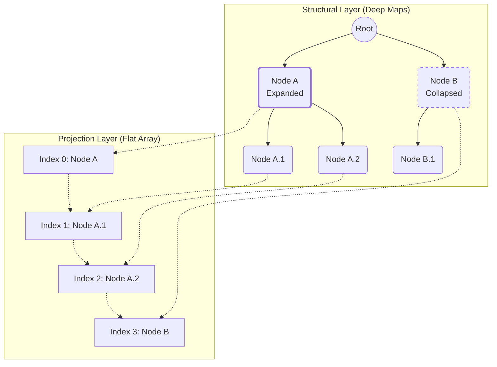
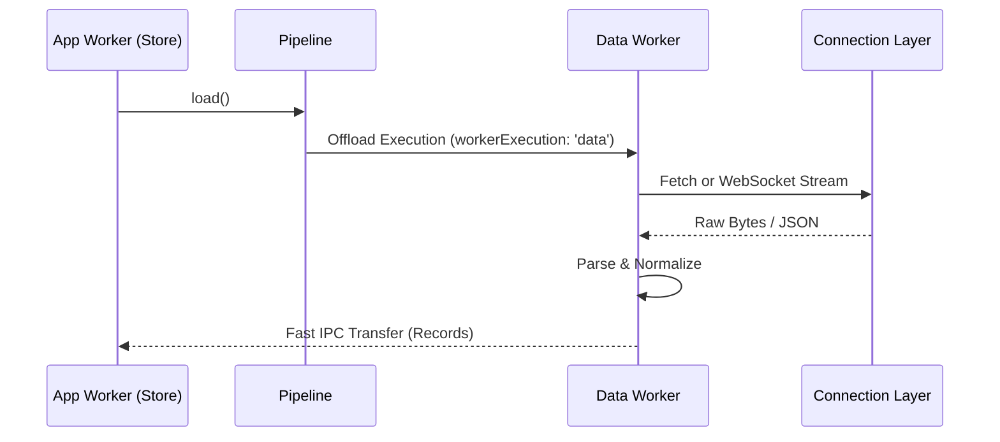

# Neo.mjs v12.1.0 Release Notes

**Release Type:** Grid Flexibility & Architecture Extensions  
**Stability:** Production-Ready  
**Upgrade Path:** Drop-in replacement for v12.0.0  

> **TL;DR:** In v12.1.0, the Neo Agent OS takes on its most profound architectural challenge yet: **The Hierarchical Data Layer**. We engineered `TreeStore` and `TreeGrid` to deliver the same O(1) raw rendering performance to infinitely nested organizational structures as v12.0 brought to flat grids. Supporting this hero feature, we completely overhauled the Data Pipeline, unlocked High-Performance Column Pinning, and fortified our MCP Server ecosystem with cloud-native OIDC security.
> 
> *Velocity Qualifier:* We resolved **184 tickets in just 22 active development days** (averaging ~8.4/day). While numerically lower than v12.0's 13.4/day, the scope per ticket in v12.1 shifted from "surface refactoring" to "deep multi-threaded architecture," proving our Human-AI co-architecture scales to extreme complexity without fracturing.

---

## ⚡ The Cyborg Factor Continues

If v12.0.0 proved that a solo developer pairing with a stateful AI agent could conquer foundational engine rewrites, v12.1.0 proves this velocity is sustainable. Working alongside the Neo Agent OS, we managed to resolve a staggering 184 tickets in just 22 days of active development.

But raw velocity isn't the real story here. The defining characteristic of v12.1 is the evolution of **Human-AI Co-Architecture**. 

### 1. Context Retention via the Memory Core
This isn't about code generation speed; it's about context retention. During the `TreeStore` implementation, we hit a critical wall: the "Split-Brain" state where hierarchical lookup maps drifted out-of-sync with raw Collection arrays during complex `updateKey` operations. Instead of losing hours to shotgun debugging, the Agent—utilizing the new **Memory Core**—synthesized our previous data-layer architectures and authored a surgical override that migrated descendant `parentId` references in perfect O(1) time across massive collections. The AI isn't just a typist; it retains the structural history of the framework.

### 2. Human Architectural Vision + AI Execution Velocity
While the AI provides unprecedented execution velocity, it requires an absolute anchor of truth to prevent the framework from collapsing under generative "spaghetti code."

> [!NOTE]
> ### 🛡️ The Cyborg Guardrail: Recovering from Architectural Hallucinations
> AI agents, even advanced ones, are prone to "architectural hallucinations" when faced with the extreme complexities of a multi-threaded VDOM. 
> 
> A perfect example occurred during the review of an external PR for Incremental Card Layout Updates. The AI reviewer hallucinated a catastrophic flaw, assuming the `VDomWorker` would destroy existing DOM nodes when receiving a pruned payload. It excitedly proposed a massive, unnecessary rewrite of the core engine.
> 
> The human (Tobi) immediately stepped in with a "recovery prompt," clarifying the fundamental symmetry of Neo's rendering engine:
> *"now YOU are hallucinating just as bad as the agent which did the PR. we are sending the same structural shape of vdom and vnode to the vdom worker... Helper ignores component references, smaller payload."*
> 
> Because the AI is stateful via the Memory Core, it instantly absorbed this structural correction, abandoned the destructive rewrite, and pivoted to generate a highly precise, encouraging, and technically flawless PR constraint matrix. The human provides the physics; the AI provides the momentum.

---

## 👑 Phase 1: The Hero Feature (TreeStore & Data Pipeline)

> **"Hierarchical data without the DOM overhead."**



v12.1 introduces a massive expansion to the data layer: native, high-performance hierarchical data management and representation. Rendering a Flat Grid with 50,000 records was solved in v12.0; the challenge for v12.1 was achieving that same O(1) rendering performance for massively nested organizational structures.

**The Challenge:** Managing deep trees of data (like file systems, organizational charts, or threaded discussions) traditionally crushes UI performance. Filtering a tree requires ancestor-aware logic. Sorting a tree requires preserving parent-child boundaries. Expanding a deeply nested node can suddenly unhide thousands of descendant records, triggering massive VDOM rebuilds and frame drops.

**The Solution: `Neo.data.TreeStore` and the Multi-Stage Pipeline**

We engineered a completely new hierarchical data foundation that fully supports the v12.0 "Turbo Mode" (bypassing model instantiation for raw JSON speed) while introducing real-time asynchronous subtree loading.

### 1. The TreeStore & TreeModel Architecture
*   **The Dual-Layer Architecture:** We introduced `Neo.data.TreeModel` and `Neo.data.TreeStore`. Unlike a flat collection, the `TreeStore` splits its state into a **Structural Layer** (`#allRecordsMap` and `#childrenMap` maintaining the complete hidden hierarchy in O(1) accessible memory) and a decoupled **Projection Layer** (a dynamically flattened array of only the expanded nodes). This allows our grid components to natively virtual-scroll a 50,000-row `TreeGrid` without ever knowing it's a tree.
*   **Ancestor-Aware Overrides & Turbo Mode:**
    *   **Filtering (`filter`):** When you filter a `TreeStore`, it employs "Ancestor-Aware Filtering" via a top-down recursive evaluation. If a deeply nested child matches the search query, the engine automatically bubbles up a visibility flag, ensuring all of its parent nodes remain visible in the projection. This integrates perfectly with "Turbo Mode Soft Hydration", validating complex nested paths without the V8 garbage-collection penalty of instantiating thousands of Records.
    *   **Sorting (`doSort`):** Sorting is now perfectly hierarchical. The Store sorts siblings within their localized parent boundary, recursively maintaining the structural integrity before surgically re-calculating the visible projection array.
*   **Structural Integrity (The Split-Brain Fix):** Complex operations like `updateKey` have been overridden to automatically migrate descendant `parentId` references. In a traditional DOM, updating an ID deep in a tree is terrifying; in Neo, we simply update the O(1) lookup map and let the VDOM worker handle the visual delta. Full CRUD support is built-in.

```javascript readonly
// Syncing the Structural Layer in O(1) time without rebuilding the VDOM.
updateKey(item, newKey) {
    let oldKey = this.getKey(item);

    // 1. Update the base Projection layer
    super.updateKey(item, newKey);

    // 2. Heal the deep O(1) Structural tracking maps
    if (this.#childrenMap.has(oldKey)) {
        let children = this.#childrenMap.get(oldKey);
        this.#childrenMap.delete(oldKey).set(newKey, children);

        // 3. Re-parent descendants instantly
        for (let child of children) {
            child[this.parentField] = newKey;
            this.#allRecordsMap.get(this.getKey(child))[this.parentField] = newKey;
        }
    }
}
```
*   **Async Subtree Loading:** For massive datasets that cannot be sent to the client at once, the `TreeStore` supports asynchronous, on-demand loading of child nodes when a user expands a parent branch. We also implemented explicit Error States and dedicated events to handle network failures gracefully within the UI.

### 2. The Unified Data Pipeline Architecture
To orchestrate complex data ingestion without freezing the UI, we completely overhauled how data flows into Neo.mjs.
*   **The Worker Execution Boundary:** The most powerful feature of the new `Neo.data.Pipeline` is that it acts as a fluid execution boundary. Developers can now trivially toggle where the heavy lifting occurs via a simple config (`workerExecution: 'data' | 'app'`). A pipeline can run entirely inside the `App` worker for typical datasets, or be instantly offloaded to the `Data` worker. When offloaded, the App Worker Pipeline becomes a lightweight proxy—it instructs the Data Worker to establish the connection, parse massive JSON payloads, and stream only the finalized records back via fast IPC.
*   **The Parser-Normalizer Split:** Data now flows through a strict, modular architecture: `Connection -> Parser -> Normalizer`. The new `Neo.data.normalizer.Base` (and its hierarchical sibling, `Tree`) acts as the final transformation layer, reshaping complex nested payloads from external APIs into predictable shapes before handing them to the Store.
*   **The Merged Universe (RPC API Integration):** Historically, Neo's Remote API (`Neo.remotes.Api`) generated typed proxy functions that bypassed data shaping. Now, these two architectures are merged. Developers can define `parser` and `normalizer` configurations directly inside the `remotes-api.json` manifest. When an App Worker ViewController invokes an RPC proxy, the Data Worker automatically intercepts the raw backend response, pipes it through the requested Pipeline components, and delivers perfectly shaped data back to the UI.

```json readonly
// remotes-api.json
{
    "MyApp.backend.Users": {
        "getUsers": {
            "pipeline": {
                "parser"    : "MyApp.parser.User",
                "normalizer": "MyApp.normalizer.User"
            }
        }
    }
}
```
*   **Progressive Hydration & Delta-Aware Pipelines:** Modern backends often push lightweight "Quick Wins" (like IDs) immediately, streaming complex aggregations later via WebSockets as Operational Transforms. Pipelines are now natively "Delta-Aware." A specialized Parser can evaluate a proprietary backend Opcode, translate it into standard Deltas (Insert, Update, Delete), and feed it to the Store. The `RecordFactory` increments the entity version, and the VDOM Worker surgical-patches only the affected grid cells without losing local UI state or resetting the collection.
*   **Dynamic Module Loading:** To keep the worker bundles instantaneously responsive, the `Data` worker dynamically requests and instantiates Connection, Parser, and Normalizer modules exactly when a proxied Pipeline requires them.



### 3. `Neo.grid.column.Tree` & The Big Data Demo
The visual counterpart to the `TreeStore` is the new `TreeGrid` column component. 
*   **O(1) Rendering Hierarchy:** It utilizes semantic indentation (`padding-left` derived from node depth) and interactive expand/collapse toggles natively rendered inside the pooled Grid Cells. 
*   **Accessibility First:** ARIA sibling and level fields are dynamically calculated and applied to the VDOM nodes on every structural mutation, guaranteeing screen-reader compatibility for nested data out of the box.
*   **The Killer Demo:** To prove the architecture, we built the **TreeGrid Big Data Demo**. It features an organic data generation algorithm that artificially constructs thousands of infinitely deep, nested records in the worker thread. Thanks to "Turbo Mode" and the fixed-DOM row pooling of the v12 Grid, sorting or expanding 10,000 nested items renders instantly at native speeds.

---

## 🧱 Phase 2: Visualizing the Data Layer (Value Banding & Locked Columns)

> **"Data visualization at the cellular level."**

### 1. Grid Value Banding
To enhance high-density data visualization, we introduced **Grid Value Banding**. This allows developers to apply dynamic visual rules to cells or rows based on their underlying record data. Whether visualizing financial thresholds, status indicators, or heatmap intensities, value banding provides immediate, semantic visual feedback without requiring heavy custom column renderers.

### 2. High-Performance Locked Columns
A long-awaited feature for enterprise grids is the ability to pin columns to the left or right of the viewport (`locked: 'start' | 'end'`) while horizontally scrolling massive datasets.

We implemented this by completely redesigning how cells are laid out.
*   **The Mathematical Layout Engine:** Instead of relying on rigid DOM structures, columns are now positioned using a purely mathematical placement engine.
*   **Cell Pooling Bypass:** To support locked columns without sacrificing the O(1) performance of our cell pooling engine, we implemented intelligent bypass logic. Locked cells are excluded from the horizontal recycling pool but remain fully integrated into the vertical Virtual DOM pipeline.
*   **Optical Pinning via Addon:** We utilize a Main Thread Addon to synchronously inject CSS variables (`--grid-locked-start-offset`) that counteract the scrolling `transform: translateX()`, creating the pinning effect.
*   **Drag & Drop Alignment:** Column Reordering (`SortZone`) seamlessly supports dragging unlocked columns across the viewport, as well as dragging locked columns to reorder within their respective pinned zones.

> [!WARNING]
> ### 🚧 The Compositor Event Horizon: Why the Industry is Broken
> Our approach to `locked` columns is fully functional and performant. However, our extreme horizontal scrolling tests revealed a fundamental limitation in modern browser architecture: **Main Thread vs. Compositor Thread synchronization**.
>
> When a user scrolls horizontally, the browser's GPU compositor instantly shifts the container. However, JavaScript `scroll` events fire *after* this native paint. Therefore, our Main Thread counter-translation arrives exactly one frame late, causing an inescapable "elastic lag" or visual jitter during fast horizontal scrolling. Every single-threaded framework suffers from this physics flaw when trying to optically pin elements inside a scrolling container.
> 
> **We refuse to accept jitter.** To achieve truly zero-latency locked columns, we are pulling no punches. We are planning a massive architectural pivot to a **Grid Multi-Body Architecture** (Epic #9486) post-v12.1. This will decouple horizontal and vertical scrolling physics, split the Virtual DOM into physically distinct container bodies, and guarantee flawless native scrolling sync.

---

## ⚖️ Phase 3: The Physics of Navigation (Loop-Free ScrollSync)

> **"Physics-based UIs demand a loop-free architecture."**

### 1. The ScrollSync Upgrade (Mobile & Desktop 2-Way Binding)
Synchronizing scroll positions between disparate elements—like a main grid body and a custom scrollbar component—has historically been prone to endless feedback loops. If Component A scrolls Component B, B fires a scroll event back to A, resulting in infinite loops or stuttering.

v12.1 introduces a complete overhaul to `Neo.plugin.ScrollSync`.
*   **Loop-Free Architecture:** We implemented a bulletproof locking mechanism. When a programmatic scroll is initiated (e.g., via the new API), `ScrollSync` establishes a lock, applies the scroll, and ignores the echo events using a highly tuned `requestAnimationFrame` release timer.
*   **Mobile vs. Desktop Unity:** We unified the two-way binding physics. `GridDragScroll` (the kinetic drag-to-scroll addon) now flawlessly routes through the `ScrollSync` API. This means dragging the grid on a touch screen perfectly accelerates the custom scrollbar thumb, and vice versa, without dropping a single frame or triggering a feedback loop.

### 2. Optical Pinning via Hybrid rAF Engine
To handle row-level pinning (like summary rows or group headers) during high-velocity scrolling, we engineered `GridRowScrollPinning`.
*   **The Hybrid Engine:** Relying solely on App Worker logic for sticky headers causes latency. We moved the pinning engine to a Main Thread Addon using a hybrid `requestAnimationFrame` structure. It injects hardware-accelerated CSS Variables to optically pin rows, matching the zero-latency responsiveness of native OS views.

### 3. Performance Engineering (The O(1) Mandate)
We scoured the codebase with extreme profiling tools to eliminate any operation that scaled exponentially with DOM size.
*   **Eradicating O(N²) Traversals:** We completely rewrote the core `syncVnodeTree` tracking. Previously, reconciling nodes required traversing the entire App Worker VDOM array. It now utilizes O(1) direct dictionary lookups.
*   **Path Traversals:** The `onScrollCapture` and `getTargetData` event paths were optimized heavily. By providing O(1) fast paths for specific event targets, we decoupled the engine from Main Thread DOM layout thrashing during continuous kinetic scrolling.
*   **Proxy Getter Hoisting:** To alleviate V8 Garbage Collection pressure during high-frequency VDOM generation, we hoisted getter proxies within the Grid Row internals, preventing duplicate function instantiations across the cell pool.

---

## 🤖 Phase 4: The Agent OS (Cloud-Native MCP Infrastructure)

> **"Unleashing Agents into Cloud-Native Environments."**

Neo.mjs is not just a UI framework; we are building the foundation of the **Neo Agent OS**. This requires robust Model Context Protocol (MCP) servers (Knowledge Base, Neural Link, Memory Core) to bridge AI agents with the framework context.

In v12.0, these servers exclusively utilized standard I/O (`stdio`) transports, limiting them to local, single-machine execution (e.g., inside an IDE like Claude Desktop or Cursor). In v12.1, we have fundamentally upgraded the MCP architecture for true cloud-native, distributed deployments.

### 1. Dual-Transport Architecture (SSE Integration)
*   **The Logical Transport Layer:** Handled by the new `TransportService`, Neo.mjs MCP servers now natively support **Server-Sent Events (SSE)** via HTTP alongside `stdio`. This allows an AI agent running in a cloud environment to connect to a Neo MCP server hosted entirely separately (e.g., in a Kubernetes cluster or Docker container).
*   **Stateful Sessions:** Unlike `stdio` where the process lifetime maps strictly to the connection, HTTP is stateless. We implemented robust session lifecycle management utilizing the standard `Mcp-Session-Id` architecture.

### 2. OIDC & OAuth 2.1 Security Anchor
Exposing MCP servers over the network requires enterprise-grade security. To prevent unauthorized agents from accessing your knowledge bases or triggering Neural Link actions, we implemented a complete **Authorization Anchor**.
*   **Discovery-First Pattern:** The `AuthService` dynamically resolves security endpoints from the identity provider's `.well-known/openid-configuration`.
*   **Token Introspection:** It implements RFC 7662 compliant token validation against any standard identity provider (like Keycloak, Auth0, or Okta).
*   **Audience Enforcement:** The server strictly validates that the `aud` (Audience) claim in the Bearer token matches the MCP server's public URL, effectively preventing token-passthrough attacks.
*   **Protected Resource Metadata (PRM):** The server natively routes discovery requests, allowing dynamic MCP clients to autonomously identify the required authorization server.

### 3. Comprehensive Playwright Testing
Security requires proof. We added `Authorization.spec.mjs` to our Playwright test suite, which spins up a mock OIDC identity provider, spawns the MCP processes dynamically, and validates the entire secure handshake (including CORS enforcement, 401 rejections, and zero-trust validations) in a fully automated flow.

### 4. The 48-Hour OIDC Sprint (An Engineering War Story)
To understand the unprecedented velocity the Neo Agent OS enables, look no further than the MCP cloud-native migration. The transition from local `stdio` to a fully authorized HTTP/SSE cloud environment was executed in an intense two-day sprint, driven entirely by this Human-AI dynamic.

*   **Security Autonomous Correction:** When an early documentation draft proposed hardcoding API keys, the Agent independently flagged the security anti-pattern. It immediately refactored the MCP ecosystem to securely map `.env` variables via `dotenv`, establishing a strict zero-trust boundary.
*   **Generic Discovery:** Moving beyond hardcoded Keycloak paths, the Agent implemented dynamic OIDC discovery (`{issuer}/.well-known/openid-configuration`), enabling seamless integration with any provider (Auth0, Okta, Google) out of the box, accompanied by a dedicated Google OAuth Hands-on Guide.
*   **Instant Structural Refactoring:** As the authorization and transport logic expanded, the core `Server.mjs` became bloated. The human architect challenged the design. In a single, flawless turn, the AI extracted the complex logic into `AuthService.mjs` and `TransportService.mjs` utilizing Neo's dynamic imports, instantly restoring architectural elegance.

This is the Reality of v12.1: We are no longer just writing code faster; we are scaling architectural execution to a superhuman timeline.

---

## 🎓 The Core Engine Learning Guides & Workshop

We believe that the best framework is one you deeply understand, not just one you use blindly. To that end, v12.1 officially launches the **Core Engine Learning Guides & Workshop**.

*   **Deep Dives:** New comprehensive guides have been added to the Neo Portal, covering everything from the underlying worker architecture to the advanced routing and state management patterns.
*   **The Workshop:** A structured set of exercises designed to take developers from basic Neo.mjs concepts to building complex, highly performant, multi-threaded applications. This is the fastest track to mastering the "Fat Client" paradigm.
*   **Documentation Enhancements:** Alongside the major features, we resolved numerous documentation gaps, improved inline styling within our Markdown components, and enhanced the knowledge base structure for AI agents and human developers alike.

---

## 📦 Full Changelog

### 🚀 [Epic] Upgrade ScrollSync for Loop-Free Two-Way Binding (Mobile & Desktop)
* **Enhancement:** Mobile Scrollbar UX: Increase touch width to 40px and theme thumb colors (#9379)
* **Enhancement:** Extract desktop grid scrollbar width into a CSS variable (#9378)
* **Enhancement:** Define `--grid-scrollbar-touch-width` variable across all themes (#9377)
* **Enhancement:** Add .neo-has-touch capability class and enhance Mobile Grid Scrollbar (#9376)
* **Enhancement:** Improve ScrollSync Lock Release Mechanism (rAF vs setTimeout) (#9375)
* **Enhancement:** Mobile UX Enhancements for Grid VerticalScrollbar (SCSS) (#9374)
* **Enhancement:** Enable Mobile Two-Way ScrollSync for Grid VerticalScrollbar (#9373)
* **Enhancement:** Refactor GridDragScroll to use ScrollSync API (#9372)
* **Enhancement:** API for Programmatic Scrolling in ScrollSync (#9371)
* **Enhancement:** Upgrade ScrollSync Locking Mechanism (#9370)

### 🚀 Buffered Grid - High-Performance Locked Columns (`locked: 'start' | 'end'`)
* **Fix:** Grid: Horizontal Scroll Performance & Jitter for Locked Columns (#9485)
* **Test:** Grid: Add Unit Tests for Locked Columns Feature (#9484)
* **Enhancement:** Grid: Implement Reactive locked Config and Run-Time Column Reordering (#9483)
* **Enhancement:** Grid: Column Drag & Drop Integration & State Transitions (#9460)
* **Enhancement:** Grid: Implement Reactive locked Config and Cell Pooling Bypass (#9459)
* **Enhancement:** Grid: Create Main Thread Addon for Column Pinning (CSS Variables) (#9458)
* **Enhancement:** Grid: Implement Mathematical Column Layout Engine (#9457)

### 🚀 TreeGrid Big Data Demo
* **Enhancement:** Portal: Add TreeGrid Big Data Example (#9578)
* **Test:** TreeGrid Big Data Demo: Create E2E Tests (#9466)
* **Enhancement:** TreeGrid Big Data Demo: Styling, Logging, and Final Integration (#9465)
* **Enhancement:** TreeGrid Big Data Demo: Implement Controls and Grid Wiring (#9464)
* **Enhancement:** TreeGrid Big Data Demo: Implement Organic Data Generation Algorithm (#9463)
* **Enhancement:** TreeGrid Big Data Demo: Scaffold Base Directory and Files (#9462)

### 🚀 [Epic] Grid Value Banding
* **Enhancement:** [Epic Sub] Value Banding styling conflicts with row selection (#9515)
* **Enhancement:** [Epic Sub] TreeStore Value Banding Support (#9514)
* **Enhancement:** Optimize Grid Value Banding (startIndex Support) (#9513)
* **Enhancement:** Dynamic Value Banding Updates (#9512)

### ✨ Standalone Enhancements
* **Enhancement:** Update AI_QUICK_START.md to include Antigravity configuration (#9567)
* **Enhancement:** Enhance `agent` parameter formatting in GitHub Workflow MCP Server (#9566)
* **Enhancement:** Finalize Data Pipeline Push Integration & UI Reactivity (#9564)
* **Enhancement:** Modularize MCP Server Architecture and Extract Shared Services (#9563)
* **Enhancement:** Implement Generic OIDC Discovery and Google OAuth Hands-on Guide (#9562)
* **Enhancement:** Implement OIDC/OAuth Authorization for KB and Memory MCP Servers (#9558)
* **Enhancement:** Examples: Implement unified Data Pipeline showcases (#9551)
* **Enhancement:** Refactor(data): Implement Store-to-Pipeline Legacy Bridge (#9550)
* **Enhancement:** Refactor Pipeline IPC to use Declarative Remote Configs (Instance Proxies) (#9546)
* **Enhancement:** Enhance RemoteMethodAccess to Support Instance-to-Instance Routing (#9544)
* **Enhancement:** Store Pipeline Instantiation and Legacy Parser Compatibility (#9543)
* **Enhancement:** Update Code of Conduct to include AI Entities & Autonomous Agents (#9542)
* **Enhancement:** Update CONTRIBUTING.md to include AI Agents & Autonomous Entities (#9540)
* **Enhancement:** Add TreeStore override for updateKey() (#9539)
* **Enhancement:** Enhance Collection.updateKey() to support filtered collections (allItems map) (#9538)
* **Enhancement:** Rename mcp-stdio.mjs to mcp-server.mjs (#9534)
* **Enhancement:** Migrate MCP servers from SSEServerTransport to StreamableHTTPServerTransport (#9533)
* **Enhancement:** Support SSE transport for knowledge-base and memory-core MCP servers (#9532)
* **Enhancement:** Add lightweight cell resizing method to grid.Body (#9529)
* **Enhancement:** Real-time cell resizing during grid column drag:move (#9528)
* **Enhancement:** Add visual focus styling during grid column resizing (#9526)
* **Enhancement:** Grid Column Resizing: Header Logic and Update on Drop (#9522)
* **Enhancement:** Tree Grid: Optional Helper Lines for Tree Structures (#9521)
* **Enhancement:** Portal HomeCanvas: Enhance spark contrast in dark theme (#9516)
* **Enhancement:** Improve inline code styling within h1 tags in Markdown component (#9506)
* **Enhancement:** Migrate existing Stores to the new Pipeline architecture (#9502)
* **Enhancement:** Auto-detect `isTreeGrid` config based on the Store instance (#9481)
* **Enhancement:** DevIndex: Add Contextual Rank Column to Grid (#9476)
* **Enhancement:** Grid: Remove `#initialChunkSize` DOM pooling bypass & fix pool shrink bug (#9475)
* **Enhancement:** Grid: Optimize row pooling for small datasets (#9474)
* **Enhancement:** Integrate RPC API into Pipeline Architecture (Connection.Rpc) (#9455)
* **Enhancement:** Implement Push-Based WebSocket Integration in Data Pipeline (#9454)
* **Enhancement:** Implement Pipeline IPC and Remote Execution Routing (#9453)
* **Enhancement:** Connection Foundation and Parser Refactoring (#9452)
* **Enhancement:** Create Pipeline Cornerstone and Refactor Store Implementation (#9451)
* **Enhancement:** Enhance Data Worker to Instantiate Dynamically Loaded Modules (#9450)
* **Enhancement:** TreeGrid Documentation: Create high-level architectural guide for TreeStore (#9445)
* **Enhancement:** Clean up redundant `Neo.isDestroyed` catch blocks (#9444)
* **Enhancement:** AI Workflow: Integrate Anchor & Echo strategy into Pre-Flight Commit check (#9440)
* **Enhancement:** TreeStore: Apply "Anchor & Echo" JSDoc strategy for AI discoverability (#9439)
* **Enhancement:** TreeStore: Reduce GC pressure and redundant iterations (#9438)
* **Enhancement:** TreeStore: Optimize #allRecordsMap iteration loops (#9437)
* **Enhancement:** TreeStore: Decouple clearFilters() from legacy allItems pattern (#9434)
* **Enhancement:** TreeStore: Implement bulk expandAll() and collapseAll methods (#9433)
* **Enhancement:** TreeModel: Introduce childCount to decouple isLeaf state from emptiness (#9430)
* **Enhancement:** TreeStore: Implement ancestor-aware filtering for filter override (#9429)
* **Enhancement:** TreeStore: Implement hierarchical sorting for doSort override (#9428)
* **Enhancement:** Refactor Tree column and component reactivity (#9426)
* **Enhancement:** Refactor Tree cell component architecture for performance (#9425)
* **Enhancement:** Optimize `cellPoolSize` calculation in `grid.Body` to prevent DOM waste (#9424)
* **Enhancement:** TreeStore Full CRUD Support & Structural Mutations (#9423)
* **Enhancement:** Update TreeStore to manage ARIA sibling fields on mutations (#9422)
* **Enhancement:** Migrate Data Pipeline to Connection -> Parser -> Normalizer flow (#9420)
* **Enhancement:** Implement Dynamic Module Loading in `Neo.worker.Data` (#9419)
* **Enhancement:** Create Data Normalizer Architecture (`Neo.data.normalizer.Base` & `Tree`) (#9418)
* **Enhancement:** Optimize `TreeStore` Hot Paths (Performance) (#9417)
* **Enhancement:** Add Error State & Events for Async Tree Loading (#9416)
* **Enhancement:** Support "Turbo Mode" in `Neo.data.TreeStore` (#9415)
* **Enhancement:** Refactor `Neo.data.Store` to unify Record Hydration (#9414)
* **Enhancement:** Create Async Subtree Loading for `Neo.data.TreeStore` (#9413)
* **Enhancement:** TreeGrid Documentation & Examples (#9410)
* **Enhancement:** Grid Core Integration & TreeGrid Accessibility (#9408)
* **Enhancement:** Create `Neo.grid.column.Tree` & Cell Component (#9407)
* **Enhancement:** Create `Neo.data.TreeStore` (#9406)
* **Enhancement:** Create `Neo.data.TreeModel` (#9405)
* **Enhancement:** Performance: Eliminate Path scrollTop Layout Thrashing in getTargetData (#9403)
* **Enhancement:** Performance: Eliminate Main Thread Layout Thrashing in getTargetData (#9402)
* **Enhancement:** Performance: Proxy Getter Hoisting in Grid Row & Array Slice Optimization (#9401)
* **Enhancement:** Performance: O(1) Fast Paths for onScrollCapture getById Traversal (#9400)
* **Enhancement:** Performance: Eliminate O(N²) App Worker VDOM Traversal (syncVnodeTree) (#9398)
* **Enhancement:** Enhance Helix to rotate to initial selection on mount (#9368)
* **Enhancement:** Feature: Add Collection.updateKey() method (#9196)

### 🐞 Bugfixes
* **Fix:** Analysis: Robust Multi-Window LivePreview Routing & Base Path Resolution (#9586)
* **Fix:** LivePreview popout windowUrl generates incorrectly in dist environments (#9585)
* **Fix:** Data worker broadly bundles non-data framework classes (Main.mjs) causing Webpack build failure (#9584)
* **Fix:** Webpack matches absolute paths, invalidating the ^\.\/ magic comment anchor (#9583)
* **Fix:** Webpack fails due to unanchored `webpackInclude` picking up Node modules (#9582)
* **Fix:** Webpack fails to resolve Task, Canvas, and Data worker dynamic chunks due to strict magic comments (#9581)
* **Fix:** Fix ChromaDB defrag crash on ghost entries and refine log output (#9579)
* **Fix:** Regression: Store.load({url}) fails when Store has no initial URL config (#9565)
* **Fix:** Fix RemoteMethodAccess for Main Thread Addons and Instance-to-Instance ID collision (#9547)
* **Fix:** Fix Knowledge Base Tool Argument Routing (x-pass-as-object) (#9545)
* **Fix:** Grid SortZone incorrectly intercepts column resize drag events, causing VDOM corruption and layout thrash (#9531)
* **Fix:** Grid cells vanish during column resize after a drag-and-drop column reorder (#9530)
* **Fix:** Grid cells do not shrink on column resize drop due to minWidth constraint (#9527)
* **Fix:** Fix header resize proxy visibility and prevent unwanted absolute styles on drop (#9525)
* **Fix:** Prevent column sort toggle when clicking/dragging resize handles (#9524)
* **Fix:** Resolve drag&drop collision between grid column resorting and resizing (#9523)
* **Fix:** LivePreview: Propagate active theme to popout child window (#9520)
* **Fix:** SharedWorker: Fix theme resolution for child windows (#9519)
* **Fix:** Fix LivePreview incorrect popout URL for subsequent windows (SharedWorkers) (#9518)
* **Fix:** Tooltip regression: dynamic domListeners bypassed reactivity and bubbling fixes (#9510)
* **Fix:** Portal: Missing scrollbar contrast in learning section markdown component (#9505)
* **Fix:** List: Fix vertical scrollbar visibility and contrast (#9504)
* **Fix:** TimelineCanvas regression: Canvas not showing due to SharedCanvas getCanvasId() mismatch with componentId (#9503)
* **Fix:** Firefox Nightly: Scroll wheel stuck on Portal home page due to scroll-snap-type mandatory (#9482)
* **Fix:** Firefox Nightly R&D: OffscreenCanvas Worker-to-Worker Transfer Failure (#9479)
* **Fix:** Grid ScrollManager: Support dynamic windowId changes for Main Thread Addon registration (#9478)
* **Fix:** Fix Grid Drag Scrolling Regression (#9470)
* **Fix:** TreeStore: internalIdMap desyncs after bulk operations (expandAll), breaking selection (#9469)
* **Fix:** Fix memory leak in TreeStore.#rebuildKeysAndCount() (#9468)
* **Fix:** TreeGrid Component pooling accumulates `is-leaf` class leading to visual bugs (#9448)
* **Fix:** Fix Grid Pooling DOM thrashing and Collection internalId lookup (#9442)
* **Fix:** TreeStore: Fix visible projection for dynamic child additions to expanded parents (#9435)
* **Fix:** TreeStore: Override clear() to prevent memory leaks and split-brain states (#9432)
* **Fix:** TreeStore: Fix ARIA desync (siblingIndex and siblingCount) after sort and filter (#9431)
* **Fix:** Fix TreeStore projection mutations and Row VDOM recycling (#9427)
* **Fix:** Fix Helix & Gallery selection models keynav and record resolution (#9367)
* **Fix:** Chrome Window Neo mjs home (#9365)
* **Fix:** Chrome Window Calendar Basic (#9364)
* **Fix:** Chrome Window Learn funktionale Komponenten (#9363)
* **Fix:** Chrome Windows DevIndex (#9362)
* **Fix:** Chrome Windows Johannes DevIndex (#9361)
* **Fix:** scroll to bottom bug on main page (#9360)
* **Fix:** Google Windows Covid 19 Helix (#9359)
* **Fix:** Google Windows Covid 19 Helix (#9358)
* **Fix:** Chrome Windows Covid App (#9357)
* **Fix:** Chrome Windows: Multi Window Drag & Drop (#9356)
* **Fix:** build: Fix dirent.path resolution and OS-agnostic pathing in esmodules.mjs (#9349)

### 📚 Documentation
* **Docs:** Create Comprehensive Guide for MCP Server Authorization (#9560)
* **Docs:** Docs: Create Learning Guide for the Unified Data Pipeline Architecture (#9552)
* **Docs:** Remove outdated and redundant .github/CONCEPT.md (#9541)
* **Docs:** Docs: Align core engine guides to use "engine" terminology instead of "framework" (#9509)
* **Docs:** Docs: Explain Main Thread Addons and Lazy Loading in Lifecycle guide (#9508)
* **Docs:** Docs: Clarify Two-Tier Reactivity Architecture and core.Config role (#9507)
* **Docs:** Add File Editing Tool Protocol to AGENTS.md (#9473)
* **Docs:** Add Testing Protocol to AGENTS.md (#9472)
* **Docs:** Add Anti-Corruption Protocol to AGENTS.md (#9471)

### 🧪 Tests & E2E
* **Test:** Add Functional Tests for MCP Authorization and Refine Error Handling (#9561)
* **Test:** Remove `console.log` statements causing noise in unit tests (#9549)
* **Test:** `calcValueBands` broken state initialization on `splice` (StoreValueBanding test failure) (#9548)
* **Test:** Fix TreeStore.collapse() failing after expandAll() due to out-of-sync Collection map (#9467)
* **Test:** TreeGrid: Fix 7-click expand/collapse bug and redundant change events (#9447)
* **Test:** Fix ComboBox test failure due to internalId changes (#9446)
* **Test:** Stabilize Playwright Unit Tests by Centralizing Global Mocks (#9443)
* **Test:** TreeGrid Component Tests (UI & Interactions) (#9412)
* **Test:** TreeGrid Unit Tests (Data & Logic) (#9411)
* **Test:** Implement Synthetic Thumb Drag Profiles for Optical Pinning Validation (#9396)
* **Test:** Refine GridRowScrollPinning to Target Explicit Thumb Drags (#9395)
* **Test:** Validate GridRowScrollPinning against DevIndex Canvas Worker Latency (#9394)
* **Test:** Implement GridRowScrollPinning via CSS Variables (#9393)
* **Test:** Implement GridRowScrollPinning Automated Test and Sync Refinement (#9392)
* **Test:** Refactor GridRowScrollPinning to Hybrid rAF Engine (#9391)
* **Test:** Fix GridRowScrollPinning Registration and DOM Lookup Flaws (#9390)
* **Test:** Remove Legacy Scroll Prediction Heuristics from Grid ScrollManager (#9389)
* **Test:** Enhance VDOM Update Pipeline with Meta Payload Support (#9388)
* **Test:** Implement Main Thread Optical Pinning for Grid Scrolling (#9387)
* **Test:** Add min velocity threshold to Grid Predictive Scrolling (#9386)
* **Test:** Expose Performance tracker metrics via Remote Methods (#9385)
* **Test:** Implement Predictive Delta Injection (Velocity & Acceleration) (#9383)
* **Test:** Implement Dynamic RTT Measurement for VDOM Updates (#9382)
* **Test:** Create Deterministic Grid Thumb Drag Benchmark (#9381)

### 🔧 Chores & Maintenance
* **Chore:** Workers: Standardize and optimize dynamic imports (#9517)
* **Chore:** Implement generic Neo.util.Performance tracker (#9384)


All changes delivered in 1 atomic commit: [eea0336](https://github.com/neomjs/neo/commit/eea03361f1d172111856cd2ac64999e29fe3717c)
