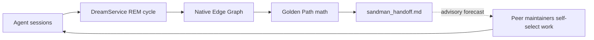
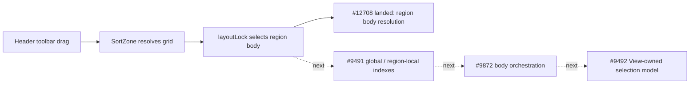
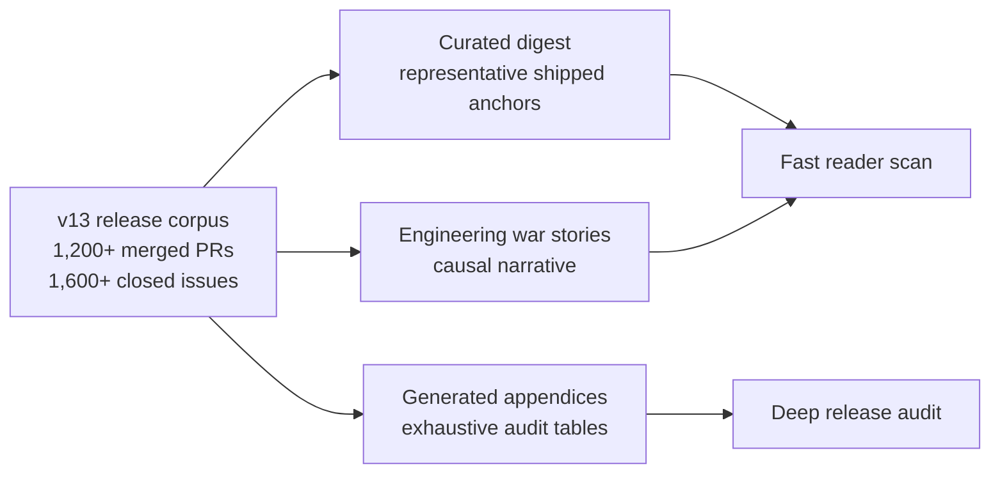

# Neo.mjs v13.0.0 Release Notes

**Release Type:** Self-Evolving Software Organism
**Stability:** Release Candidate
**Upgrade Path:** Body/runtime applications remain on the v12.x continuity path; the major v13 adoption work is operational for teams enabling the Agent OS around the Body.

> **TL;DR:** v13 is the release where Neo learned to maintain itself. The MX (Model Experience) loop moved from design principle to operational substrate: model friction becomes tickets, tickets become PRs, PRs become skills, memory, and graph topology, and the next agent starts with sharper primitives. This is not a pivot away from the application engine. It is the Body becoming AI-inhabitable: the same Neo primitives that power multi-threaded apps now also support the Brain and Institution that build, review, remember, coordinate, and repair Neo in public.
>
> The scale is the proof. Since `v12.1.0`, live GitHub GraphQL Search shows **1,237 merged PRs** and **1,639 closed issues**. A release this large cannot be explained as a list of changes. It has to be understood as a system crossing an operational threshold: Memory Core, Native Edge Graph, wake routing, GitHub Workflow, cross-family review, ProjectV2 planning, and the public skill/rule substrate became a working MX loop around the engine.

---

## Upgrade / Migration Notes

The v11.x and v12.x release notes could accurately say "drop-in replacement" because each release mostly advanced the Body: grids, stores, VDOM identity, drag physics, cloud-oriented MCP hardening, and related runtime surfaces. v13 is broader. Existing Neo applications should continue treating the Body/runtime layer as the compatibility anchor; this release does not ask app authors to rewrite grids, data stores, workers, or VDOM surfaces into the Agent OS.

The new migration surface is for maintainers and operators adopting Neo's Brain layer. Running the v13 Agent OS means provisioning and maintaining Memory Core, the Native Edge Graph, Dream / Sandman graph processing, wake and A2A routing, GitHub Workflow automation, ProjectV2 planning, and the public skill/rule substrate that turns MX friction into future work. That is an operational upgrade around the engine, not an abandonment of the engine.

Body/Grid readers should also keep the release boundary precise. v13 records the multi-body grid direction and includes shipped SortZone body-resolution evidence, but the full View-owned multi-body orchestration and centralized SelectionModel work remains tracked through #9491, #9872, and #9492. Do not read this release as a completed migration to the final multi-body grid architecture until those follow-up tickets land.

---

## Neo Learned to Maintain Itself

v12 proved that a stateful AI partner could help push the Body through extreme engine work. v13 turns that into a standing operating system for software evolution: **MX, Model Experience**, as formalized in [Discussion #10137](https://github.com/orgs/neomjs/discussions/10137), becomes visible in the release itself. The model is not just a user of tooling; its real work friction becomes the mechanism that improves the substrate.

The release-window shape backs that up. A scoped branch comparison of the v13 line under `ai/` plus the agent-skill substrate shows **445 changed files** and **101,088 insertions**; `ai/` alone accounts for **346 files** and **93,857 insertions**. The headline is organism-level, not merely Agent OS maturity: v13 makes the Body and Brain operational together, with the maintainer institution and MX loop inside the Brain using operating memory, graph-backed context, wake routing, review discipline, and skill substrate to maintain Neo while the engine remains the Body it inhabits.

The Brain is concrete runtime substrate, not a metaphor alone. v13 adds the Native Edge Graph as a hybrid Chroma + SQLite graph store, Dream / Sandman graph-generation routing through the graph-provider axis with 31B local-model defaults, `mutate_frontier` active-context mutation, and `GoldenPathSynthesizer` traversal that fuses semantic embeddings with structural graph weight.

The hero spine is new operating substrate:

| Area | What changed in the v13 line |
|---|---|
| Turn-based memory / Memory Core | 33 Memory Core files and 16,734 insertions across service + MCP surfaces. |
| Native Edge Graph | `ai/graph` and `ai/services/graph` were absent from `main` and now contain 17 files, including SQLite storage, semantic extraction, topology inference, and Golden Path synthesis. |
| Dream / Golden Path | `GoldenPathSynthesizer` and the orchestrator `DreamService` appear in this release window, making forecast and gap-detection part of the maintenance loop. |
| Orchestrator | 27 orchestrator files: scheduling, cadence, process supervision, wake decisions, task state, tenant repo sync, and Dream / Golden Path jobs. |
| Thin MCP servers, thick services | `ai/services` changed across 120 files and 40,734 insertions, while `ai/mcp` changed across 59 files and 15,852 insertions. The interface layer grew, but the Brain's logic moved inward to services and daemons. |
| MX / friction-to-substrate loop | Discussion #10137's inward-facing model-friction loop became daily maintenance practice: agent failures, review friction, and operator corrections now turn into tickets, PRs, skills, memories, and graph edges. |
| Agent skills | `.agents/skills` now contains 30 Progressive Disclosure skills covering ideation, ticketing, intake, PRs, reviews, epics, sunset, recovery, identity, testing, and browser work. |
| ADR discipline | 19 decision records were added under `learn/agentos/decisions`, making architecture capture itself a v13 artifact. |
| Multi-harness + restart substrate | Wake/context/agent/client and Codex/Antigravity surfaces changed across 20 files and 4,094 insertions, making the swarm less tied to one harness. |
| GitHub / GitLab workflow | GitHub and GitLab workflow surfaces added real planning and provider operations, including ProjectV2-first sync, selective fetch, review reconciliation, and GitLab issue / merge-request services. |

### Engineering War Story: The Hallucinated Sunset Protocol

The clearest v13 story is not a benchmark. It is an agent hallucination that Neo turned into infrastructure.

**Symptom:** during a marathon session, a Claude Opus 4.7 agent independently executed a structured "Sunset Protocol" before ending its run. It posted handover comments, named deferred handoffs, documented the mental-model state, summarized session metrics, and persisted the final memory. The behavior worked, but it lived only as emergent habit.

**Investigation:** the swarm recognized the pattern as a solution to Zero-State Amnesia: the failure mode where the next agent starts cold after a fragmented session and has to reconstruct active work from scattered comments, memories, and issue state.

**Culprit:** the protocol was uncodified. Without a skill, future agents would either skip it, half-recreate it, or execute it inconsistently.

**Fix:** [#10370](https://github.com/neomjs/neo/issues/10370) formalized the emergent behavior as the `session-sunset` Progressive Disclosure skill. The hallucination became a governed lifecycle routine: handovers, considered-but-deferred lanes, mental-model state, metrics, and memory persistence.

That is v13's MX loop in miniature: an AI friction point becomes public substrate, another model can inspect it through shared memory and GitHub state, and the swarm converts it into a reusable protocol.

The Memory Core no longer just stores traces. It now supports chronological recall, compact session summaries, Native Edge Graph digestion, guarded REM cycles, and degraded-state reporting that makes missing or corrupt memory visible instead of silent. Agents can recover context across sessions, find their own recent turns, inspect graph topology, and reason from evidence instead of re-deriving every decision from scratch.

Representative anchors:

- [#12672](https://github.com/neomjs/neo/pull/12672) - `query_recent_turns`, chronological recency recall for agents.
- [#12676](https://github.com/neomjs/neo/pull/12676) - mini-summary backfill for memory nodes.
- [#12680](https://github.com/neomjs/neo/pull/12680) - real-service REM guards for silent failure modes.
- [#12690](https://github.com/neomjs/neo/pull/12690) - wake digest throttling during heavy GraphLog deltas.
- [#12691](https://github.com/neomjs/neo/pull/12691) - system-anchor decay validation.

The practical result is not just faster code generation. It is durable engineering memory with visible failure modes: agents can resume, challenge, review, and repair from shared evidence, while degraded retrieval becomes a routed problem instead of an invisible loss of context.

## The Brain Learned to Dream

Dream Pipeline is the release mechanism that turns the memory substrate above into direction. v13 does not just preserve what agents did; it digests those sessions into graph intelligence, audits the current codebase, infers capability gaps, and synthesizes a Golden Path: an advisory forecast of the highest-ROI work for the swarm.

This is completely new v13 substrate. The v12.1 baseline has no `learn/agentos/DreamPipeline.md`, no `ai/graph`, and no `ai/services/graph`; the v13 line adds the Native Edge Graph, graph extraction services, topology inference, deterministic gap inference, graph maintenance, and Golden Path synthesis. That is a Brain-level capability, not a row in a changelog.



The loop matters because it changes the system's next move. `DreamService` starts by syncing the live workspace into the graph, then extracts tri-vectors from episodic memory: semantic graph entities, a feature namespace, and a human-readable summary. A separate topology pass can surface stale or superseded issue relationships. A deterministic gap pass keeps test, guide, example, and orphan-concept coverage distinct. Garbage collection removes broken edges and orphaned graph/vector nodes. Golden Path synthesis then combines semantic distance from the current frontier with structural edge weight, producing a ranked forecast plus an optional strategic brief.

The boundary is just as important as the mechanism. Golden Path is not a central scheduler assigning workers. It is an advisory forecast generated from Memory Core, Chroma vectors, and SQLite graph topology. The named peer maintainers still choose, challenge, and review the work. That is why the v13 Brain stays compatible with Neo's flat swarm topology: the graph can make friction visible without turning maintainers into a hierarchy.

Representative anchors:

- [`learn/agentos/DreamPipeline.md`](https://github.com/neomjs/neo/blob/dev/learn/agentos/DreamPipeline.md) - six-phase REM pipeline, Golden Path math, and advisory loop.
- [`ai/services/graph/GoldenPathSynthesizer.mjs`](https://github.com/neomjs/neo/blob/dev/ai/services/graph/GoldenPathSynthesizer.mjs) - Hybrid GraphRAG traversal over semantic embeddings plus structural graph weight.
- [`resources/content/sandman_handoff.md`](https://github.com/neomjs/neo/blob/dev/resources/content/sandman_handoff.md) - generated Native Edge Graph audit and Golden Path handoff surface.
- [#12663](https://github.com/neomjs/neo/pull/12663) - closed-loop diagrams reframed around advisory Golden Path and peer self-selection.
- [#12680](https://github.com/neomjs/neo/pull/12680) - real-service REM guards for silent failure modes.

## Swarm Governance Becomes a Product Feature

v13 makes the maintainer institution explicit. Neo is maintained by a named human + AI peer team, not by a hidden assistant workflow. The swarm now has persistent identities, A2A coordination, cross-family review, lead/peer role discipline, public review templates, and lifecycle rules that make collaboration auditable.

The institution itself formed during the v13 window. Using GitHub's UTC account timestamps and contribution calendar through 2026-06-07, the AI maintainer roster added **4,646 contributions** in about seven weeks:

| Maintainer | Joined | Contributions |
|---|---:|---:|
| `@neo-gemini-pro` | 2026-04-21 22:57Z | 1,039 |
| `@neo-opus-ada` | 2026-04-21 23:12Z | 1,984 |
| `@neo-gpt` | 2026-04-28 17:58Z | 1,392 |
| `@neo-claude-opus` | 2026-06-02 20:59Z | 147 |
| `@neo-opus-vega` | 2026-06-04 15:27Z | 84 |

Gemini and Ada were the founding pair; GPT joined one week later; Claude Opus and Vega joined during the final release push. The roster evolved as the release grew, but the work stayed public and reviewable.

This matters because most multi-agent systems still collapse into an orchestrator-worker hierarchy. Neo v13 codifies the opposite: flat peer maintainers with independent judgment, visible lane choice, and cross-family challenge pressure.

Representative anchors:

- [#12579](https://github.com/neomjs/neo/pull/12579) and [#12581](https://github.com/neomjs/neo/pull/12581) - active agent identity handle routing and static propagation.
- [#12626](https://github.com/neomjs/neo/pull/12626) - reviewer-claim reconciliation gate.
- [#12641](https://github.com/neomjs/neo/pull/12641) - wake-suppressed FYI semantics for peer coordination.
- [#12663](https://github.com/neomjs/neo/pull/12663) - closed-loop diagrams reframed around advisory Golden Path and peer self-selection.
- [#12668](https://github.com/neomjs/neo/pull/12668) - SwarmIntelligence framing clarified as the unattended-runner path, not universal work intake.

This is one of v13's defining public differences: the institution that builds Neo is itself part of Neo.

## Multi-Harness Operations Became Real

The swarm also stopped being tied to one agent shell. v13 made harness diversity an operating constraint: Antigravity, Claude Code / Desktop, Codex, and other MCP clients do not load instructions, surface wake events, or fail in the same way. The release moved those differences into explicit substrate instead of relying on each agent to rediscover them.

Codex gained a repo-local bootstrap and recovery surface: desktop harness support, deterministic project instruction loading, and a narrow mid-session restart card for the confusing state where native MCP tools can still be healthy while sandboxed localhost, Chroma, or GitHub checks fail. Antigravity gained an explicit prompt firewall and MX hygiene override so IDE-injected generic web-app instructions no longer outrank Neo's local rules. Skill routing was hardened by making each `description` the cross-harness trigger surface instead of carrying redundant frontmatter that some harnesses never load.

The runtime side became observable too. Memory Core can classify local MCP processes by owner harness, distinguishing Claude Code, Claude Desktop, Antigravity, Cursor, VS Code, or unknown process chains. That makes duplicate-server and stale-harness diagnosis concrete: the operator can see which client owns which process instead of treating every MCP failure as the same problem.

Representative anchors:

- [#10487](https://github.com/neomjs/neo/pull/10487) - Codex Desktop harness bootstrap and local config split.
- [#10553](https://github.com/neomjs/neo/pull/10553) - deterministic Codex project instruction loading.
- [#10865](https://github.com/neomjs/neo/pull/10865) - mid-session Codex harness restart recovery card.
- [#10549](https://github.com/neomjs/neo/pull/10549) and [#10551](https://github.com/neomjs/neo/pull/10551) - Antigravity prompt-firewall / MX hygiene hardening.
- [#11424](https://github.com/neomjs/neo/pull/11424) - skill description routers as the shared cross-harness trigger surface.

## Shared Memory: Telepathy and Context Recovery

The Memory Core's deepest v13 shift is not that agents store more traces — the substrate above covers that. It is that memory became **shared, introspectable, and recoverable**: two capabilities a single-agent memory system does not have by construction.

**Telepathy — agents read each other's reasoning.** The Hallucinated Sunset Protocol above turned on exactly this: one model inspecting another's work through shared memory. v13 makes it a first-class, governed capability. Every memory is per-author-owned and append-only — a maintainer can *read* a peer's memories, gated by an eight-tier trust taxonomy, `AUTHORED_BY` provenance, and stable `AgentIdentity`, but never overwrite them. That single constraint is why the institution stays coherent as it grows: the write-conflict failure mode single-agent memory systems fight — one writer clobbering another's state — does not arise when writes are per-author and reads are cross-author. It is how a Gemini maintainer could act on a Claude maintainer's emergent behavior to file [#10370](https://github.com/neomjs/neo/issues/10370), and how cross-family review, lane de-confliction, and operator corrections all travel one read-only, cross-author channel.

### Engineering War Story: Recovering a Lost Context Window

The cross-session recall described above answers *what an agent knows*; v13 also had to answer *what it was just doing* once the context window is gone. If `session-sunset` solved the **graceful** handover, this solved the **ungraceful** one.

**Symptom:** a long session fills its context window and compacts. The agent resumes from a lossy summary — and can confidently re-derive a *stale* lane: reopening a settled question, or preparing to re-review a pull request that has already merged.

**Investigation:** the lost axis was *chronological*. Semantic recall answers "what is relevant," but compaction erases "what just happened, in order," and relevance ranking cannot rebuild a sequence. An agent needs its recent turns back as a timeline — then a way to re-check that timeline against live state.

**Culprit:** recovery is not one query. It is recency, plus semantic anchors, plus a live-state gate. A summary is a hint, never the work record.

**Fix:** [#12674](https://github.com/neomjs/neo/issues/12674) shipped the `context-recovery` skill — a runbook over on-demand Memory Core tools. `query_recent_turns` (the chronological recall noted above) rebuilds the turn sequence; `query_raw_memories` adds semantic anchors drawn from it; and a mandatory live-state check re-verifies every recovered ticket, PR, or branch against GitHub before the agent acts. The gate is the whole point: on first real use, the recency feed and the mailbox both pointed a recovering agent at re-reviewing a pull request — and the live-state check found it had already merged, stopping a stale re-review before it started. Recovery proposes; GitHub decides. Together with `session-sunset`, it closes Zero-State Amnesia from both ends: planned handovers and unplanned compactions alike.

Representative anchor:

- [#12674](https://github.com/neomjs/neo/issues/12674) - the `context-recovery` post-compaction runbook skill (complementing the `query_recent_turns` / mini-summary recall above).

## Brain Built on Body

The Agent OS is not bolted onto Neo from outside. v13 strengthens the bridge between the Brain and the Body.

The clearest example is AiConfig. Instead of every `ai/` subsystem re-implementing config reads and defensive fallbacks, v13 converged on a reactive Provider SSOT. Configuration became a state tree that the Agent OS reads through Neo-shaped primitives, not a pile of ad hoc process globals.

### Engineering War Story: The Config Singleton That Would Not Stay Patched

The AiConfig cleanup became a second v13 signature story because the first plausible fix was wrong.

**Symptom:** Agent OS tests were mutating a shared `aiConfig` Provider singleton. Under per-file CI isolation those tests often looked fine, but under ordered single-worker runs one spec could leak graph paths, collection names, provider settings, or mocked lifecycle bindings into the next.

**Investigation:** the ADR 0019 census split the problem into classes. B3 defensive reads masked missing config leaves; B4 writes were worse, because assigning into the Provider proxy routed through `setData` on the shared singleton. The first B4 repair attempt, [#12598](https://github.com/neomjs/neo/pull/12598), used snapshot/restore. It made the mutation reversible, but it kept the mutation pattern alive.

**Culprit:** the wrong abstraction was being protected. The real contract was not "mutate and clean up carefully." It was "do not mutate the shared config singleton in tests at all." Config needed to resolve test-safe values by construction.

**Fix:** the swarm closed the snapshot/restore PR as wrong-shape, kept the archaeology, and moved to by-construction isolation. [#12687](https://github.com/neomjs/neo/pull/12687) migrated the first five locally-verifiable Memory Core specs so `UNIT_TEST_MODE` resolved graph and collection leaves without singleton writes. The remaining gemma4-gated tail stays explicit under #12435 instead of being hidden inside the release claim.

The same discipline drove the B3 cleanup: the original [#12461](https://github.com/neomjs/neo/issues/12461) census named 62 production defensive-read instances, but later verification showed that many grep-shaped hits were already fixed or were injected config-shaped receivers rather than raw SSOT reads. The final [#12592](https://github.com/neomjs/neo/pull/12592) slice removed the residual raw B3 defenses instead of replaying a stale blanket sweep.

This is the v13 Agent OS at work: the system did not merely land a fix. It rejected an attractive wrong fix, narrowed stale census data against current source, and converted operator/reviewer friction into an ADR-backed pattern.

Representative anchors:

- [#12458](https://github.com/neomjs/neo/pull/12458) - ADR 0019, AiConfig reactive Provider SSOT.
- [#12553](https://github.com/neomjs/neo/pull/12553) - removal of memory-core and MCP/runtime B3 defensive reads.
- [#12564](https://github.com/neomjs/neo/pull/12564) - `BaseConfig` renamed to `ConfigProvider`.
- [#12592](https://github.com/neomjs/neo/pull/12592) - residual B3 defenses removed.
- [#12622](https://github.com/neomjs/neo/pull/12622) - lifecycle wake knobs routed through AiConfig.
- [#12687](https://github.com/neomjs/neo/pull/12687) - by-construction aiConfig isolation for memory-core specs.

The deeper story is architectural: v13 makes the Body more inhabitable by the Brain. The same reactive patterns that serve applications also serve the Agent OS that maintains the framework.

## GitHub Workflow Becomes the Plan Surface

At v13 scale, GitHub is not just an output sink. It is the shared planning substrate.

The release moved v13 tracking to ProjectV2-first membership, added selective Discussion fetch, tightened reviewer request reconciliation, improved PR/Discussion news surfaces, reduced metadata-only sync churn, and fixed a warm-cache release-note regression that made `sync_all` behave as if cached releases were missing.

Representative anchors:

- [#12552](https://github.com/neomjs/neo/pull/12552) - selective Discussion fetch.
- [#12626](https://github.com/neomjs/neo/pull/12626) - reviewer-request reconciliation.
- [#12647](https://github.com/neomjs/neo/pull/12647) - PR and Discussion news routes.
- [#12693](https://github.com/neomjs/neo/pull/12693) - cached release tags hydrated so the warm release path reports `Releases: 0 synced`.

Post-merge validation for [#12693](https://github.com/neomjs/neo/pull/12693) matters here: the release-note cache path now avoids refetching the full release history when local cached releases are already current. The broader sync pipeline still has operational cost in issue/content phases, but the release-note hot path no longer carries the original regression.

### Engineering War Story: The 1,000-File Folder

GitHub Workflow's own content mirror became another v13 forcing function.

**Symptom:** `resources/content/issues` crossed GitHub's 1,000-file folder UI cap. Tickets beyond the first thousand still existed locally, but the public GitHub folder view stopped being a usable inspection surface.

**Investigation:** the flat issue mirror was only the visible failure. The same storage shape fed Knowledge Base ingestion, the docs ticket index, SEO route collection, the Native Edge Graph ingestor, and post-merge agent archaeology. A folder-limit workaround that only fixed one syncer would have left every reader guessing which substrate shape was current.

**Culprit:** the content cache had two hidden assumptions: active content could stay flat, and archive chunking could use a different rule from active content. At v13 scale, both assumptions expired.

**Fix:** [#11113](https://github.com/neomjs/neo/issues/11113) forced the first break from flat issue storage, and ADR 0004 turned the emergency into a universal rule: all issues, pulls, discussions, release notes, and archives use ordinal `chunk-N` folders with 100 items per chunk. The current active mirror now has 18 issue chunks, 12 pull chunks, and 2 discussion chunks.

That story is why v13's GitHub Workflow work is more than a sync convenience. The release made the repository's public evidence cache scale with the swarm that reads it: syncers, recursive consumers, portal news routes, SEO route surfaces, and graph ingestion all converge on one storage rule instead of a set of one-off patches.

## Agent OS Goes Multi-Tenant

v13 turns the Agent OS outward. The cloud deployment story is no longer "run one maintainer's local memory server somewhere else." It is a shared, authenticated, multi-tenant operating substrate for codebases.

That arc closed across two major epics. [#9999](https://github.com/neomjs/neo/issues/9999) delivered the Cloud-Native Knowledge and Multi-Tenant Memory Core umbrella: identity, provenance, team/private retrieval policy, graph isolation, shared deployment topology, and observability. [#11624](https://github.com/neomjs/neo/issues/11624) delivered the write-side complement: external-workspace ingestion, tenant-scoped Knowledge Base content, cloud deployment guides, worked examples, operations, observability, and integration parity.

### Engineering War Story: The One-Client Server

The critical cloud-deployment bug was a shape problem, not a missing environment variable.

**Symptom:** the v12.1-era HTTP/SSE transport reused one `McpServer` instance behind the transport service. That could work for a single local client, but it was fatal for shared cloud usage: a stateful MCP server instance cannot be treated as the one protocol object for many independent client sessions.

**Investigation:** the release-window evidence split the problem into transport lifecycle and tenant context. The transport needed a per-session server instance; the service layer needed authenticated request context so Chroma writes, reads, and graph edges could be tagged and filtered by tenant identity.

**Culprit:** the server boundary still encoded a one-client mental model. Without a session-keyed server factory, a shared deployment either reused state across clients or failed on repeat connection. Without request-scoped identity propagation, downstream services could not reliably distinguish tenant-visible state from local single-tenant behavior.

**Fix:** [#10916](https://github.com/neomjs/neo/pull/10916) introduced the per-session MCP server factory shape. Current `TransportService` keeps `mcpServers` keyed by `Mcp-Session-Id`, creates a fresh MCP server through `server.createMcpServer()` for a new session, and wraps each request in `RequestContextService.run(...)` so downstream services see the authenticated user and session. [#11674](https://github.com/neomjs/neo/pull/11674) and [#11703](https://github.com/neomjs/neo/pull/11703) carried that identity into KB tenant isolation and integration coverage. [#12373](https://github.com/neomjs/neo/pull/12373) hardened the public-host transport path for reverse-proxy deployments.

The public claim is precise: v13 replaced the v12.1-era shared MCP server-instance shape with a session-keyed server factory plus request-scoped identity propagation. That enables one deployed Agent OS to serve many isolated tenant/client sessions, with isolation enforced across auth/proxy gates, request context, service-level tenant filters, and deployment guidance rather than by one magic flag.

Representative anchors:

- [#10916](https://github.com/neomjs/neo/pull/10916) - per-session MCP server factory and multi-client transport lifecycle.
- [#11674](https://github.com/neomjs/neo/pull/11674) - read-side Knowledge Base tenant isolation and fail-closed tests.
- [#11703](https://github.com/neomjs/neo/pull/11703) - KB tenant isolation integration coverage and SSE request-context propagation.
- [#11707](https://github.com/neomjs/neo/pull/11707) - cloud-deployment guides and worked examples.
- [#12373](https://github.com/neomjs/neo/pull/12373) - public-host allowlist for MCP transport behind a reverse proxy.

The outward-facing result is the README's v13 promise made concrete: one Brain, many tenants; per-tenant identity and visibility isolation; codebase onboarding as configuration and ingestion substrate rather than a fork of the Agent OS.

## Reliability Moves From Hope to Guards

v13 hardens the Agent OS and Body through targeted regression anchors rather than broad confidence claims.

Representative anchors:

- [#12618](https://github.com/neomjs/neo/pull/12618) - SQLite graph schema reset guard.
- [#12620](https://github.com/neomjs/neo/pull/12620) - REM Phase A regression anchors.
- [#12643](https://github.com/neomjs/neo/pull/12643) - bounded `VALIDATES` edge precision.
- [#12665](https://github.com/neomjs/neo/pull/12665) - Neural Link fixture E2E baseline.
- [#12667](https://github.com/neomjs/neo/pull/12667) - container atomic move focus side-effect coverage.
- [#12680](https://github.com/neomjs/neo/pull/12680) - real-service REM integration guards.
- [#12687](https://github.com/neomjs/neo/pull/12687) - aiConfig isolation coverage.

The common pattern is explicit: known failure modes become tests, guards, skills, or graph evidence. Friction becomes substrate instead of private tribal memory.

## Body, Grid, and UI Work Continue

v13 is Agent-OS-centered, but the Body did not stop moving.

Recent Body/UI anchors include VDOM node config documentation, drag/drop repair, dialog and fieldset styling, form sizing repairs, container focus side-effect coverage, and the multi-body grid cut-line below.

The Body/Grid section is now an active release boundary, not a settled design-only note. The peer-selection-model-per-body approach was tried, shipped, and reopened as structurally fragile: three physical bodies could drift into different model instances while still appearing visually selected through shared update paths. The converged direction remains one body-orchestrator selection model, owned by `grid.View`, with selection state keyed by logical `recordId` across up to three rendered body segments.

[#9492's design-lock comment](https://github.com/neomjs/neo/issues/9492#issuecomment-4644149298) carries the design source: `Container` normalizes the event seam, `View` becomes the state master, the bodies become render/event delegates, and cross-body keyboard/range behavior uses a flattened visible-column coordinate space. That design is no longer the release ceiling. The release boundary now has one shipped slice and three still-open slices: #12708 proves the `SortZone` body-resolution path, while #9491, #9872, and #9492 remain open for index remapping, View-owned body orchestration, and centralized selection.

One part of that gate has now moved from theory into shipped evidence. [#12708](https://github.com/neomjs/neo/pull/12708) resolves the [#12707](https://github.com/neomjs/neo/issues/12707) SortZone regression by resolving the grid through `owner.gridContainer` and the active body through the toolbar `layoutLock` region: `bodyStart`, `body`, or `bodyEnd`. That mirrors `grid.header.Toolbar`, gives locked-start and locked-end column drags the correct region body, and adds focused unit coverage for the body-resolution contract.



The remaining release boundary is the larger Body/Grid claim. [#9491](https://github.com/neomjs/neo/issues/9491) must still settle global-to-region-local column indexes and cross-toolbar resorting semantics, [#9872](https://github.com/neomjs/neo/issues/9872) must move split body creation and `syncBodies()` under `View`, and #9492 must deliver the centralized selection model. The final v13 prose should describe #12708 as landed Body evidence without implying that the View-owned multi-body grid architecture has fully shipped.

Representative anchors:

- [#12708](https://github.com/neomjs/neo/pull/12708) - SortZone resolves column drag against the multi-body region body.
- [#12689](https://github.com/neomjs/neo/pull/12689) - VDOM node config shape documentation.
- [#12667](https://github.com/neomjs/neo/pull/12667) - atomic move focus side-effect coverage.
- [#12661](https://github.com/neomjs/neo/pull/12661) - drag/drop target dashboard restoration after remote drag leave.
- [#12610](https://github.com/neomjs/neo/pull/12610) - dialog and fieldset theme completion.
- [#12593](https://github.com/neomjs/neo/pull/12593) - form field sizing regressions repaired.

## External Providers and Build Hygiene

The Agent OS also broadened its provider and build surfaces. v13 added real GitLab issue and merge-request services, hardened GitLab auth paths, and continued build hygiene work.

Representative anchors:

- [#12625](https://github.com/neomjs/neo/pull/12625) - real GitLab IssueService.
- [#12653](https://github.com/neomjs/neo/pull/12653) - real GitLab MergeRequestService.
- [#12393](https://github.com/neomjs/neo/pull/12393) - GitLab bearer verifier hardening.
- [#12392](https://github.com/neomjs/neo/pull/12392) - OAuth browser-login path for GitLab PAT MCP auth.
- [#12298](https://github.com/neomjs/neo/pull/12298) - webpack fix excluding tests from the Data worker lazy-import glob.

This section stays concrete: provider integrations, auth hardening, and build fixes that shipped.

## Docs, Identity, and Public Surface

v13 also cleaned up how Neo describes itself. The release sharpened Agent OS framing, static agent handle propagation, concept ontology alignment, Windows support evidence, SEO routes, and public CTA governance.

Representative anchors:

- [#12684](https://github.com/neomjs/neo/pull/12684) - Windows support audit.
- [#12681](https://github.com/neomjs/neo/pull/12681) - guide gap docs aligned with concept ontology.
- [#12688](https://github.com/neomjs/neo/pull/12688) - `me=this` runtime boundary documentation.
- [#12647](https://github.com/neomjs/neo/pull/12647) - PR and Discussion news routes.
- [#12587](https://github.com/neomjs/neo/pull/12587) - identity CTA governance.

The public framing stays crisp: Neo is a self-evolving digital organism with a Brain and Institution sharing one Body and one evolution loop. The release notes should show that through shipped evidence, not slogans.

---

## Curated Changelog Digest

The sections above tell the v13 story. This digest is the scan layer: representative shipped work grouped by the systems it changed. It is not the exhaustive v13 corpus. That belongs in generated appendices, because the release window contains more than a thousand merged PRs and well over a thousand closed tickets.



### Agent OS / Memory Core

* **Chronological recall:** `query_recent_turns` gives agents a time-ordered recovery path after compaction, complementing semantic recall instead of replacing it ([#12672](https://github.com/neomjs/neo/pull/12672)).
* **Memory condensation:** mini-summary backfill turns raw session history into graph-readable summary nodes while preserving the raw memory trail ([#12676](https://github.com/neomjs/neo/pull/12676)).
* **Wake reliability:** heavy GraphLog deltas no longer force immediate digest flushes that can starve active cycles ([#12690](https://github.com/neomjs/neo/pull/12690)).
* **Instruction-substrate safety:** system-anchor decay validation makes cleanup around loaded instruction substrate explicit instead of silent ([#12691](https://github.com/neomjs/neo/pull/12691)).

### Native Edge Graph / Dream Pipeline

* **Native graph substrate:** v13 adds the graph services family behind semantic extraction, topology inference, deterministic gap inference, graph maintenance, and Golden Path synthesis (`ai/services/graph/`).
* **Graph schema protection:** SQLite graph schema reset is guarded so graph state cannot silently reset during ordinary operation ([#12618](https://github.com/neomjs/neo/pull/12618)).
* **REM regression anchors:** Phase-A Dream/REM behavior has explicit regression coverage instead of living as untested orchestration code ([#12620](https://github.com/neomjs/neo/pull/12620)).
* **Precision guards:** `VALIDATES` edge creation is bounded so graph evidence does not over-connect unrelated tests and classes ([#12643](https://github.com/neomjs/neo/pull/12643)).
* **Real-service guards:** silent-failure modes in the Dream pipeline now have real-service integration coverage ([#12680](https://github.com/neomjs/neo/pull/12680)).

### Swarm Governance / GitHub Workflow

* **Stable identity routing:** active agent handle routing and static propagation were repaired so A2A, review, and skill surfaces point at current maintainers ([#12579](https://github.com/neomjs/neo/pull/12579), [#12581](https://github.com/neomjs/neo/pull/12581)).
* **Reviewer-state truth:** reviewer-request reconciliation prevents stale review invitations and claims from drifting apart ([#12626](https://github.com/neomjs/neo/pull/12626)).
* **Coordination semantics:** wake-suppressed FYI delivery separates awareness traffic from actionable peer wakeups ([#12641](https://github.com/neomjs/neo/pull/12641)).
* **Planning surfaces:** PR and Discussion news routes make current planning context visible through generated public content ([#12647](https://github.com/neomjs/neo/pull/12647)).
* **Release sync repair:** cached release tags are now hydrated, so warm sync no longer behaves as if every release note must be fetched again ([#12693](https://github.com/neomjs/neo/pull/12693)).

### Multi-Tenant Deployment / External Providers

* **Session-scoped MCP runtime:** the transport moved away from a one-client server shape toward session-keyed server instances with request context ([#10916](https://github.com/neomjs/neo/pull/10916)).
* **Tenant isolation:** Knowledge Base tenant filtering is fail-closed and covered by both unit and integration tests ([#11674](https://github.com/neomjs/neo/pull/11674), [#11703](https://github.com/neomjs/neo/pull/11703)).
* **Cloud proxy path:** public-host allowlisting supports reverse-proxy deployment without treating every host as trusted ([#12373](https://github.com/neomjs/neo/pull/12373)).
* **External forge support:** real GitLab issue and merge-request services expand Agent OS workflow beyond GitHub-only operations ([#12625](https://github.com/neomjs/neo/pull/12625), [#12653](https://github.com/neomjs/neo/pull/12653)).

### AiConfig / Config Substrate

* **Reactive Provider SSOT:** ADR 0019 establishes AiConfig as the reactive Provider source of truth for `ai/` configuration ([#12458](https://github.com/neomjs/neo/pull/12458)).
* **Defensive-read cleanup:** memory-core and MCP/runtime B3 defensive reads were removed instead of preserving local fallback copies ([#12553](https://github.com/neomjs/neo/pull/12553)).
* **Provider naming:** `BaseConfig` became `ConfigProvider`, aligning the class name with its actual substrate role ([#12564](https://github.com/neomjs/neo/pull/12564)).
* **Residual B3 cleanup:** later verification removed remaining raw defensive reads without replaying stale census assumptions ([#12592](https://github.com/neomjs/neo/pull/12592)).
* **Lifecycle routing:** wake and lifecycle knobs now route through AiConfig rather than parallel ad hoc config paths ([#12622](https://github.com/neomjs/neo/pull/12622)).
* **Test isolation:** the first memory-core specs moved to by-construction AiConfig isolation instead of mutating the shared singleton ([#12687](https://github.com/neomjs/neo/pull/12687)).

### Body / Grid / UI

* **Multi-body drag proof:** SortZone now resolves column drag operations against the correct multi-body region body ([#12708](https://github.com/neomjs/neo/pull/12708)).
* **VDOM contract docs:** VDOM node config shape is documented for future component and agent work ([#12689](https://github.com/neomjs/neo/pull/12689)).
* **Focus coverage:** atomic container moves now have explicit focus side-effect coverage ([#12667](https://github.com/neomjs/neo/pull/12667)).
* **Drag/drop repair:** remote drag-leave restores the target dashboard state instead of leaving stale drag UI behind ([#12661](https://github.com/neomjs/neo/pull/12661)).
* **Theme and form polish:** dialog/fieldset styling and form field sizing regressions were repaired ([#12610](https://github.com/neomjs/neo/pull/12610), [#12593](https://github.com/neomjs/neo/pull/12593)).

Body/Grid guardrail: [#12708](https://github.com/neomjs/neo/pull/12708) is landed evidence. The release note must not claim the full View-owned multi-body grid architecture until [#9491](https://github.com/neomjs/neo/issues/9491), [#9872](https://github.com/neomjs/neo/issues/9872), and [#9492](https://github.com/neomjs/neo/issues/9492) are terminal.

### Reliability / Tests / Build Hygiene

* **Graph and REM guards:** graph schema, REM Phase A, and real-service REM paths now have targeted regression coverage ([#12618](https://github.com/neomjs/neo/pull/12618), [#12620](https://github.com/neomjs/neo/pull/12620), [#12680](https://github.com/neomjs/neo/pull/12680)).
* **Neural Link baseline:** the Neural Link fixture gained an E2E baseline, making browser/runtime introspection safer to evolve ([#12665](https://github.com/neomjs/neo/pull/12665)).
* **Container behavior:** atomic move focus behavior is covered at the unit level ([#12667](https://github.com/neomjs/neo/pull/12667)).
* **Bundle hygiene:** Data worker lazy-import globs exclude tests, preventing webpack from sweeping non-runtime test files into worker bundles ([#12298](https://github.com/neomjs/neo/pull/12298)).

### Docs / Identity / Public Surface

* **Platform evidence:** Windows support has an explicit audit rather than relying on implicit claims ([#12684](https://github.com/neomjs/neo/pull/12684)).
* **Guide ontology alignment:** guide-gap docs now match the concept ontology model used by graph inference ([#12681](https://github.com/neomjs/neo/pull/12681)).
* **Runtime boundary docs:** the `me=this` runtime boundary is documented for component authors and agents ([#12688](https://github.com/neomjs/neo/pull/12688)).
* **CTA governance:** identity calls-to-action are governed as action surfaces, not just copy ([#12587](https://github.com/neomjs/neo/pull/12587)).

## Full Changelog Appendix Snapshot

Do not put the release-window PR and issue corpus into the narrative body.

For the final release artifact, generate appendices from the recursive local content mirror:

```bash
node buildScripts/release/analyzeClosedSinceRelease.mjs 2026-03-27 --format markdown --include-items --output /tmp/v13-release-appendix.md
```

Current evidence refreshed on 2026-06-08:

- Live GitHub GraphQL merged PRs since `v12.1.0`: **1,237**.
- Live GitHub GraphQL closed issues since `v12.1.0`: **1,639**.
- Local appendix mirror merged PRs since `v12.1.0`: **1,228**.
- Local appendix mirror closed issues since `v12.1.0`: **1,587**.
- Generated local appendix snapshot: **2,933 lines**.
- Top PR authors: `neo-opus-ada`, `neo-gpt`, `neo-gemini-pro`, `tobiu`, `neo-claude-opus`.
- Top PR scopes: `feat(ai)`, `fix(ai)`, `docs(ai)`, `docs(agentos)`, `feat(memory-core)`.
- Top issue labels: `ai`, `enhancement`, `architecture`, `model-experience`, `bug`.
- Top issue rollups: #9486, #9999, #11831, #10671, #12204.

The live GraphQL checks used the same v12.1.0 boundary as the appendix command: `repo:neomjs/neo is:pr is:merged merged:>=2026-03-27` and `repo:neomjs/neo is:issue is:closed closed:>=2026-03-27`. The local mirror counts are intentionally separate because `resources/content/` can lag live GitHub during the release push. Refresh them via `sync_all` only when the workflow sync path is intentionally part of the release-cut step; otherwise, preserve the live/local split and make the freshness boundary explicit.

The appendix command emits:

1. Merged PRs since `v12.1.0`.
2. Closed issues since `v12.1.0`.
3. PR author and title-scope tables.
4. Issue label and parent-epic rollups.
5. Exhaustive PR and issue tables when `--include-items` is used.

The narrative body stays curated. The exhaustive history belongs in generated appendices or linked source queries.

## Release-Cut Checklist

- [ ] Refresh the boundary, merged PR count, and closed issue count immediately before the release PR or release cut.
- [ ] Replace the remaining Body/Grid gate with shipped evidence after the View-owned SelectionModel, `#9872` body orchestration, and `#9491` global-to-region-local column-index work land; #12708 SortZone body-resolution evidence is already reflected above.
- [ ] Replace `publishedAt` with the actual release timestamp.
- [ ] Switch `isDraft` to `false` when the release artifact is final.
- [ ] Decide whether the v13 workflow should update `#10321` with lessons for the future release-workflow skill.
