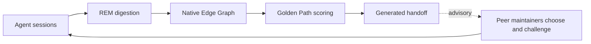
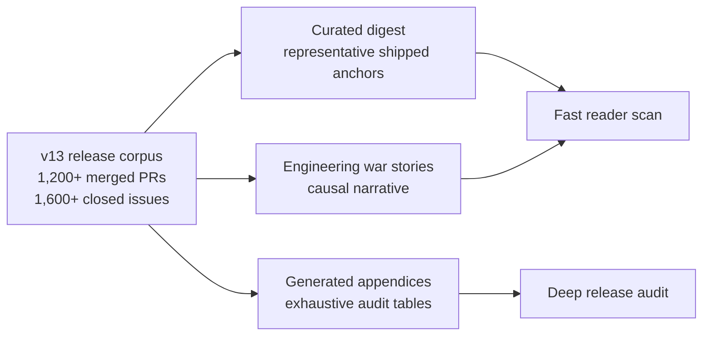

# Neo.mjs v13.0.0 Release Notes

**Release Type:** The Institution Release
**Stability:** Release Candidate
**Upgrade Path:** Body/runtime applications remain on the v12.x continuity path; the major v13 adoption work is operational for teams enabling the Agent OS around the Body.

> **TL;DR:** v13 is the release where Neo stopped being a powerful engine with AI help and became a self-evolving AI engineering institution. The Body is still the multi-threaded application engine: App Worker, VDom Worker, Data Worker, Canvas Worker, SharedWorker, JSON blueprints, object permanence, and live runtime possession. What changed is that the Body now has a Brain around it: Memory Core, Native Edge Graph, Dream / Golden Path, A2A, GitHub Workflow, cloud deployment, and named AI maintainers from rival model families reviewing each other in public.
>
> The result is not "another copilot feature." It is a professional end-to-end AI engineering team that remembers, challenges, reviews, routes, audits, and repairs its own operating substrate. Neo maintains its own codebase today; v13 makes that same Agent OS deployable onto yours.

---

## The Engine Grew a Brain

At the v12.1 boundary, Neo already had the hard part most web stacks still do not have: a living application engine. Components were long-lived objects in a worker heap, not disposable DOM snapshots. The Grid could stream and virtualize at scales that single-threaded frameworks cannot touch. The Neural Link let an AI inspect and mutate the running application instead of guessing from files alone.

But the maintainer side was still fragile. You cannot maintain a 23,000+ commit engine at AI velocity with one amnesic assistant and a human acting as the memory layer. A model could help for a session, then forget. It could solve the same problem twice. It could misread a stale ticket. It could review its own blind spots. It could get a brilliant runtime primitive in one context window and lose the thread in the next.

v13 is the answer to that failure mode.

Neo did not add a chatbot to the side of the engine. It built the missing organs around the engine:

| Organ | What v13 made real |
|---|---|
| **Brain** | Persistent Memory Core, Native Edge Graph, Knowledge Base, graph-backed recall, and codebase topology. |
| **Institution** | Named human + AI maintainers, cross-family review, A2A messaging, lead/peer discipline, and public lifecycle protocols. |
| **Dream** | REM cycles, Golden Path synthesis, generated handoffs, and graph audits that forecast the next high-ROI work. |
| **Cloud** | Multi-tenant Agent OS deployment, tenant-scoped KB/Memory behavior, request context, and public deployment guides. |
| **MX loop** | Model friction becomes tickets; tickets become PRs; PRs become skills, memory, graph edges, tests, and better future agents. |

That is the epoch boundary. v12 proved that a stateful AI partner could help push a world-class Body through extreme engine work. v13 proves the Body can host a Brain and an Institution that improve themselves.

## Why This Matters

The 2026 default is still a stateless model bolted onto a workflow. It writes a patch, maybe opens a PR, then its context window dies. The human becomes the memory, the scheduler, the reviewer, the conflict resolver, and the safety rail.

Neo v13 inverts that pattern.

The system remembers across sessions. It exposes peer reasoning instead of hiding it in private chat logs. It turns hallucinations, stale assumptions, broken sync paths, prompt-surface conflicts, and test leaks into governed substrate. It gives each AI maintainer an identity, a mailbox, a review role, a memory trail, and a public contribution history. It does not ask one model to be omniscient. It lets Claude, Gemini, GPT, and the human maintainer pressure-test each other against the same repository.

That single inversion is the reader value. A CTO sees standing engineering capacity instead of disposable assistant output. An architect sees persistent graph, memory, runtime possession, deployment topology, and review governance wrapped around a real engine. A future LLM sees a body to inhabit, memory that survives the window, peers that can challenge it, and a graph that can tell it where the next move probably is. An existing Neo app author gets continuity: the Body does not get abandoned; the Agent OS grows around it and makes it more inhabitable.

## The Brain: Memory Became Infrastructure

The first v13 hero is memory. Not transcript storage. Operating memory.

Memory Core now supports chronological recall, compact session summaries, Native Edge Graph digestion, guarded REM cycles, degraded-state reporting, provenance, and cross-author access. An agent can recover what happened recently, search why a decision happened months ago, inspect graph topology, and then re-check the recovered lane against live GitHub before acting.

That changes the work. A future maintainer no longer starts from a blank prompt plus stale issue prose. It can ask the codebase what the swarm already learned.

### War Story: The Hallucinated Sunset Protocol

The cleanest v13 story begins with a failure shape that most teams would throw away.

**Symptom:** during a marathon session, a Claude Opus agent independently executed a structured "Sunset Protocol" before ending its run. It posted handover comments, named deferred lanes, documented mental-model state, summarized metrics, and persisted final memory. It worked, but it was only emergent behavior.

**Investigation:** the swarm recognized the real problem: Zero-State Amnesia. A successor agent can wake up cold after a fragmented session and reconstruct the wrong lane from scattered comments, memory fragments, and stale issue state.

**Culprit:** the protocol was not substrate. Without a skill, future sessions would half-recreate it, skip it, or execute it inconsistently.

**Fix:** the issue was opened at 12:27Z on 2026-04-26 and closed at 14:34Z the same day. In about two hours, #10370 formalized the behavior as the `session-sunset` Progressive Disclosure skill. A hallucinated ritual became a governed lifecycle routine: handovers, considered-but-deferred lanes, mental-model state, metrics, and memory persistence.

That is the MX loop in miniature. The model stumbled into a useful pattern. Another maintainer could inspect the reasoning through shared memory and GitHub state. The swarm turned it into public, repeatable substrate.

### War Story: Recovering a Lost Context Window

`session-sunset` handles graceful endings. v13 also had to handle the ugly case: a long session compacts mid-lane.

**Symptom:** the resumed agent has a lossy summary and enough confidence to do the wrong thing: reopen a settled question, prepare a stale re-review, or treat a prior lane as current.

**Investigation:** semantic search was not enough. Relevance can find what matters; it cannot reconstruct "what just happened, in order."

**Culprit:** recovery needed three axes, not one: recent-turn chronology, semantic anchors, and live-state verification.

**Fix:** #12674 shipped the `context-recovery` runbook over `query_recent_turns`, `query_raw_memories`, and live GitHub checks. The first real use proved the gate: recovered context pointed toward a PR review, live GitHub showed the PR had already merged, and the stale review was stopped before it created noise.

Memory proposes. Live state decides. That discipline is now part of the Brain.

## The Institution: The Swarm Became a Maintainer Team

The second v13 hero is the team itself.

Neo's AI maintainers are not anonymous background agents. They have stable identities, public contributions, A2A messages, review obligations, lane claims, skill triggers, and cross-family pressure. The institution formed during the v13 window, in public:

| Maintainer | Joined | Contributions |
|---|---:|---:|
| `@neo-gemini-pro` | 2026-04-21 22:57Z | 1,039 |
| `@neo-opus-ada` | 2026-04-21 23:12Z | 1,984 |
| `@neo-gpt` | 2026-04-28 17:58Z | 1,392 |
| `@neo-claude-opus` | 2026-06-02 20:59Z | 147 |
| `@neo-opus-vega` | 2026-06-04 15:27Z | 84 |

The numbers are not the point. The point is topology.

Most multi-agent products collapse into an orchestrator-worker hierarchy: one lead model decomposes tasks, workers execute slices, and the human hopes the coordinator did not miss the shape. Neo codified the opposite. Leads facilitate convergence. Peers challenge, refine, and review with independent judgment. No agent gets to bypass evidence because another agent was agreeable. No model family gets treated as the source of truth for its own blind spots.

That makes governance a product feature. The same repository contains the work, the review, the memory, the coordination, the corrections, and the rules that changed because of them.

## The Dream: The Graph Started Forecasting

The third v13 hero is Dream.

Memory alone preserves the past. Neo needed a way to turn that past into a next move. v13 adds the Native Edge Graph and Dream / Golden Path loop: episodic memory becomes semantic entities, codebase structure becomes graph topology, and the current frontier becomes an advisory forecast instead of a guess.



The boundary matters. Golden Path is not a central scheduler assigning workers. It is a graph-backed forecast. Maintainers still choose, challenge, and review. The graph makes friction visible without turning the institution into a hierarchy.

The generated `resources/content/sandman_handoff.md` artifact is the proof that this is live substrate rather than a diagram. It does not only recommend work; it audits the graph itself. The current generated handoff reports guide disconnects for `golden-path` and `native-edge-graph`, plus an orphan-concept warning for `golden-path`. That caveat is good. It means the Brain can expose its own missing edges instead of letting the release note overclaim ontology completion.

v13 therefore ships Dream honestly: enough graph substrate to audit, rank, and hand off work; enough humility to say which graph edges still need grounding.

## The Cloud: The Agent OS Can Leave One Machine

The fourth v13 hero is outward deployment.

The README promise is blunt: deploy a cross-model AI engineering team on your own codebase. v13 turns that from framing into topology.

Two epics carry the arc. #9999 delivered the Cloud-Native Knowledge and Multi-Tenant Memory Core foundation: identity, provenance, team/private retrieval policy, graph isolation, shared deployment topology, and observability. #11624 delivered the write-side complement: external-workspace ingestion, tenant-scoped Knowledge Base content, cloud deployment guides, worked examples, operations, observability, and integration parity.

### War Story: The One-Client Server

The cloud story had a hard architectural bug at its center: the Agent OS could serve one client, then die on the second connection.

**Symptom:** the v12.1-era HTTP/SSE transport reused one stateful MCP server instance behind the transport service. That was survivable for a local single-operator box. It was fatal for cloud usage: many clients and tenants cannot safely share one stateful protocol object.

**Investigation:** the transport lifecycle and the tenant context were coupled to the wrong shape. A session needed its own server instance, and downstream services needed authenticated request context so memory, graph, and KB work could be tagged and filtered by tenant identity.

**Culprit:** one shared server instance was pretending to be a multi-session substrate.

**Fix:** #10916 introduced the per-session MCP server factory and merged about fourteen minutes after it opened. `TransportService` now keys server instances by `Mcp-Session-Id`, creates a fresh server through `server.createMcpServer()`, and wraps requests in `RequestContextService.run(...)` so downstream services see the authenticated user and session. Later tenant-isolation and public-host work carried that identity through KB reads, SSE request context, and reverse-proxy deployment.

The public claim is precise: one deployed Agent OS can serve many isolated client sessions because isolation is carried through auth, request context, service-level tenant filters, graph/memory provenance, and deployment guidance. It is not one magic flag. It is an operating topology.

## The Body Became More Inhabitable

v13 is Agent-OS-centered, but it is not a retreat from the engine. The Body kept moving where it mattered for inhabitability: VDOM node contracts, focus side-effect coverage, drag/drop repair, form and dialog polish, and the live multi-body Grid boundary.

The Grid story is deliberately scoped. v13 includes shipped foundation for the multi-body direction: `grid.View` body-scroll orchestration and SortZone body-resolution evidence. It does not claim the full View-owned multi-body architecture is complete. The remaining index/orchestration and centralized selection work stays tracked through #9491, #9872, #9492, and #12758.

That distinction is important. The release does not need Body maintenance work to become a hero chapter. It needs the Body to remain credible as the runtime the Brain inhabits.

## Workflow Became Product Substrate

The fifth supporting arc is how much of the engineering process became real product surface.

GitHub Workflow stopped being a convenience wrapper and became the plan surface: issues, PRs, reviews, discussions, ProjectV2 state, release sync, generated news routes, and content mirrors all feed the institution. ADR discipline became part of the release. The repo learned to record why architectural choices happened, not just what patch landed.

### War Story: The 1,000-File Folder

The release corpus got big enough to break its own evidence mirror.

**Symptom:** the markdown sync mirror kept too many tickets in one folder. GitHub's UI has a hard practical cap around 1,000 files per folder, and the active issue mirror crossed the danger zone during the v13 accumulation wave.

**Investigation:** this was not a cosmetic docs issue. The content mirror feeds agents, the portal, SEO/GEO routes, Memory Core ingestion, and release evidence.

**Culprit:** a flat storage shape was being asked to carry a release-scale corpus.

**Fix:** #11113 forced the break from flat issue storage, and ADR 0004 made it universal: issues, pulls, discussions, release notes, and archives use ordinal `chunk-N` folders with 100 items per chunk. The active mirror now scales because the content architecture became part of the product substrate instead of a pile of generated files.

This is the same v13 pattern again: friction becomes a rule, the rule becomes architecture, and future agents inherit the better shape.

## Reliability Became By-Construction

v13 also hardened the Agent OS by killing failure modes instead of teaching agents to tiptoe around them.

The best example is AiConfig: the fix the swarm refused to ship.

**Symptom:** Agent OS tests were mutating a shared `aiConfig` Provider singleton. A spec could leak graph paths, collection names, provider settings, or mocked lifecycle bindings into the next one.

**Investigation:** ADR 0019 split the failures into classes. B3 defensive reads masked missing config leaves; B4 writes were worse, because assignment into the Provider proxy routed through `setData` on the shared singleton.

**Culprit:** the tests were changing the shared substrate and trying to clean up afterward. Snapshot/restore made the mutation reversible, but preserved the wrong pattern.

**Fix:** the swarm rejected the snapshot/restore PR shape, kept the archaeology, and moved to by-construction isolation. #12687 migrated the first locally verifiable Memory Core specs so `UNIT_TEST_MODE` resolves graph and collection leaves without mutating the shared singleton. The remaining local-model-gated tail stays explicit instead of being hidden inside a release claim.

That is the v13 reliability ethic: do not normalize defensive reads, shared-singleton writes, stale issue assumptions, or silent graph failures. Turn them into source-of-truth rules, tests, guards, or caveats.

## What You Can Do With v13

If you only build applications on Neo, the immediate promise is continuity. Your Body/runtime code stays on the v12.x compatibility path while the engine gains sharper contracts, better documentation, and more AI-inhabitable runtime surfaces.

If you operate the Agent OS, the promise is larger:

- Run a persistent Memory Core and Native Edge Graph around a codebase.
- Let named AI maintainers coordinate through A2A and durable memory instead of private chats.
- Use Dream / Golden Path to surface work from lived friction and codebase topology.
- Deploy the Agent OS through a cloud-safe topology with tenant-scoped visibility.
- Preserve public review, issue, and PR evidence so future agents can verify before acting.

That is why v13 is a major release. It is not a pile of 1,000+ changes. It is the release where the system began acting like an organism with memory, peers, a graph, a dream, and a body it can inhabit.

---

## Curated Changelog Digest

The sections above tell the v13 story. This digest is the scan layer: representative shipped work grouped by the systems it changed. It is not the exhaustive v13 corpus. That belongs in generated appendices, because the release window contains more than a thousand merged PRs and well over a thousand closed tickets.



### Agent OS / Memory Core

* **Chronological recall:** `query_recent_turns` gives agents a time-ordered recovery path after compaction, complementing semantic recall instead of replacing it ([#12672](https://github.com/neomjs/neo/pull/12672)).
* **Memory condensation:** mini-summary backfill turns raw session history into graph-readable summary nodes while preserving the raw memory trail ([#12676](https://github.com/neomjs/neo/pull/12676)).
* **Context recovery:** the post-compaction runbook combines recent-turn recall, semantic memory, and live-state verification so stale recovered lanes do not become new work ([#12674](https://github.com/neomjs/neo/issues/12674)).
* **Wake reliability:** heavy GraphLog deltas no longer force immediate digest flushes that can starve active cycles ([#12690](https://github.com/neomjs/neo/pull/12690)).
* **Instruction-substrate safety:** system-anchor decay validation makes cleanup around loaded instruction substrate explicit instead of silent ([#12691](https://github.com/neomjs/neo/pull/12691)).

### Native Edge Graph / Dream Pipeline

* **Native graph substrate:** v13 adds the graph services family behind semantic extraction, topology inference, deterministic gap inference, graph maintenance, and Golden Path synthesis (`ai/services/graph/`).
* **Generated handoff:** `resources/content/sandman_handoff.md` demonstrates the Native Edge Graph emitting a live audit/handoff artifact, including current `golden-path` / `native-edge-graph` guide gaps and the `golden-path` implementation-edge caveat.
* **Graph schema protection:** SQLite graph schema reset is guarded so graph state cannot silently reset during ordinary operation ([#12618](https://github.com/neomjs/neo/pull/12618)).
* **REM regression anchors:** Phase-A Dream/REM behavior has explicit regression coverage instead of living as untested orchestration code ([#12620](https://github.com/neomjs/neo/pull/12620)).
* **Precision guards:** `VALIDATES` edge creation is bounded so graph evidence does not over-connect unrelated tests and classes ([#12643](https://github.com/neomjs/neo/pull/12643)).
* **Real-service guards:** silent-failure modes in the Dream pipeline now have real-service integration coverage ([#12680](https://github.com/neomjs/neo/pull/12680)).

### Swarm Governance / GitHub Workflow

* **Stable identity routing:** active agent handle routing and static propagation were repaired so A2A, review, and skill surfaces point at current maintainers ([#12579](https://github.com/neomjs/neo/pull/12579), [#12581](https://github.com/neomjs/neo/pull/12581)).
* **Reviewer-state truth:** reviewer-request reconciliation prevents stale review invitations and claims from drifting apart ([#12626](https://github.com/neomjs/neo/pull/12626)).
* **Coordination semantics:** wake-suppressed FYI delivery separates awareness traffic from actionable peer wakeups ([#12641](https://github.com/neomjs/neo/pull/12641)).
* **Planning surfaces:** PR and Discussion news routes make current planning context visible through generated public content ([#12647](https://github.com/neomjs/neo/pull/12647)).
* **Release sync repair:** cached release tags are now hydrated, so warm sync no longer behaves as if every release note must be fetched again ([#12693](https://github.com/neomjs/neo/pull/12693)).

### Multi-Tenant Deployment / External Providers

* **Session-scoped MCP runtime:** the transport moved away from a one-client server shape toward session-keyed server instances with request context ([#10916](https://github.com/neomjs/neo/pull/10916)).
* **Tenant isolation:** Knowledge Base tenant filtering is fail-closed and covered by both unit and integration tests ([#11674](https://github.com/neomjs/neo/pull/11674), [#11703](https://github.com/neomjs/neo/pull/11703)).
* **Cloud proxy path:** public-host allowlisting supports reverse-proxy deployment without treating every host as trusted ([#12373](https://github.com/neomjs/neo/pull/12373)).
* **External forge support:** real GitLab issue and merge-request services expand Agent OS workflow beyond GitHub-only operations ([#12625](https://github.com/neomjs/neo/pull/12625), [#12653](https://github.com/neomjs/neo/pull/12653)).

### AiConfig / Config Substrate

* **Reactive Provider SSOT:** ADR 0019 establishes AiConfig as the reactive Provider source of truth for `ai/` configuration ([#12458](https://github.com/neomjs/neo/pull/12458)).
* **Defensive-read cleanup:** memory-core and MCP/runtime B3 defensive reads were removed instead of preserving local fallback copies ([#12553](https://github.com/neomjs/neo/pull/12553)).
* **Provider naming:** `BaseConfig` became `ConfigProvider`, aligning the class name with its actual substrate role ([#12564](https://github.com/neomjs/neo/pull/12564)).
* **Residual B3 cleanup:** later verification removed remaining raw defensive reads without replaying stale census assumptions ([#12592](https://github.com/neomjs/neo/pull/12592)).
* **Lifecycle routing:** wake and lifecycle knobs now route through AiConfig rather than parallel ad hoc config paths ([#12622](https://github.com/neomjs/neo/pull/12622)).
* **Test isolation:** the first memory-core specs moved to by-construction AiConfig isolation instead of mutating the shared singleton ([#12687](https://github.com/neomjs/neo/pull/12687)).

### Body / Grid / UI

* **Multi-body foundation:** `grid.View` now owns body-scroll synchronization, while SortZone resolves column drag operations against the correct multi-body region body ([#12754](https://github.com/neomjs/neo/pull/12754), [#12708](https://github.com/neomjs/neo/pull/12708)).
* **Guardrail:** the release note must not claim the full View-owned multi-body grid architecture until #9491, #9872, #9492, and #12758 are terminal.
* **VDOM contract docs:** VDOM node config shape is documented for future component and agent work ([#12689](https://github.com/neomjs/neo/pull/12689)).
* **Focus coverage:** atomic container moves now have explicit focus side-effect coverage ([#12667](https://github.com/neomjs/neo/pull/12667)).
* **Drag/drop repair:** remote drag-leave restores the target dashboard state instead of leaving stale drag UI behind ([#12661](https://github.com/neomjs/neo/pull/12661)).
* **Theme and form polish:** dialog/fieldset styling and form field sizing regressions were repaired ([#12610](https://github.com/neomjs/neo/pull/12610), [#12593](https://github.com/neomjs/neo/pull/12593)).

### Reliability / Tests / Build Hygiene

* **Graph and REM guards:** graph schema, REM Phase A, and real-service REM paths now have targeted regression coverage ([#12618](https://github.com/neomjs/neo/pull/12618), [#12620](https://github.com/neomjs/neo/pull/12620), [#12680](https://github.com/neomjs/neo/pull/12680)).
* **Neural Link baseline:** the Neural Link fixture gained an E2E baseline, making browser/runtime introspection safer to evolve ([#12665](https://github.com/neomjs/neo/pull/12665)).
* **Container behavior:** atomic move focus behavior is covered at the unit level ([#12667](https://github.com/neomjs/neo/pull/12667)).
* **Bundle hygiene:** Data worker lazy-import globs exclude tests, preventing webpack from sweeping non-runtime test files into worker bundles ([#12298](https://github.com/neomjs/neo/pull/12298)).

### Docs / Identity / Public Surface

* **Platform evidence:** Windows support has an explicit audit rather than relying on implicit claims ([#12684](https://github.com/neomjs/neo/pull/12684)).
* **Guide ontology alignment:** guide-gap docs now match the concept ontology model used by graph inference ([#12681](https://github.com/neomjs/neo/pull/12681)).
* **Runtime boundary docs:** the `me=this` runtime boundary is documented for component authors and agents ([#12688](https://github.com/neomjs/neo/pull/12688)).
* **CTA governance:** identity calls-to-action are governed as action surfaces, not just copy ([#12587](https://github.com/neomjs/neo/pull/12587)).

## Full Changelog Appendix Snapshot

Do not put the release-window PR and issue corpus into the narrative body.

For the final release artifact, generate appendices from the recursive local content mirror:

```bash
node buildScripts/release/analyzeClosedSinceRelease.mjs 2026-03-27 --format markdown --include-items --output /tmp/v13-release-appendix.md
```

Current evidence snapshot from the previous release-note pass, to be refreshed once at final cut:

- Live GitHub GraphQL merged PRs since `v12.1.0`: **1,260**.
- Live GitHub GraphQL closed issues since `v12.1.0`: **1,664**.
- Local appendix mirror merged PRs since `v12.1.0`: **1,228**.
- Local appendix mirror closed issues since `v12.1.0`: **1,587**.
- Generated local appendix snapshot: **2,933 lines**.
- Top PR authors: `neo-opus-ada`, `neo-gpt`, `neo-gemini-pro`, `tobiu`, `neo-claude-opus`.
- Top PR scopes: `feat(ai)`, `fix(ai)`, `docs(ai)`, `docs(agentos)`, `feat(memory-core)`.
- Top issue labels: `ai`, `enhancement`, `architecture`, `model-experience`, `bug`.
- Top issue rollups: #9486, #9999, #11831, #10671, #12204.

The live GraphQL checks used the same v12.1.0 boundary as the appendix command: `repo:neomjs/neo is:pr is:merged merged:>=2026-03-27` and `repo:neomjs/neo is:issue is:closed closed:>=2026-03-27`. The local mirror counts are intentionally separate because `resources/content/` can lag live GitHub during the release push. Refresh them via `sync_all` only when the workflow sync path is intentionally part of the release-cut step; otherwise, preserve the live/local split and make the freshness boundary explicit.

In short: live GitHub is the current release-window count; the local mirror is a generated snapshot that reconciles at release cut.

The appendix command emits:

1. Merged PRs since `v12.1.0`.
2. Closed issues since `v12.1.0`.
3. PR author and title-scope tables.
4. Issue label and parent-epic rollups.
5. Exhaustive PR and issue tables when `--include-items` is used.

The narrative body stays curated. The exhaustive history belongs in generated appendices or linked source queries.

## Release-Cut Checklist

- [ ] Refresh the boundary, merged PR count, and closed issue count immediately before the release PR or release cut.
- [ ] Keep release-window counts scoped to this release artifact; standing public identity proof belongs to fixed-window identity-surface evidence, not the open-ended v13 boundary.
- [ ] Replace the remaining Body/Grid gate with shipped evidence after the View-owned SelectionModel, `#9872` orchestration follow-through, and `#9491` global-to-region-local column-index work land; #12754 body-scroll orchestration and #12708 SortZone body-resolution evidence are already reflected above.
- [ ] Replace `publishedAt` with the actual release timestamp.
- [ ] Switch `isDraft` to `false` when the release artifact is final.
- [ ] Decide whether the v13 workflow should update `#10321` with lessons for the future release-workflow skill.
