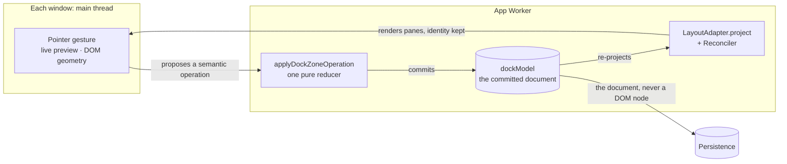

# Neo.mjs v13.2.0 Release Notes

**Release Type:** *pending: the operator confirms it at the cut.*
**Stability:** *pending: the operator confirms it at the cut.*
**Upgrade Path:** See *Upgrading from 13.1* below for stable package entry points, removed files and scripts, and behavior changes that require action.

> **Status: iteration 1 of N — a deliberately-early draft.** The story, scope figures and upgrade guidance are still being checked before the 13.2 cut. The release designation and Full Changelog are pending.

> **TL;DR:** Arrange a workspace, drag a pane into an opener popup and bring it home, then undo or reset the change. Scroll a 5,000-record list with a small mounted row pool; build and boot an app against the Engine package you install. Grid edits follow records through pooled cells, menus return focus when they close, hidden windows keep receiving updates, and two independently opened roots keep their canvases painting. This is the Engine's first release since the Agent OS split.

---

## 📋 13.2 in 2 Minutes

**The short route:** build a workspace from panes and zones with the [first Dock Layout tutorial](https://github.com/neomjs/neo/blob/dev/learn/tutorials/DockLayoutsFirstLayout.md), then try a [5,000-record Buffered List](https://github.com/neomjs/neo/blob/dev/examples/list/buffered/index.html) with a bounded row pool. The [Grid cell-editing example](https://github.com/neomjs/neo/blob/dev/examples/grid/cellEditing/index.html) shows another kind of continuity: an edit stays with its record while the cell drawing it changes. These are `dev` source links while the 13.2 site is being prepared.

**The scale:** the 2026-09-23 corpus snapshot counted roughly 995 Engine PRs since 13.1.0 after separating the Agent OS and Fleet Manager work that moved to sibling repositories. The figure will be refreshed at the cut.

**Read for your work:** Dock and Runtime if an app spans windows; Buffered List and Components if its views carry changing data; Package and the upgrade path if you install, extend or ship the Engine.

**The limit:** Canvas workers now separate unrelated roots, but App, Data and VDom workers remain origin-wide; the wider heap boundary stays open under [D#18730](https://github.com/orgs/neomjs/discussions/18730). A Workstation place-cycle can still transiently hide resident-card children ([#16498](https://github.com/neomjs/neo/issues/16498)).

---

## 🧩 Dock Layouts: one workspace, even when a pane leaves

Select the second tab and resize its split: the first tab could come back. An initial edge-zone band offered no resize handle, while a split made by rearranging panes did. The July [choreography](https://github.com/neomjs/neo/issues/14589) and [perspectives](https://github.com/neomjs/neo/issues/14590) demos could move a pane into a popup opened from the workspace and bring it home, but those gestures exposed a deeper problem. Selection lived in a view while geometry lived in the stored layout; the next projection could disagree with what the user just did (D#17818, #17836).

The August decision was to give the workspace one authoritative document for its current state. The App Worker owns that serialisable dock document and its perspectives. A window renders a projection; a drag or resize proposes a semantic operation, and one reducer commits it. Pointer previews and hover pixels remain temporary, while DOM geometry and physical windows stay on the main thread. Persistence receives the document, never a DOM node or a window object. [ADR 0029](https://github.com/neomjs/neo/blob/dev/learn/agentos/decisions/0029-docking-design.md) records that boundary.

This was a deliberate hard cut, with a real upgrade cost. npm `neo.mjs@13.1.0` shipped three experimental dock foundations — `DockZoneModel`, `DockLayoutAdapter` and `DockSplitter`. The new system replaces those `Dock*` files without a compatibility alias; a 13.1 consumer importing them must port. The Workstation and dashboard examples were updated with the engine cut ([#17841](https://github.com/neomjs/neo/pull/17841)). The migration is spelled out below.

### From a model to an experience

The model cut landed on 2026-08-29 ([#17841](https://github.com/neomjs/neo/pull/17841)). The dock then stopped asking each consumer to reconstruct facts only the engine knew (#18151), and its growing `Workspace` class gave projection, interaction, persistence and window behavior distinct homes (#18304). [Tab activation and edge extent](https://github.com/neomjs/neo/pull/17845) now commit through that document; [splitters preview both sides live](https://github.com/neomjs/neo/pull/17849) before one terminal commit. The Workstation's edge once booted pinned at its CSS maximum, so it could not grow right and snapped back after some leftward drops. [#17858](https://github.com/neomjs/neo/pull/17858) removed those caps and restored the preview floor. Selection and width now survive the next projection rather than being reconstructed from a view that disagrees with the stored layout.

For a developer, a first arrangement can now be declared as panes and zones rather than programmed step by step (#18474). The host to extend is [`Neo.dashboard.dock.Workspace`](https://github.com/neomjs/neo/blob/dev/src/dashboard/dock/Workspace.mjs); a pane is a named ordinary component configuration, not a `Neo.dashboard.Panel` instance ([first-layout tutorial](https://github.com/neomjs/neo/blob/dev/learn/tutorials/DockLayoutsFirstLayout.md), [document contract](https://github.com/neomjs/neo/blob/dev/src/dashboard/dock/model/WorkspaceDocument.mjs#L50-L53)). Perspective selection follows reactive state (#18605). A window group owns transaction history and the topology needed to restore a saved arrangement across reload (#18303). The Workstation [extends that host](https://github.com/neomjs/neo/blob/dev/apps/workstation/view/VesselWorkspace.mjs) with its own panes and vessel lifecycle; the [Dock Layouts guide series](https://github.com/neomjs/neo/blob/dev/learn/guides/uibuildingblocks/DockLayoutsAdoption.md) starts with that ownership choice.

The document is visible in the controls. A tab can offer the engine's lock, reload, pin, pop-out, maximize and close actions ([Workspace action contracts](https://github.com/neomjs/neo/blob/dev/src/dashboard/dock/Workspace.mjs#L198-L289)). Pin can fold an edge-owned pane into its rail ([#17952](https://github.com/neomjs/neo/pull/17952)); the rail tab [reveals it from the edge](https://github.com/neomjs/neo/pull/18120), and the reveal's pin brings it home. A [keyboard detach command](https://github.com/neomjs/neo/pull/15483) gives the window route a path when a platform refuses a pointer-born popup.

A drag offers placement choices in an [indicator menu](https://github.com/neomjs/neo/pull/14974), then paints the [region it would occupy](https://github.com/neomjs/neo/pull/17873) before committing. Structural moves use [FLIP motion](https://github.com/neomjs/neo/pull/14944), while the other transitions read [shared tokens](https://github.com/neomjs/neo/pull/14947) that collapse for reduced motion. Rails and splitters now take their structural paint from the engine ([#17524](https://github.com/neomjs/neo/pull/17524), [#17531](https://github.com/neomjs/neo/pull/17531)), with dock theming across [every shipped theme](https://github.com/neomjs/neo/pull/17613).

### A pane can become a real window

A drag past the page boundary can [birth an OS popup mid-gesture](https://github.com/neomjs/neo/pull/15444). Without an explicit staging scheme, a popup opened through `Main.windowOpen` [inherits the opener's color scheme](https://github.com/neomjs/neo/pull/18436) instead of flashing the browser default before the app mounts. Releasing the pane commits one semantic move; cancelling it leaves the document untouched. A later journey handles the browser's native title bar, where the page cannot see `pointerup`: holding the popup over a target for **1.2 seconds** [fills its drop area and commits the transfer](https://github.com/neomjs/neo/pull/18119), then closes the popup. A [whole stack can come home atomically](https://github.com/neomjs/neo/pull/15501); [live-header preparation](https://github.com/neomjs/neo/pull/18684) preserves its pane identities, and the [Windows guide](https://github.com/neomjs/neo/pull/18715) shows the route. The title-bar dwell [now returns a whole stack as well](https://github.com/neomjs/neo/pull/19181), refusing a partial stack or one from another Group. A blocked popup [rolls the detach back](https://github.com/neomjs/neo/pull/15478).

### The arrangement has a way back

The Workstation exposes the Group's shared [Undo and Redo cursor](https://github.com/neomjs/neo/pull/18387) across its main window and popup. [Reset to default](https://github.com/neomjs/neo/pull/18595) enables when the committed arrangement differs from the shipped one; during a live history it returns that arrangement in one undoable commit. The current [compact toolbar](https://github.com/neomjs/neo/pull/19054) shows Reset, Undo and Redo with reactive history badges. The Workstation persists Group commits automatically in IndexedDB, so a cold boot restores the saved layout with an empty undo history. The engine makes a layout capturable, while an application chooses when to store it; the standalone example captures named arrangements and restores its collection at boot. [State, Operations and Persistence](https://github.com/neomjs/neo/blob/dev/learn/guides/uibuildingblocks/DockLayoutsStateAndPersistence.md) shows the boundary.

The flagship still has bounds beyond the opener-popup journey. A place-cycle restore can transiently hide resident-card children ([#16498](https://github.com/neomjs/neo/issues/16498)). The complete Workstation tour has a tracked pooled-grid continuity case ([#17871](https://github.com/neomjs/neo/issues/17871)); recent production-order runs pass, so the older midpoint-only reduction does not establish a current failure.

---

## 📜 Buffered List: thousands of records, a small physical list

A long activity history should still behave like a list: records can be selected, focused, sorted and prepended without mounting a component for every record. [Buffered List](https://github.com/neomjs/neo/pull/17557) keeps the Store, ListModel and `ul/li` contracts while separating logical records from physical row slots. In its 5,000-record unit fixture, five visible rows and a two-row buffer on each side need **nine mounted components**. The [example](https://github.com/neomjs/neo/pull/17941) uses a 400px viewport and 40px rows, with a **16-row pool** over the same 5,000 records. Those are different fixtures, not competing performance claims.

The first pool reused components, but crossing its range still moved existing DOM rows. The [fixed-slot pass](https://github.com/neomjs/neo/pull/17600) made the physical order invariant: a forward and reverse scroll that previously made seven and two `moveNode` calls now makes none. Record identity, focus and selection still follow the logical Store slice. That distinction lets the browser keep a stable small tree while the list shows a changing part of the data.

### The 180px wheel gesture that ran to 3,780px

The first real-wheel investigation exposed a failure the unit-level scroll calls could not see. Four or five 30px wheel deltas stopped at 120px and 150px. The sixth crossed the mounted-range boundary at 180px; within 1.5 seconds the seat had reached **3,780px** without another gesture. The browser's scroll anchoring saw the virtual list's top spacer grow, adjusted `scrollTop` to preserve visual content, and triggered another range change. The spacer was the scroll geometry, so the compensation became a feedback loop. One `overflow-anchor: none` rule stopped the same gesture at 180px; the controlled before/after and below-boundary cases are in [#17944](https://github.com/neomjs/neo/pull/17944).

The investigation also corrected its own early green claim: the first wheel checks sampled one animation frame after input, before the delayed runaway began ([retraction on #17878](https://github.com/neomjs/neo/issues/17878#issuecomment-5479134218)). The [example and real-wheel component test](https://github.com/neomjs/neo/pull/17941) now cross the boundary and observe both browser scroll position and App Worker state. That browser witness covers the generic list, not every app that embeds it.

---

## 🧮 Editing, menus and controls that survive change

### Grid editing follows the record, not the cell

The old cell editor was still present in the package, but a developer trying the public example could not use it. At `dev@d688710175`, the example rendered no rows; double-click, Enter and F2 mounted no editor, and double-click threw. The 2024 implementation was a 34-line subclass of Table editing, written before the Grid pooled rows and cells. Two repairs that kept that inheritance (#17937, #18222) were dropped. A Grid editor needed to belong to the Grid's own projection model.

The new editing session is logical: `{recordId, dataField}` names what is being edited, while the Row places the editor in whichever pooled cell currently represents it. Scrolling can recycle the cell without committing or cancelling the draft. Double-click, Enter and F2 start an edit; with a valid draft, [Tab can commit and advance while Shift+Tab moves back](https://github.com/neomjs/neo/pull/18878) to the next editable cell in that direction. At an edge, the edit ends on the Grid View. [D#17832](https://github.com/orgs/neomjs/discussions/17832) set the model, and the [public example's source](https://github.com/neomjs/neo/tree/dev/examples/grid/cellEditing) is available on `dev`.

#### The example changed the plan

The first implementation and its synthetic text fixture were green. Then a real pointer-and-keyboard pass through the public example failed **six of eleven** interactions. Picker focus, ComboBox ownership, Tab, locked bodies and accessibility attributes were not the same problem as placing one text editor in one cell. A return review over 120 columns and 400 rows found one more missed path, arrows while an edit was suspended ([#18958](https://github.com/neomjs/neo/pull/18958)). The repair grew from placing an editor to keeping a real user's edit intact through the Grid's changing view.

That evaluation has a precise limit. The `aria-readonly` tests inspect the rendered attribute; no screen-reader announcement was run (#18876). The IME witness uses synthetic Chromium composition events, not a real OS IME. Non-text editors in nested fields and tree columns were witnessed after the epic closed ([#18991](https://github.com/neomjs/neo/pull/18991)); the earlier closeout did not establish them. The [Grids guide](https://github.com/neomjs/neo/blob/dev/learn/guides/datahandling/Grids.md) now teaches the editing contract alongside the example.

### Menus keep the path through a cascade

A menu assembled by independent modules can now take one [TreeStore of parent-linked commands](https://github.com/neomjs/neo/pull/17843). Each open level derives its own flat view, so selection and index math do not mistake the whole tree for the visible level. A pointer resting on a parent [previews its submenu](https://github.com/neomjs/neo/pull/18765) without stealing selection or keyboard focus; Right and Left [walk levels](https://github.com/neomjs/neo/pull/18766), while Escape returns to the parent. A later browser probe found that closing a hovered branch could instead drop keyboard focus onto the page body. The [focus hand-back repair](https://github.com/neomjs/neo/pull/18860) returns it to the opening item or the original trigger. The cascade's pointer and keyboard paths have Chromium coverage; screen-reader and touch behavior have not been independently verified.

An [outside press](https://github.com/neomjs/neo/pull/17828) also dismisses a menu or picker without treating its trigger or open submenu as outside. Authors can declare [separators and disabled items](https://github.com/neomjs/neo/pull/17856), or opt into an [entrance from the aligned side](https://github.com/neomjs/neo/pull/17861); instant opening remains the default.

### More room to compose

A TabContainer can carry [header actions](https://github.com/neomjs/neo/pull/17423), use [inline or standalone chrome](https://github.com/neomjs/neo/pull/17956), and keep [overflow in its action rail](https://github.com/neomjs/neo/pull/17960). A generic Splitter can opt into [live main-thread resizing](https://github.com/neomjs/neo/pull/17822), with one durable worker commit at release. Grid columns had a related geometry problem: a resize could leave header and body at different widths during the drag or snap cells back after drop. They now [move together during the gesture](https://github.com/neomjs/neo/pull/17417) and keep the [configured width](https://github.com/neomjs/neo/pull/17332) through [header-to-cell routing](https://github.com/neomjs/neo/pull/17291).

Form controls can add value without taking ownership away from their caller. The [Chip field](https://github.com/neomjs/neo/pull/17749) is an array-valued multi-select, and [FileUpload](https://github.com/neomjs/neo/pull/15833) accepts an app-supplied transport with XHR as its default. A Store supplied to a field survives [Chip teardown](https://github.com/neomjs/neo/pull/18922) and [ComboBox's local filter](https://github.com/neomjs/neo/pull/18857), so another view can keep using it. Unfinished input stays put too: edge spaces in a text field [survive the next render](https://github.com/neomjs/neo/pull/18915), and a text area [keeps its keystrokes](https://github.com/neomjs/neo/pull/18937). The Phone field's default pattern now handles [long invalid input](https://github.com/neomjs/neo/pull/15381) without exponential backtracking.

In a multi-window app, input history need not collapse into one global hint. When loaded, the [input-modality addon](https://github.com/neomjs/neo/pull/15467) stamps pointer or keyboard use on each document and exposes it to the App Worker by window ID. For a drag that must use the browser's native transfer path, a configured [native drag source](https://github.com/neomjs/neo/pull/17891) prepares `DataTransfer` rather than relying on the Dock's synthetic pane gesture.

A mounted component can change its visual role: it may enter or leave the [floating layer at runtime](https://github.com/neomjs/neo/pull/18701), releasing its alignment when it leaves, and `removeAddCls()` [swaps classes in one update](https://github.com/neomjs/neo/pull/18738) instead of two.

For theme authors, app palette overrides now win at `:where()` weight across the [pure Neo token sheets](https://github.com/neomjs/neo/pull/18747), while a component in a nested scope [reads that nearer theme](https://github.com/neomjs/neo/pull/18111). A [shared motion vocabulary](https://github.com/neomjs/neo/pull/15205) reaches all five themes and collapses timing for reduced motion. The engine [composites theme reveals](https://github.com/neomjs/neo/pull/18344); a measured HiDPI Chrome correction [keeps the reveal centered on its trigger](https://github.com/neomjs/neo/pull/17743).

Data composition gets different safeguards. A [TreeStore path](https://github.com/neomjs/neo/pull/17854) can materialize missing ancestors for independently supplied records, and an effect that read a missing key [runs when it appears](https://github.com/neomjs/neo/pull/18619). When parsed input reaches `Neo.merge`, it [skips prototype-chain keys](https://github.com/neomjs/neo/pull/17537) rather than writing them into a target.

---

## ⚙️ Runtime: a quiet window still has work to do

The Workstation's live data kept streaming while a genuinely hidden pane stopped advancing. The first suspicion was its Grid; the evidence instead found the main thread waiting on paint to deliver size changes. A hidden resize left the DOM at one width and the App Worker at another until a forced frame. [ResizeObserver's paint-independent carrier](https://github.com/neomjs/neo/pull/16426) repaired that path. Then the tour still stopped before its first scene: every sparkline had registered, but [DockFlip waited on `requestAnimationFrame`](https://github.com/neomjs/neo/pull/16436), which a hidden pane did not receive. The tour could land instantly while hidden and use a bounded alternative when occluded but still visible. A later [overflow-mount repair](https://github.com/neomjs/neo/pull/16438) closed a separate stop. The lesson from the sequence is concrete: a worker-driven application cannot make progress through a main-thread step that only paint can release.

One remaining timer clamp surfaced much later. The ResizeObserver addon's hidden poll and dispatch timer could miss a size change for more than 90 seconds after a Workstation tab had been hidden for six minutes. The [App Worker hidden tick](https://github.com/neomjs/neo/pull/18755) now prompts that window once per second; in the controlled Chrome run the same change reached the worker in **0.71 seconds**. This is a measured case, not a latency promise: the author also observed pre-existing 18–40-second stretches when the App Worker was busy, and occluded-but-visible windows were outside that tick repair.

### When a worker fails, the page can see it

In a development build using SharedWorkers, an App Worker error used to stay in a worker inspector that no page reads. It now reaches the page console, as do [errors from the other SharedWorkers](https://github.com/neomjs/neo/pull/18567) ([App Worker path](https://github.com/neomjs/neo/pull/18557)). The [Engine E2E error gate](https://github.com/neomjs/neo/pull/18716) added unhandled-rejection forwarding and fails a test on an unnamed page or worker error; its first run exposed four defects in the tear-out matrix. This is development diagnostics, not a production error transport.

As failures became visible, a closed window's normal departure needed a different answer from a live-owner defect. Consumers of a call that outlives its window port can now [classify the typed departure](https://github.com/neomjs/neo/pull/18743). The rejection path then learned to [settle verified departed-window calls](https://github.com/neomjs/neo/pull/19061), and a [shared departure predicate](https://github.com/neomjs/neo/pull/19073) keeps that classification consistent. A message addressed to a departed window [no longer reaches a sibling](https://github.com/neomjs/neo/pull/19074) of the same app.

### A render belongs to its own flight

The VDom side received a different timing repair. For a mounted component, a successful render flight [settles the update promises it claimed](https://github.com/neomjs/neo/pull/18787) when it collected its payload; a later request waits for the flight carrying its own change. First mount has a deliberate exception because its callers await initial readiness. A covering parent render also passes its landed deltas to the field it covers. In a [real Grid editor probe](https://github.com/neomjs/neo/pull/18926), 26 typed letters survived record updates every 4ms with no programmatic write over the input, where the previous behavior lost letters in three of three runs. A warm Workstation reload that once [spun the VDom diff](https://github.com/neomjs/neo/pull/19064) on a component referenced from two old-tree parents now completes. These repairs make a render's result belong to the request that actually made it.

### A second root must keep the first painting

Open the same app from a bookmark in a second tab, with no opener relationship: before this release, that could stop the first root's canvases. An [expected-failure browser witness](https://github.com/neomjs/neo/pull/19041) recorded the kill. Both roots had connected to one origin-wide Canvas SharedWorker, where an offscreen canvas crossing their browser-process boundary could kill its host. The [Canvas group repair](https://github.com/neomjs/neo/pull/19125) gives each unrelated root its own Canvas SharedWorker and routes App-to-Canvas calls by `windowId`. An opener popup or a reload rejoins its window's Canvas group; a fresh unrelated root mints another. In the measured Chromium journey, the old expected-failure witness now passes, and both roots keep painting. Firefox and WebKit have not been independently measured for this release path.

The App Worker also has [logical Groups](https://github.com/neomjs/neo/pull/18351) that bind a workspace's windows across generations; each Group keeps its own [bounded transaction history](https://github.com/neomjs/neo/pull/18360). Those Groups own application state and transactions. `CanvasGroups` has a separate window-to-group map for Canvas routing; the Canvas workers now separate, while App, Data and VDom workers remain origin-wide. [D#18730](https://github.com/orgs/neomjs/discussions/18730) retains the wider worker-boundary questions.

---

## 📦 An Engine package a consumer can build

The Agent OS and Fleet Manager moved to their own repositories. The Engine build now runs with the Brain absent ([#17506](https://github.com/neomjs/neo/pull/17506)); the received Agent OS implementation and Fleet duplication left this tree ([#17806](https://github.com/neomjs/neo/pull/17806), [#17810](https://github.com/neomjs/neo/pull/17810)). The [package-contents guard](https://github.com/neomjs/neo/pull/17253) keeps the corpus and plane state out of `npm pack`. This is a practical boundary for someone installing `neo.mjs`: the Engine package can be built and checked without asking the consumer to host its former Brain.

Build success also has a stricter meaning. A `dist/esm` transform used to exit 0 even when its copied imports could not load; the [build repair](https://github.com/neomjs/neo/pull/17932) makes that class fail. The [consumer-runtime check](https://github.com/neomjs/neo/pull/18872) packs and installs the Engine, then compiles its App Worker against **all 153 apps shipped in that measured package**. Reverting one Portal `marked` import made that installed-copy check fail before the fix made it green. Import paths received separate repairs: [Data Worker lazy imports](https://github.com/neomjs/neo/pull/17882), a workspace `WS/` main-thread addon inside `dist/esm` ([#18712](https://github.com/neomjs/neo/pull/18712)), and a [docs app entry](https://github.com/neomjs/neo/pull/18890) that the production App Worker bundle can load. Browser dependencies for guide code fences and editors were made portable across the package boundary ([Mermaid beside Monaco](https://github.com/neomjs/neo/pull/18572), [highlight bundle](https://github.com/neomjs/neo/pull/18706)).

An installed-workspace Canvas build exposed another import split: [engine renderers now load from the package](https://github.com/neomjs/neo/pull/19165), while app renderers still load from the workspace. Before the repair, a packed consumer fixture's Canvas build left the engine renderer out in both development and production modes; afterward both builds include it. The DevIndex header's deployed browser paint remains a [site validation](https://github.com/neomjs/neo/issues/19047), not a result claimed here.

One install-lifecycle failure was caught before publication: the prospective 13.2 package ran a development-only materializer from `postinstall`, where an ordinary consumer did not have its binary. [#19053](https://github.com/neomjs/neo/pull/19053) moved it to `prepare`; a packed-tarball install that had exited 127 now exits 0. No released 13.2 consumer had encountered that defect.

### A clean checkout can prove it

The [README now maps the five repository homes](https://github.com/neomjs/neo/pull/17812) so a contributor can find the Engine before changing it. A fresh clone does not contain git-ignored browser bundles. Before the [contributor setup repair](https://github.com/neomjs/neo/pull/19000), `npm run test-unit` could collect zero tests because `dist/marked.mjs` and `dist/parse5.mjs` were missing; the documented `npm run bundle-browser-deps` step built them in six seconds in the clean-clone probe. The guide also now points contributors to the repository's explicit `npm run test-*` scripts, because bare `npx playwright test` [fails during mixed-tier collection](https://github.com/neomjs/neo/pull/19019) without running a test.

The checks behind a change are broader too. The [mounted-component tier](https://github.com/neomjs/neo/pull/15373) entered CI after 41 specs had existed without a workflow; the [Engine E2E tier](https://github.com/neomjs/neo/pull/18404) gained its own runner and states its selected coverage. In a later measured run, [three shards](https://github.com/neomjs/neo/pull/19079) executed **212 selected tests in 40 files**, each below its five-minute step ceiling. A [packed greenfield `dist/esm` workspace](https://github.com/neomjs/neo/pull/18718) now builds and boots as a consumer, rather than only resolving imports in a stub. These receipts describe selected checks, not every E2E file on every PR.

The [bundle-size decision](https://github.com/neomjs/neo/issues/18823) and [13.2 site dry run](https://github.com/neomjs/neo/issues/19047) are still open; a working packed build is not a claim that the new site has deployed.

> [!NOTE]
> ### 🧊 The tier that can see the cube
> On 2026-09-19, an issue curated for new contributors ([#19010](https://github.com/neomjs/neo/issues/19010)) asked for a unit spec over `Neo.layout.Cube`, the CSS 3D layout behind the portal's cube easter egg. The operator, Tobi, corrected the tier, in words [#18985](https://github.com/neomjs/neo/issues/18985) records:
> *"e2e and component-based testing beats unit testing by a long shot when it comes to visual items."*
>
> A unit assertion could only read back the transform the layout had just written, and it would pass while the cube rendered inside out. The issue moved to the component tier. [@sloemo01's component spec](https://github.com/neomjs/neo/pull/19024) now asks the browser which face `elementFromPoint` hits at the cube's center, for all six faces. The same limit runs through this release: the Buffered List's unit-level scroll calls missed the 3,780px runaway, and the Grid editor's synthetic fixture stayed green while a real pass failed six of eleven interactions.

---

## ▶️ What you can do with 13.2

### Explore

You can [open the current Calendar](https://neomjs.com/examples/calendar/basic/index.html). The Portal's example catalog again lists DevIndex and keeps Calendar visible; both cards had been lost to separate catalog defects ([#17437](https://github.com/neomjs/neo/pull/17437), [#17487](https://github.com/neomjs/neo/pull/17487)). In the 13.2 `dev` source, the month view [draws its days even with no calendars or an event store that never loads](https://github.com/neomjs/neo/pull/19150); events still wait for their matching calendars. The hosted example receives that repair with the release.

### Build

Start with the [first Dock Layout tutorial](https://github.com/neomjs/neo/blob/dev/learn/tutorials/DockLayoutsFirstLayout.md): change the named panes and zones in its live previews, then use the [Workstation's local run guide](https://github.com/neomjs/neo/blob/dev/apps/workstation/README.md) to try popup motion, Reset, Undo and Redo in an application. Those `dev` links provide the working path while the 13.2 site is being prepared.

The [Buffered List example](https://github.com/neomjs/neo/blob/dev/examples/list/buffered/index.html) turns 5,000 records into something you can tune: change the mounted-row range, row height or viewport height and watch the list respond ([#17941](https://github.com/neomjs/neo/pull/17941)). It runs from a `dev` checkout; after dependencies and fresh theme assets are in place, `npm run server-start -- --no-open` serves `examples/list/buffered/index.html` on the printed local port. Its hosted 13.2 route is not live in this draft, so the link leads to source rather than a dead demo. The [styling guide](https://github.com/neomjs/neo/blob/dev/learn/guides/uibuildingblocks/StylingAndTheming.md) gives the exact build-then-watch workflow before you change SCSS (#17902).

### Extend

Once an example becomes your own app, two guides prevent a subtle class-system mistake: [`SetupClass`](https://github.com/neomjs/neo/blob/dev/learn/guides/coreengine/SetupClass.md) explains generated `is<Ntype>` flags, and [extending Neo classes](https://github.com/neomjs/neo/blob/dev/learn/guides/fundamentals/ExtendingNeoClasses.md) shows why an inherited reactive config is overridden by its bare name, not a repeated underscore (#17905, #17959). `Neo.manager.ClassHierarchy.isA()` now [recognizes ancestors above `Neo.component.Base`](https://github.com/neomjs/neo/pull/19154) instead of stopping early. A component that needs to wait for a condition can use [`Neo.core.Base#waitFor()`](https://github.com/neomjs/neo/pull/18407) with bounded attempts; a pending wait rejects if the instance is destroyed. A custom canvas renderer can [declare the context it draws with](https://github.com/neomjs/neo/pull/19169): `contextType` defaults to `'2d'` and `contextAttributes` pass through only when set, so a renderer in the canvas worker can draw with WebGL2, and a context the browser refuses is reported once while the renderer stays idle. The [Earthquakes map tutorial](https://github.com/neomjs/neo/blob/dev/learn/tutorials/Earthquakes.md) now asks you to supply your own Google Maps key instead of lending you one (#18830).

The [Introduction guide](https://github.com/neomjs/neo/blob/dev/learn/benefits/Introduction.md) maps the five repositories when you need to go deeper: the Engine's code and the sibling Agent OS have different homes and release on different lines (#18337).

---

## ⬆️ Upgrading from 13.1

**What stays the same:** `package.json`'s `main`, `exports`, `bin`, `engines`, `type` and dependencies are unchanged.

**What changes is what the package ships:** the [13.1 upgrade audit](https://github.com/neomjs/neo/pull/19113) counted 6,261 files in 13.1.0; a [2026-09-24 dry-run pack](https://github.com/neomjs/neo/issues/19047#issuecomment-5813189242) counted 5,723 at `dev@18b473b6e8`. The 13.2 count will be refreshed at the cut.

| If your code… | In 13.2 | Do this |
|---|---|---|
| imports `src/dashboard/DockZoneModel.mjs`, `DockLayoutAdapter.mjs` or `DockSplitter.mjs` | removed, with no compatibility layer (#17841) | port to Dock Layouts in `src/dashboard/dock/` (see the Dock Layouts chapter and the guide series, #17540) |
| imports `Neo.util.Env` (`src/util/Env.mjs`) | removed from the public surface (#17243). Nothing in the engine called it | inline the parser you used |
| runs anything under `node_modules/neo.mjs/ai/`, or one of the 59 `ai:*` scripts | the Agent OS left the package: 500 files, with its tests (#17806) | run it from `neomjs/neo-agent-brain` |
| was scaffolded by `npx neo-app` | the workspace's `ai:*` scripts point into `ai/` | delete them. A new scaffold still writes them while neomjs/create-app#34 is open |
| calls `buildScripts/docs/jsdocx.mjs` directly | renamed to `generateDocsJson.mjs` (#15461) | use `npm run generate-docs-json`, whose name is unchanged |
| uses `src/ai/fleet/*`, the `devindex:*` scripts or the `agentos` / `devindex` apps | moved to the Fleet Manager and devindex repositories (#16687, #17810, #17429) | use `neomjs/neo-agent-institution` or `neomjs/devindex` |
| links to `examples/dashboard/index.html` | the dashboard root became a pure parent; its demo moved to `examples/dashboard/base/` (#17520) | update the link to `examples/dashboard/base/index.html` |
| runs the Google Maps example or the Earthquakes tutorial | the committed Maps key is gone; both ship `YOUR_GOOGLE_MAPS_API_KEY` (#18830) | supply your own Google Maps API key |

**Public behavior to check:** Package entry points stayed stable, but code written against 13.1 can encounter these changes.

| If your code… | In 13.2 | Do this |
|---|---|---|
| declares a class field with the same name as a config | `Neo.create` throws before `construct()` ([#18629](https://github.com/neomjs/neo/pull/18629)); in 13.1 the field silently shadowed the config | put the default in `static config`, or rename the field or config |
| sets a Grid selection model on a body | the body's setter throws; the View owns the model ([#18661](https://github.com/neomjs/neo/pull/18661)) | use `viewConfig: {selectionModel}`, or set `grid.view.selectionModel` at runtime |
| reads `this` in an inline function Grid column `renderer` whose effective `rendererScope` is unset | `this` is the Grid Container; 13.1 used the column ([#18773](https://github.com/neomjs/neo/pull/18773)) | read the renderer's `column` argument, or set `rendererScope: 'this'` |
| expects a ComboBox given a shared Store to filter that Store for other consumers | the field filters a view it owns; the supplied Store stays unfiltered ([#18857](https://github.com/neomjs/neo/pull/18857)) | filter the shared Store yourself if other consumers need it |
| expects `Neo.data.connection.WebSocket` to retry after a clean code-1000 close | it stays closed by default ([#18984](https://github.com/neomjs/neo/pull/18984)) | set `reconnectOnCleanClose: true` |
| reads a main-thread `Neo.worker.Manager.promiseMessage()` reply envelope under SharedWorkers | direct main/window-targeted replies now yield the payload, and remote rejection rejects ([#18768](https://github.com/neomjs/neo/pull/18768)) | read the value directly and catch rejections |
| calls a Canvas remote without `windowId`, including scalar `setTheme('dark')` | it works with one known Canvas group, but rejects with `NEO_UNROUTABLE` when unrelated roots create several groups ([#19125](https://github.com/neomjs/neo/pull/19125)) | pass the caller's `windowId`; use `{theme, windowId}` for `setTheme` |
| points `rendererImportPath` at a workspace-owned `src/canvas/*` module | that prefix now loads from the installed Engine package rather than the workspace ([#19165](https://github.com/neomjs/neo/pull/19165)) | move the module under `apps/<app>/canvas/*` and update `rendererImportPath` |

The Canvas bridge also deprecates `Neo.main.DomAccess#getOffscreenCanvas` in favor of `transferCanvasToWorker`, and `Neo.worker.Canvas#retrieveCanvas` in favor of `registerCanvas` ([#19125](https://github.com/neomjs/neo/pull/19125)).

**Gone from the package, with no code impact:**
- 102 `learn/agentos` guides, now in the Brain's repository;
- the generated `apps/portal/sitemap.xml` and `llms.txt` (#17253), which a site build now regenerates.
